## 1. 上手LogicView Designer触摸屏设计

### 1.1 LogicView Designer介绍

LogicView Designer是配合LogicLab使用的HMI触摸屏设计软件，具有很高的深入性和可拓展性。

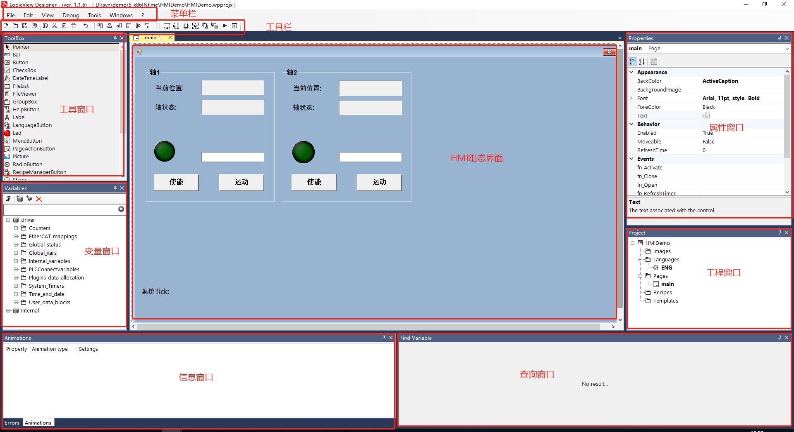

### 1.2 LogicView Designer初体验

打开LogicView Designer，创建第一个项目。如下图所示：

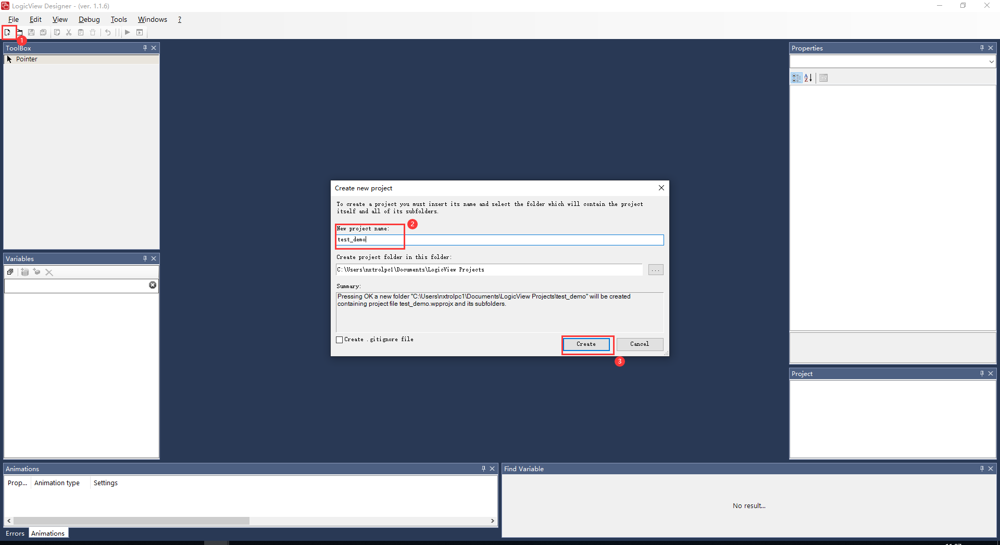


创建空白页面，编辑组态想要的HMI界面。如下图所示：

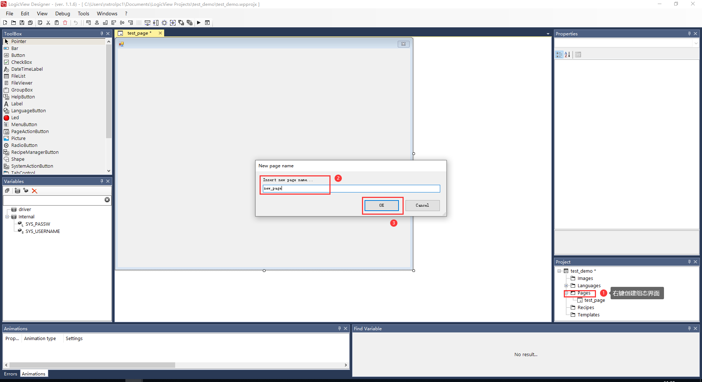


软件连接设备，变量窗口创建新的设备，在属性窗口添加IP地址和符号表。如下图所示：

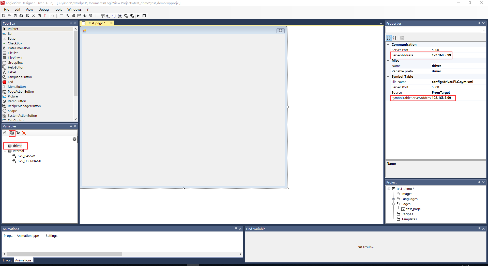


LogicLab连接到设备，将设备中需要的变量传上LogicView Designe，以供我们组态HMI界面。如下图所示：


变量添加到组态界面，选择变量的功能组件。如下图所示：

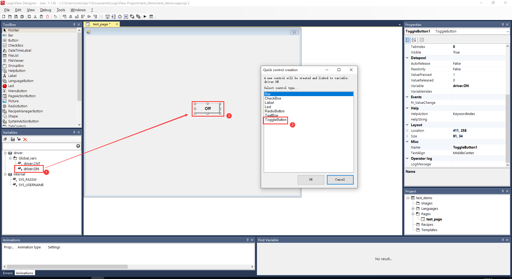


运行组态好的HMI界面，HMI界面控制LogicLab变量，效果如图所示：

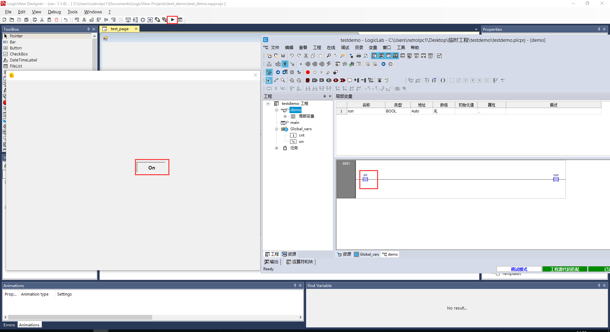


## 2.示例（HMI界面EherCAT控制电机）

   **tips：本小节可参考 现场总线EherCAT配置和上一小节HMI上手详细步骤。**

1. 打开LogicLab，插入ESI配置文件，添加从站。如下图所示：

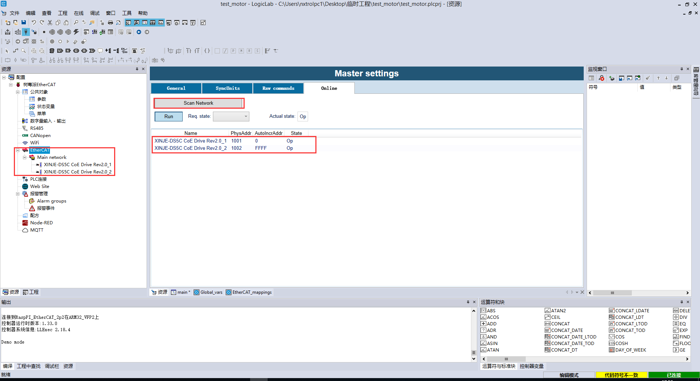

2.在从站设备上添加变量，以让LogicLab和HMI组态关联。如下图所示：

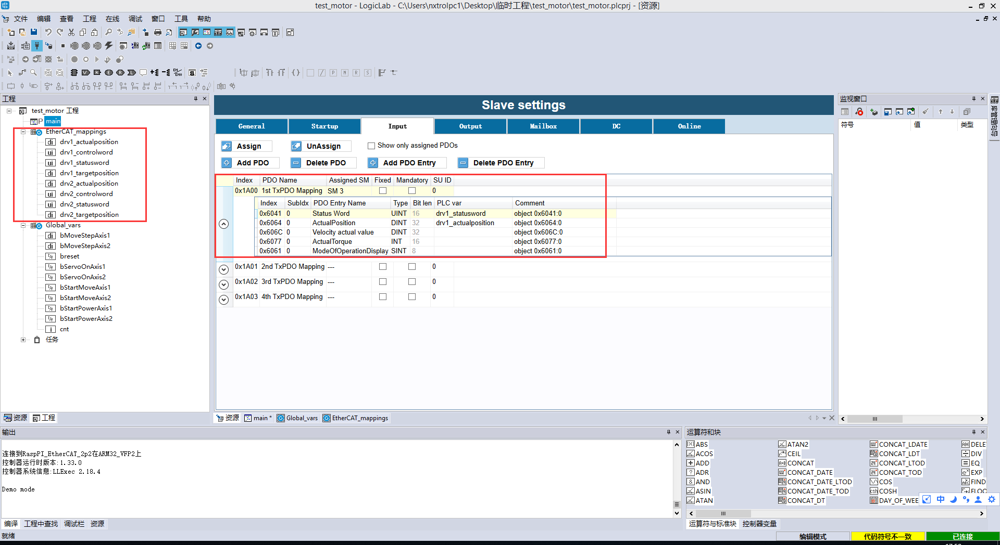


在main中编辑代码和添加全局变量，代码和图如下.

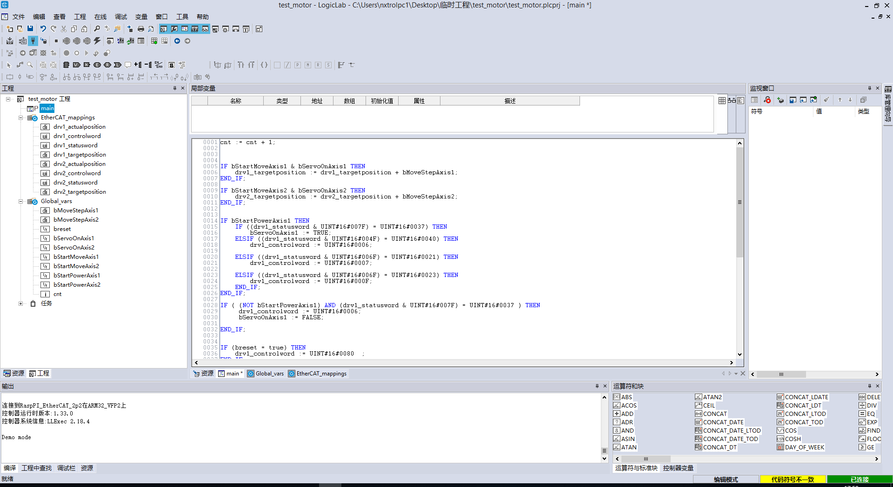

```c

cnt := cnt + 1;


IF bStartMoveAxis1 & bServoOnAxis1 THEN 
	drv1_targetposition := drv1_targetposition + bMoveStepAxis1;
END_IF;

IF bStartMoveAxis2 & bServoOnAxis2 THEN 
	drv2_targetposition := drv2_targetposition + bMoveStepAxis2;
END_IF;


IF bStartPowerAxis1 THEN
	IF ((drv1_statusword & UINT#16#007F) = UINT#16#0037) THEN
		bServoOnAxis1 := TRUE;
	ELSIF ((drv1_statusword & UINT#16#004F) = UINT#16#0040) THEN
		drv1_controlword := UINT#16#0006;
		
	ELSIF ((drv1_statusword & UINT#16#006F) = UINT#16#0021) THEN
		drv1_controlword := UINT#16#0007;
		
	ELSIF ((drv1_statusword & UINT#16#006F) = UINT#16#0023) THEN
		drv1_controlword := UINT#16#000F;
	END_IF;	

ELSIF ((drv1_statusword & UINT#16#007F) = UINT#16#0037 ) THEN
	drv1_controlword := UINT#16#0006;
    bServoOnAxis1 := FALSE;

END_IF;
	
IF ( (NOT bStartPowerAxis1) AND (drv1_statusword & UINT#16#007F) = UINT#16#0037 ) THEN
	 drv1_controlword := UINT#16#0006;
     bServoOnAxis1 := FALSE;    

END_IF;


IF (breset = true) THEN
	drv1_controlword := UINT#16#0080  ;
END_IF;
IF	(breset = false) THEN
	drv1_controlword := UINT#16#ff7f & drv1_controlword;
END_IF;


IF bStartPowerAxis2 THEN
	IF ((drv2_statusword & UINT#16#007F) = UINT#16#0037) THEN
		bServoOnAxis2 := TRUE;
	ELSIF ((drv2_statusword & UINT#16#004F) = UINT#16#0040) THEN
		drv2_controlword := UINT#16#0006;
		
	ELSIF ((drv2_statusword & UINT#16#006F) = UINT#16#0021) THEN
		drv2_controlword := UINT#16#0007;
		
	ELSIF ((drv2_statusword & UINT#16#006F) = UINT#16#0023) THEN
		drv2_controlword := UINT#16#000F;
	END_IF;

	
ELSIF ((drv2_statusword & UINT#16#007F) = UINT#16#0037 ) THEN
	drv2_controlword := UINT#16#0006;
    bServoOnAxis1 := FALSE;

END_IF;

IF (breset = true) THEN
	drv2_controlword := UINT#16#0080  ;
END_IF;
IF	(breset = false) THEN
	drv2_controlword := UINT#16#ff7f & drv1_controlword;
END_IF;
```

2. 组态HMI界面，如图所示：

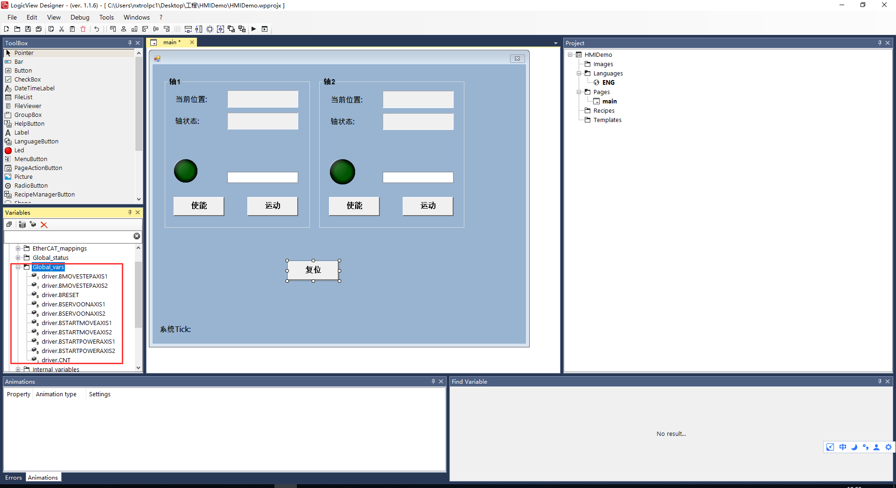


运行HMI，控制电机转动，效果如图所示：

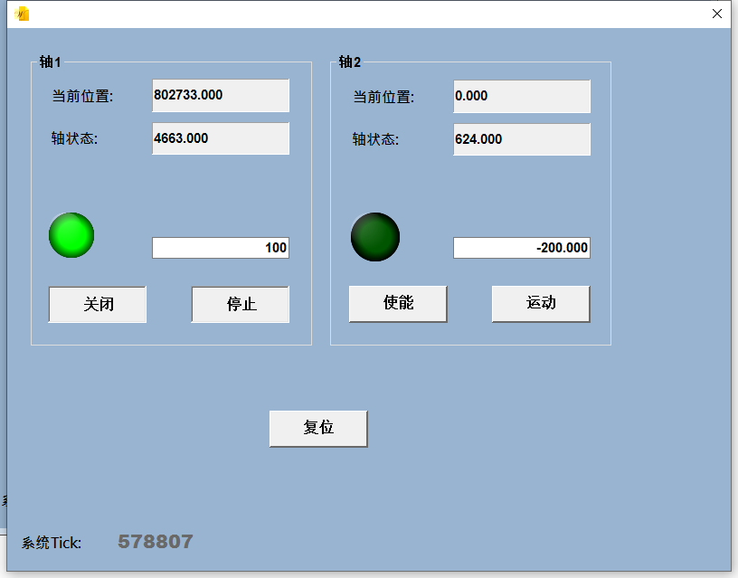