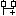
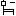

### 10.1 MENUS REFERENCE 

In the following tables you can see the list of all LogicLab’s commands. However, since 

LogicLab has a multi-document interface (MDI), you may find some disabled commands

or even some unavailable menus, depending on what kind of document is currently active.

#### 10.1.1 FILE MENU 

| **Command**                  | **Icon**                     | **Key**  | **Description**                                              |
| ---------------------------- | ---------------------------- | -------- | ------------------------------------------------------------ |
| *New project*                |  |          | Creates a new LogicLab project.                              |
| *Open project*               |                              |          | Opens an existing LogicLab project                           |
| *Import project from target* |                              |          | Imports sources project from target device.                  |
| *View project (read only)*   |                              |          | Opens an existing LogicLab project in read-only mode.        |
| *Save project*               |  |          | Saves the current open project.                              |
| *Save project As*            |                              |          | Saves the current open project specifying new name, location and extension. |
| *Close project*              |                              |          | Closes the open project.                                     |
| *New text file*              |                              |          | Opens a blank new generic text file.                         |
| *Open file*                  |                              | *Ctrl+O* | Opens an existing file, whatever its extension. The file is displayed in the text editor. Anyway, if you open a project file, you actually open the LogicLab project it refers to. |
| *Save*                       |                              | *Ctrl+S* | Saves the document of the currently active window.           |
| *Close*                      |                              |          | Closes the document of the currently active window.          |
| *Options*                    |                              |          | Opens the LogicLab options dialog box.                       |
| *Print*                      |  | *Ctrl+P* | Prints the document of the currently active window.          |
| *Print preview*              |  |          | Creates a preview of the document of the currently active window,ready to be printed. |
| *Print project*              |                              |          | Prints all the documents making up the project.              |
| *Printer setup*              |                              |          | Opens the Printer setup dialog box.                          |
| *..recent..*                 |                              |          | Lists a set of project file recently opened.                 |
| *Exit*                       |                              |          | Closes LogicLab.                                             |

#### 10.1.2 EDIT MENU 

| **Command**        | **Icon**                                | **Key**               | **Description**                                              |
| ------------------ | --------------------------------------- | --------------------- | ------------------------------------------------------------ |
| *Redo*             |  | *Ctrl+Y*              | Restores the last action cancelled by Undo.                  |
| *Cut*              |  | *Ctrl+X*              | Removes the selected items from the active document and stores them in a system buffer. |
| *Copy*             |                                         | *Ctrl+C*              | Copies the selected items to a system buffer                 |
| *Paste*            |                                         | *Ctrl+V*              | Pastes in the active document the contents of the system buf-fer. |
| *Delete*           |                                         | *Del*                 | Deletes the selected item.                                   |
| *Delete line*      |                                         | *Ctrl+E*              | Deletes the whole source code line.                          |
| *Go to symbol*     |  | *Shift+F12*           | Allows you to move through the results of a symbol search    |
| *Find in project*  |                                         | *Ctrl+Shift+F*        | Opens the Find in project dialog box                         |
| *Bookmarks...*     |                                         |                       |                                                              |
| *Add/Toggle*       |                                         | *Ctrl+F2*             | Adds a bookmark to mark lines. If a bookmark is already defined, removes it. |
| *Next*             |                                         | *F2*                  | Goes to next defined bookmark                                |
| *Prev*             |                                         | *Shift+F2*            | Goes to previous defined bookmark                            |
| *Remove all*       |                                         |                       | Removes all defined bookmarks                                |
| *Go to line*       |                                         | *Ctrl+G*              | Allows you to quickly move to a specific line in the source  code editor. |
| *Find*             |  | *Ctrl+F*              | Asks you to type a string and searches for its first instance within the active document from the current location of the cursor. |
| *Find next*        |  | *F3*                  | Iterates between the results of the research, found by the **Find** command. |
| *Replace*          |                                         | *Ctrl+H*              | Allows you to automatically replace one or all the instances of a string with another string. |
| *Insert/Move mode* |             | *Spacebar*            | Toggle between those two editing modes, used to insert or move blocks. You can switch from Insert/Move to Connection mode with the spacebar |
| *Connection mode*  |                                         | *Spacebar*            | Editing mode which allows you to draw logical wires to con-nect pins. You can switch from Insert/Move to Connection mode with the spacebar |
| *Watch mode*       |             |                       | Editing mode which allows you to add variables to any debug- ging tool. |
| *Zoom in*          |  | *Ctrl +mouse wheel*   | Increase zoom level inside the active POU                    |
| *Zoom out*         |             | *Ctrl +*mouse *wheel* | Decrease zoom level inside the active POU.                   |

#### 10.1.3 VIEW MENU 

| **Command**            | **Icon**                                | **Key**  | **Description**                                              |
| ---------------------- | --------------------------------------- | -------- | ------------------------------------------------------------ |
| *Toolbar*              |                                         |          |                                                              |
| *Main*                 |                                         |          | Shows or hides the *Main* toolbar.                           |
| *Project*              |                                         | *Ctrl+J* | Shows or hides the *Project* toolbar.                        |
| *Status bar*           |                                         |          | Shows or hides the *Status* bar.                             |
| *Debug*                |                                         | *Ctrl+B* | Shows or hides the *Debug* toolbar.                          |
| *FBD bar*              |                                         | *Ctrl+D* | Shows or hides the *FBD* toolbar.                            |
| *LD bar*               |                                         | *Ctrl+A* | Shows or hides the LD toolbar.                               |
| *SFC bar*              |                                         | *Ctrl+Q* | Shows or hides the *SFC*   toolbar.                          |
| *Network*              |                                         | *Ctrl+N* | Shows or hides the *Network* toolbar.                        |
| *Tool windows*         |                                         |          |                                                              |
| *Local variables*      |                                         |          | Shows or hides the local variables window for the active POU. |
| *Project*              |  | *Ctrl+W* | Shows or hides the *Workspace* window (also called Workspace  window). |
| *Watch*                |                                         | *Ctrl+T* | Shows or hides the *Watch* window.                           |
| *Properties window*    |  |          | Shows or hide the properties window.                         |
| *Oscilloscope*         |                                         | *Ctrl+K* | Shows or hides the *Oscilloscope* window.                    |
| *PLC run-time status*  |  | *Ctrl+L* | Shows or hides the *PLC run-time* window.                    |
| *Operators and blocks* |  |          | Shows or hides the Operators and Blocks window               |
| *Library Tree*         |  |          | Shows or hides the *Libraries* window                        |
| *Output*               |  | *Ctrl+R* | Shows or hides the *Output* window.                          |
| *Cross Reference*      |  |          | Shows or hides the cross reference window.                   |
| *Resources*            |                                         |          | Add or remove the resources panel from the workspace.        |
| *Catalog*              |                                         |          | Shows or hides the catalog window.                           |
| *Full screen*          |             | Ctrl+U   | Expands the currently active document window to fill entire screen. (Esc to exit from this mode). |
| *Grid*                 |                                         |          | Shows or hides a dotted grid in the background of graphical source code editors. |

#### 10.1.4 PROJECT MENU 

| **Command**                              | **Icon**                     | **Key**            | **Description**                                              |
| ---------------------------------------- | ---------------------------- | ------------------ | ------------------------------------------------------------ |
| *New program*                            |                              |                    | Creates a new program. A dialog is prompted in order to specify the new program properties. |
| *New function block*                     |                              |                    | Creates a new function block. A dialog is prompted in order to specify the new function block properties. |
| *New function*                           |                              |                    | Creates a new function block. A dialog is prompted in order to specify the new function properties. |
| *New variable*                           |                              |                    |                                                              |
| *Automatic*                              |                              |                    | Creates a new automatic variable. A dialog is prompted in order to specify the new variable properties. |
| *Mapped variable*                        |                              | *Ctrl + Shift + M* | Creates a new mapped variable. A dialog is prompted in order to specify the new variable properties. |
| *Constant*                               |                              |                    | Creates a new constant. A dialog is prompted in order to specify the new constant properties. |
| *Retain*                                 |                              |                    | Creates a new retain variable. A dialog is prompted in order to specify the new variable properties. |
| *New definition*                         |                              |                    |                                                              |
| *Enumeration*                            |                              |                    | Creates a new user defined type, of type enumeration.        |
| *Interface*                              |                              |                    | Creates a new user defined type, of type interface.          |
| *Macro*                                  |                              |                    | Creates a new user defined type, of type macro.              |
| *Structure*                              |                              |                    | Creates a new user defined type, of type structure.          |
| *Subrange*                               |                              |                    | Creates a new user defined type, of type subrange.           |
| *TypeDef*                                |                              |                    | Creates a new user defined type, of type typedef.            |
| *Copy object*                            |                              |                    | Copies the object currently selected in the Workspace.       |
| *Paste object*                           |                              |                    | Pastes the previously copied object.                         |
| *Duplicate object*                       |                              |                    | Duplicates the object currently selected in the Workspace, and asks you to type the name of the copy. |
| *Delete object*                          |                              | *Del*              | Deletes the currently selected object.                       |
| *View PLC object properties*             |                              | *Alt+Enter*        | Shows properties and description of the currently selected object. |
| *Object browser*                         |                              |                    | Opens the **Object** browser, which lets you navigate between objects. |
| *Compile*                                |  | *F7*               | Launches the LogicLab compiler.                              |
| *Recompile all*                          |                              | *Ctrl+ Alt+F7*     | Recompiles the project.                                      |
| *Generate redistributable source module* |                              |                    | Generates an RSM file.                                       |
| *Import objects*                         |                              |                    | Lets you import a LogicLab object from a library             |
| *Export object to library*               |                              |                    | Lets you export a LogicLab object to a library               |
| *Library manager*                        |  |                    | Opens the **Library** manager.                               |
| *Refresh all li-*braries*                |                              |                    | Reloads all libraries linked to the project.                 |
| *Select target...*                       |                              |                    | Lets you to select a new target for the project.             |
| *Refresh current target*                 |                              |                    | Lets you update the target file for the same version of the target. |
| *Options...*                             |                              |                    | Opens the project options dialog.                            |
|                                          |                              |                    |                                                              |

​           

#### 10.1.5 ONLINE MENU 

| **Command**                  | **Icon**                                | **Key** | **Description**                                              |
| ---------------------------- | --------------------------------------- | ------- | ------------------------------------------------------------ |
| *Set up communication...*    |                                         |         | Lets you set the properties of the connection to the target. |
| *Connect*                    |             |         | LogicLab tries to establish a connection to the target.      |
| *Download code*              |             | *F5*    | LogicLab checks if any changes have been applied since last compilation, if so compiles the project and then downloads the source code to the target. |
| *Download options*           |                                         |         | Lets you set the properties of the source code downloaded to the target. |
| *Force target image upload*  |                                         |         | If the target device is connected, lets you upload the img file. |
| *Force debug symbols upload* |                                         |         | If the target device is connected, lets you upload the debug symbols file. |
| *Halt*                       |  |         | Stops the PLC execution.                                     |
| *Cold restart*               |             |         | Restarts the PLC execution and both retain and non-retain variables will be reset. |
| *Warm restart*               |             |         | Restarts the PLC execution and non-retain variables will be reset. |
| *Hot restart*                |             |         | Restarts the PLC execution without any reset on variables.   |
| *Reboot target*              |             |         | Reboots the target.                                          |
| Read all logs again          |                                         |         | Reloads all remote logs from target.                         |

#### 10.1.6 DEBUG MENU 

| **Command**                           | **Icon**                                | **Key**         | **Description**                                              |
| ------------------------------------- | --------------------------------------- | --------------- | ------------------------------------------------------------ |
| *Simulation mode*                     |                                         |                 | Open/close the integrated simulation environment.            |
| *Start/Stop watch value*              |                                         |                 | Starts or stops (toggle) the evaluation of the symbols added in the watch window. |
| *Add symbol to watch*                 |                                         | *F8*            | Adds a symbol to the **Watch** window.                       |
| *Add symbol to a de*bug window*       |                                         | *F10*           | Adds a symbol to a **debug** window.                         |
| *Insert new item into a debug window* |                                         | *Shift+F10*     | Inserts a new item into a **debug** window.                  |
| *Quick watch symbol*                  |                                         | *Shift+F8*      | Opens a new window which allows you to se the current value of the selected symbol (not refreshing) and to force a new value. |
| *Live debug mode*                     |                                         |                 | If debug mode is running, starts or stops (toggle) the live debug mode. |
| *Add/remove text  trigger*            |             | *F9*            | Adds/removes a text trigger.                                 |
| *Add/remove graphic trigger*          |                                         | *Shift+F9*      | Adds/removes a graphic trigger.                              |
| *Remove all triggers*                 |  | *Ctrl+Shift+F9* | Removes all the active triggers.                             |
| *Trigger list*                        |  | *Ctrl+I*        | Lists all the active triggers.                               |
| *Run*                                 |  |                 | Restarts program after a breakpoint is hit.                  |
| *Step*                                |             |                 | Restarts program executing only one instruction, after a breakpoint is hit. |
| *Add/Remove breakpoint*               |             | *F12*           | Adds or removes a breakpoint.                                |
| *Remove all breakpoints*              |             |                 | Removes all the active breakpoints.                          |
| *Breakpoint list*                     |  |                 | Lists all the active breakpoints.                            |

#### 10.1.7 SCHEME MENU FOR FBD 

| **Command**                 | **Icon**                                | **Key**    | **Description**                                              |
| --------------------------- | --------------------------------------- | ---------- | ------------------------------------------------------------ |
| *Network*                   |                                         |            |                                                              |
| *New*                       |                                         |            |                                                              |
| *Top*                       |  |            | Adds a blank network at the top of the active document.      |
| *Bottom*                    |  |            | Adds a blank network at the bottom of the active document.   |
| *Before*                    |  |            | Adds a blank network before the selected network in the active document. |
| *After*                     |  |            | Adds a blank network after the selected network in the active document. |
| *Label*                     |                                         |            | Assigns a label to the selected network, so that it can be indicated as the target of a jump instruction. |
| *Object*                    |                                         |            |                                                              |
| *Function*                  |                                         |            | Opens the object browser in order to choose a function to be added to the current active document. |
| *Function block*            |                                         |            | Opens the object browser in order to choose a function block to be added to the current active document. |
| *Variable*                  |                                         | *shift+V*  | Opens the object browser in order to choose a variable to be added to the current active document. |
| *Constant*                  |                                         | *shift+K*  | Opens the object browser in order to choose a constant to be added to the current active document. |
| *Return*                    |  | *shift+R*  | Adds a return statement into the selected network.           |
| *Jump to label*             |  | *shift+J*  | Adds a jump statement into the selected network.             |
| *Operator*                  |                                         |            | Opens the object browser in order to choose an operator to be added to the current active document. |
| *Comment*                   |                                         | *shift+M*  | Adds a comment into the selected network.                    |
| *Instance name*             |                                         |            | Opens the object browser in order to choose an operator to be added to the current active document. |
| *Open source*               |                                         |            | Opens the editor by which the selected object was created, and displays the relevant source code: \- if the object is a program, or a function, or a function block, this command opens its source co \- if the object is a variable or a parameter, this command opens the corresponding variable editor; - if the object is a standard function or an operator, this command has no functionality |
| *Auto connect*              |  |            | Toggle auto-connection mode, in order to connect automatically  two blocks when they are close enough. |
| *Delete invalid connection* |                                         | *Ctrl+M*   | Removes all invalid connections, represented by a red line in the active scheme |
| *Increment pins*            |                                         | *Ctrl+’+’* | Adds additional pins to the selected block in order to increase standard ones. |
| *Decrement pins*            |             | *Ctrl+’-’* | Removes pins added by the **Increment pins** command.        |
| *Enable EN/ENO pins*        |                                         |            | Adds the **enable in/enable out** pins to the selected block. The code implementing the selected block will be executed only when the **enable in** signal is true. The **enable out** signa simply repeats the value of **enable in**, allowing you either to enable or to disable a set of blocks in cascade. |
| *Object proper ties*        |                                         |            | Shows some properties of the selected block.                 |
|                             |                                         |            |                                                              |

#### 10.1.8 SCHEME MENU FOR LD 

| **Command**          | **Icon**                                | **Key**    | **Description**                                              |
| -------------------- | --------------------------------------- | ---------- | ------------------------------------------------------------ |
| *Network*            |                                         |            |                                                              |
| *New*                |                                         |            |                                                              |
| *Top*                |                                         |            | Adds a blank network at the top of the active  document      |
| *Bottom*             |                                         |            | Adds a blank network at the bottom of the active document.   |
| *Before*             |                                         |            | Adds a blank network before the selected network in the active document |
| *After*              |                                         |            | Adds a blank network after the selected network in the active document. |
| *Label*              |                                         |            | Assigns a label to the selected network in order to be used as target of a jump instruction. |
| *Object*             |                                         |            |                                                              |
| *New*                |                                         |            |                                                              |
| *Parallel contact*   |                                         | *Shift+P*  | Adds a contact parallel to the selected one.                 |
| *Serie contact*      |                                         | *Shift+C*  | Adds a contact in series to the selected one.                |
| *Coil*               |                                         | *Shift+O*  | Adds a Coil into the selected network.                       |
| *Block*              |                                         | *Shift+B*  | Opens the object browser in order to choose which block should be added to the current active document. |
| *Constant*           |                                         | *Shift+K*  | Opens the object browser in order to choose a constant  to be added to the current active document. |
| *Return*             |                                         | *Shift+R*  | Adds a Return statement into the selected network.           |
| *Jump*               |                                         | *Shift+J*  | Adds a jump statement into the selected network.             |
| *Variable*           |                                         | *Shift+V*  | Opens the object browser in order to choose a variable to be added to the current active document. |
| *Expression*         |                                         | *Shift+E*  | Adds an expression into the selected network.                |
| *New branch*         |                                         |            | Creates new branch after the current position.               |
| *Comment*            |                                         | *Shift+M*  | Adds a comment into the selected network.                    |
| *Instance name*      |                                         |            | Lets you assign a name to an instance of the selected function block. |
| *Open source*        |                                         |            | Opens the editor by which the selected object was created, and displays the relevant source code:  if the object is a program, or a function, or a function block, this command opens its source code; if the object is a variable or a parameter, this command opens the corresponding variable editor; if the object is a standard function or an operator, this command has no functionality. |
| *Open object*        |  | *O*        | Changes the selected object into an open contact object.     |
| *Negated object*     |  | *C*        | Changes the selected object into a negated contact object.   |
| *Positive object*    |  | *P*        | Changes the selected object into a positive contact object.  |
| *Negative object*    |  | *N*        | Changes the selected object into a negative contact object.  |
| *Set coil*           |  | *S*        | Changes the selected coil into a set coil.                   |
| *Reset coil*         |  | *R*        | Changes the selected coil into a reset coil.                 |
| *Increment pins*     |                                         | *Ctrl+’+’* | Adds additional pins to the selected block in order to increase standard ones. |
| *Decrement pins*     |                                         | *Ctrl+’-’* | Removes pins added by the Increment pins  command.           |
| *Enable EN/ENO pins* |                                         | *E*        | Adds the **enable in/enable out** pins to the selected  block. The code implementing the selected block will be executed only when the **enable in** signal is true. The **enable out** signal simply repeats the value of **enable** **in**, allowing you either to enable or to disable a set of  blocks in cascade. |
| *Set output line*    |                                         |            | Set selected pin as the output line of the block.            |
| *Object properties*  |                                         |            | Shows some properties of the selected block.                 |

#### 10.1.9 SCHEME SFC MENU 

| **Command**                                               | **Icon**                                | **Key**  | **Description**                                              |
| --------------------------------------------------------- | --------------------------------------- | -------- | ------------------------------------------------------------ |
| *Object*                                                  |                                         |          |                                                              |
| *New*                                                     |                                         |          |                                                              |
| *Step*                                                    |  |          | Adds new step into the selected network.                     |
| *Transition*                                              |                                         |          | Adds new transition into the selected network                |
| *Jump*                                                    |                                         |          | Adds new jump into the selected network.                     |
| *Modify*                                                  |                                         |          |                                                              |
| *Add pin to divergent* *transition*                       |  |          | Adds a divergent pin to the selected transition.             |
| *Remove pin from divergent* *transition*                  |  |          | Removes a divergent pin to the selected transition.          |
| *Add pin to convergent* *transition*                      |  |          | Adds a convergent pin to the selected transition.            |
| *Remove pin from convergent* *transition*                 |             |          | Removes a convergent pin to the selected transition          |
| *Add pin to simultaneous* *divergent transition*          |  |          | Adds a simultaneous divergent pin to the selected transition. |
| *Remove pin from* *simultaneous divergent*  *transition*  |  |          | Removes a simultaneous divergent pin to the selected transition. |
| *Add pin to simultaneous* *convergent transition*         |  |          | Adds a simultaneous convergent pin to the selected transition. |
| *Remove pin from* *simultaneous convergent*  *transition* |  |          | Removes a simultaneous convergent pin to the selected transition |
| *Add space before rightmost* *pin*                        |  |          | Adds a space before the rightmost pin.                       |
| *Remove space before* *rightmost pin*                     |  |          | Removes a space before the rightmost pin.                    |
| *Code Object*                                             |                                         |          |                                                              |
| *New Action*                                              |                                         |          | Adds an action in the active document.                       |
| *New Transition code*                                     |             |          | Adds a transition in the active document.                    |
| *Auto connect*                                            |                                         |          | Toggle auto-connection mode, in order to connect automatically two blocks when they are close enough. |
| *Delete invalid connection*                               |                                         | *Ctrl+M* | Removes all invalid connections, represented by a red line in the active scheme. |

#### 10.1.10 VARIABLES MENU

| **Command**       | **Icon** | **Key**          | **Description**                                              |
| ----------------- | -------- | ---------------- | ------------------------------------------------------------ |
| *Insert*          |          | *Ctrl+Shift+ins* | Adds a new row to the grid in the currently active editor    |
| *Delete*          |          | *Del*            | Deletes the variable in the selected row of the currently active table. |
| *Create multiple* |          |                  | Lets you to create a set of multiple variables.              |

#### 10.1.11 WINDOW MENU

| **Command**     | **Icon** | **Key** | **Description**                                              |
| --------------- | -------- | ------- | ------------------------------------------------------------ |
| *Cascade*       |          |         | Displaces all open documents in cascade, so that they completely overlap except for the caption. |
| *Tile*          |          |         | The PLC editors area is split into frames having the same dimensions, depending on the number of currently open documents. Each frame is automatically assigned to one of such documents. |
| *Arrange Icons* |          |         | Displaces the icons of the minimized documents in the bottom eft-hand corner of the PLC editors area. |
| *Close all*     |          |         | Closes all open documents.                                   |
| *Windows...*    | *Alt+W*  |         | Shows the list of active open windows, allowing you to close or bring to focus specific window. Useful when you have a lot of open window. |

#### 10.1.12 TOOLS MENU

 

| **Command**    | **Icon** | **Key** | **Description**                                           |
| -------------- | -------- | ------- | --------------------------------------------------------- |
| *Custom tools* |          |         | Allows to see and execute previously loaded custom tools. |

#### 10.1.13 HELP MENU

| **Command** | **Icon** | **Key** | **Description**                                              |
| ----------- | -------- | ------- | ------------------------------------------------------------ |
| *Index*     |          |         | Lists all the **Help keywords** and opens the related topic. |
| *Context*   |          | *F1*    | Context-sensitive help. Opens the topic related to the currently active window. |
| *About...*  |          |         | Credits and version information.                             |

### 10.2 TOOLBARS REFERENCE 

In the following tables you can see the list of all LogicLab’s toolbars. The buttons making 

up each toolbar are always the same, whatever the currently active document. However, 

some of them may produce no effect, if there is no logical relation to the active document.

#### 10.2.1 MAIN TOOLBAR 

#### 10.2.2 FBD TOOLBAR 

#### 10.2.3 LD TOOLBAR 

#### 10.2.4 SFC TOOLBAR 

#### 10.2.5 PROJECT TOOLBAR 

#### 10.2.6 NETWORK TOOLBAR 

#### 10.2.7 DEBUG TOOLBAR 

