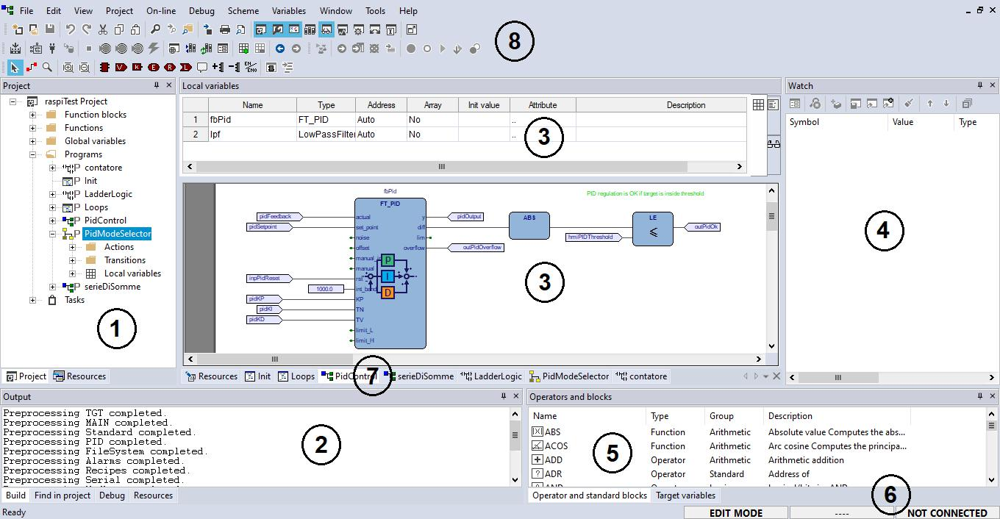
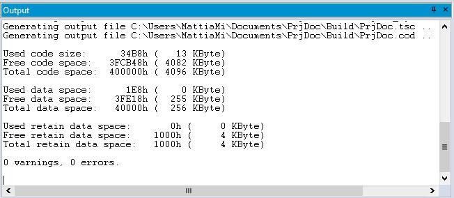
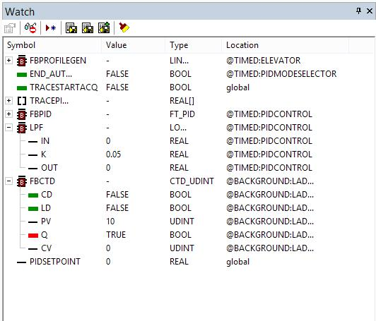
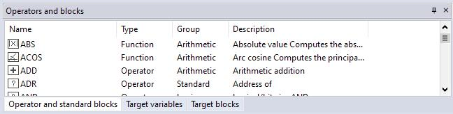
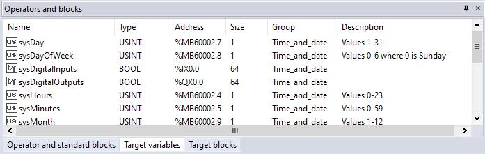
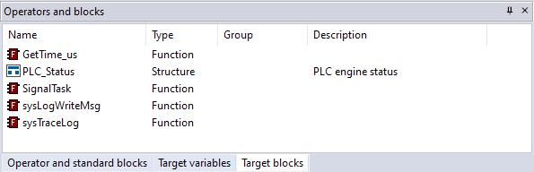
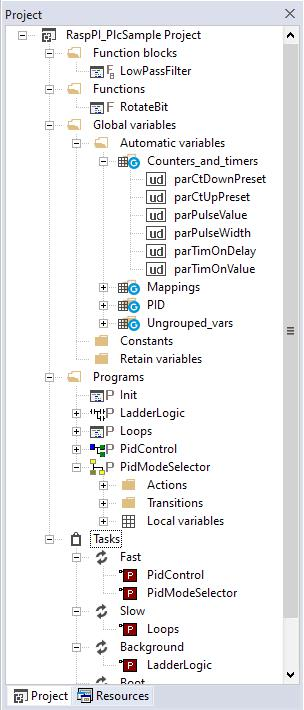
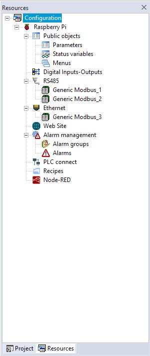
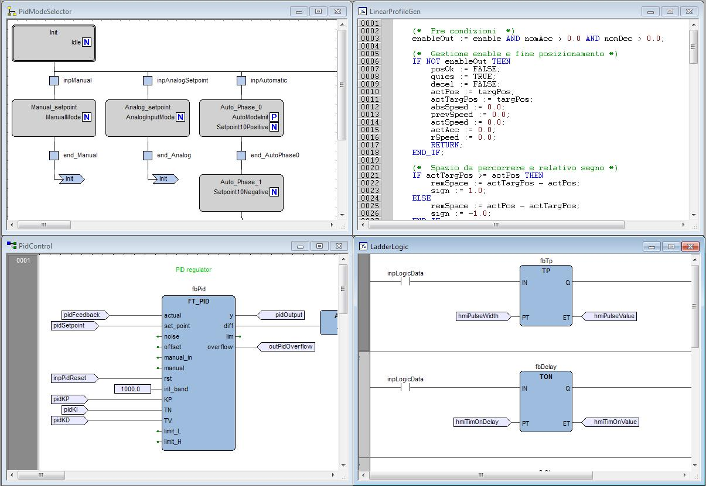
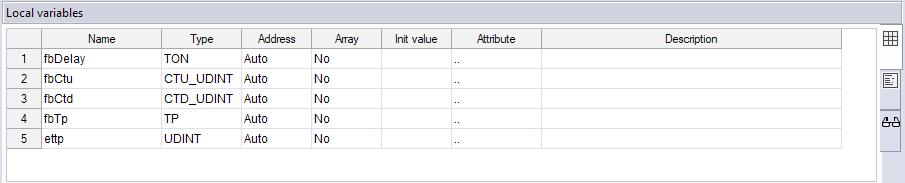

## 2.OVERVIEW

LogicLab is an IEC61131-3 Integrated Development Environment supporting the whole 

range of languages defined in the standard.

In order to support the user in all the activities involved in the development of an applica

tion, LogicLab includes:

\- textual source code editors for the Instruction List (briefly, IL) and Structured Text

(briefly, ST) programming languages (see Chapter 6.);

\- graphical source code editors for the Ladder Diagram (briefly, LD), Function Block Dia

gram (briefly, FBD), and Sequential Function Chart (briefly, SFC) programming lan

guages (see Chapter 6.); 

\- a compiler, which translates applications written according to the IEC standard directly 

into machine code, avoiding the need for a run-time interpreter, thus making the pro

gram execution as fast as possible (see Chapter 7);

\- a communication system which allows the download of the application to the target 

environment (see Chapter 8);

\- a rich set of debugging tools, ranging from an easy-to-use watch window to more pow

erful tools, which allows the sampling of fast changing data directly on the target envi

ronment, ensuring the information is accurate and reliable (see Chapter 9).

### 2.1 THE WORKSPACE

The figure below shows a view of LogicLab’s workspace, including many of its more com

monly used components.

 1 *. Workspace window*  2.  *Output window*  3.  *Source code editors*  4.  *Watch window*  5.  *Operators and blocks win*

*dow*  6.  *Status bar*  7.  *Document bar*  8.  *Toolbars*

The following paragraphs give an overview of these elements.

 

#### 2.1.1 THE OUTPUT WINDOW

The  Output  window is the place where LogicLab prints its output messages. This window 

contains four tabs: *Build, Find in project, Debug,* and *Resources*.

 Build 

The *Build* panel displays the output of the following activities: 

\- opening a project;

\- compiling a project;

\- downloading code to a target.

 Find in project 

This panel shows the result of the *Find in project* activity.

 Debug 

The *Debug* panel displays information about advanced debugging activities (for example, 

breakpoints). Depending on the target device you are interfacing with, LogicLab can print 

on this output window every PLC run-time error (for example, division by zero), locating 

the exact position where the error occurred.

 Resources 

The *Resources* panel displays messages related to the specific target device LogicLab is 

interfacing with.

#### 2.1.2 THE STATUS BAR

The *Status* bar displays the state of the application at its left border, and an animated 

control reporting the state of communication at its right border.

For further details see paragraph 8.2.1 and 8.2.2.

### 2.1.3 THE DOCUMENT BAR

The *Document* bar lists all the documents currently open for editing in LogicLab. 

LogicLab user manual

#### 2.1.4 THE WATCH WINDOW

The *Watch* window is one of the many debugging tools supplied by LogicLab. Among the 

other debugging tools, it is worth mentioning the Oscilloscope, the triggers, and the live 

debug mode (see Paragraph 9.2).

#### 2.1.5 THE OPERATORS AND BLOCKS WINDOW

The *Operators and blocks* window contains a set of different panels, which fall into the

categories explained in the following paragraphs.

You can choose the display mode by clicking the right button of your mouse. In the 

*[View list]* mode, each element is represented by its name and icon. Instead, a table 

appears in the *[View detail]* mode, each row of which is associated with one of the em

bedded elements. The latter mode also displays the *Type* (Operator/Function) and the 

description of each element.

If you right-click one of the elements of this panel, and you click *[Object properties]* from 

the dialog box, then a window appears with further details on the element you selected 

(input and output supported types, name of input and output pins, etc.).

In the *[View folder]* mode each element is grouped into the folder to which it belongs. 

These folders are useful to logically group the elements.

##### 2.1.5.1 OPERATORS AND STANDARD BLOCKS

This panel lists basic language elements, such as operators and functions defined by the

IEC 61131-3 standard. 

##### 2.1.5.2 TARGET VARIABLES

This panel lists all the system variables, also called target variables, which are the inter

face between firmware and PLC application code.

 

##### 2.1.5.3 TARGET BLOCKS

This panel lists all the system functions and function blocks available on the specific target

device.

#### 2.1.6 THE WORKSPACE WINDOW

The *Workspace* window consists of two distinct panels, as shown in the following picture.

 

##### 2.1.6.1 PROJECT

The *Project* panel contains all the elements of the project, visualized in a tree-like organi

zation; custom folders can be added to the project tree in order to reorganize the ele

ments accordingly to the user preferences. 

Among the other elements, there’s also the *task list*, which represent the available tasks 

and the relative assigned programs (see Paragraph 5.3). 

##### 2.1.6.2 RESOURCES 

The contents of the *Resources* panel depends on how the target device is interfacing with 

LogicLab: it may include configuration elements, schemes, wizards, and so on.

LogicLab user manual
#### 2.1.7 THE SOURCE CODE EDITORS

The LogicLab programming environment includes a set of editors to manage, edit, and 

print source files written in any of the 5 programming languages defined by the IEC

61131-3 standard (see Chapter 6).

The definition of both global and local variables is supported by specific spreadsheet-like

editors

#### 2.1.8 THE TOOLBARS 

LogicLab allows the user to hide or show specific toolbars to fully customize the workspace.

Each operation in the environment, to realize a program (for example add a variable), can 

be performed through the menus; the toolbars contain icons which work as shortcut for 

the menus commands (see paragraph 3.2).

 

LogicLab user manual
