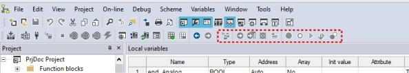

## 3. USING THE ENVIRONMENT 

This chapter shows you how to deal with the many UI elements LogicLab is composed of, 

in order to let you set up the IDE in the way which best suits to your specific development

process.

### 3.1 LAYOUT CUSTOMIZATION 

The layout of LogicLab’s workspace can be freely customized in order to suit your needs.

LogicLab takes care to save the layout configuration on application exit, in order to persist

your preferences between different working sessions.

### 3.2 TOOLBARS 

#### 3.2.1 SHOWING/HIDING TOOLBARS 

In details, in order to show (or hide) a toolbar, open the *View>Toolbars* menu and select 

the desired toolbar (for example, the  FBD  bar).

The toolbar is then shown (hidden).

#### 3.2.2 MOVING TOOLBARS 

You can move a toolbar by clicking on its left border and then dragging and dropping it to the destination.

The toolbar shows up in the new position.

### 3.3 DOCKING WINDOWS 

#### 3.3.1 SHOWING/HIDING TOOL WINDOWS 

The *View>Tool windows* menu allows you to show (or hide) a tool window (for example, 

LogicLab user manual 

9the *Watch* window, the *Properties* window, the *Library* window...).

The window is then shown (hidden).

#### 3.3.2 FLOATING TOOL WINDOWS 

You can undock any window from its default location in LogicLab and move it anywhere , just click on its title bar and drag it to the location you want.

Take back a window to its most recent docked location simply double-click the title bar of 

the window.

#### 3.3.3 DOCKING TOOL WINDOWS 

LogicLab shows you a guide diamond when you drag a window to another location to help 

you easily re-dock the window.

While dragging a window move the mouse cursor on the position of the guide diamond 

you want to use as new window position.

Tool windows can be fastened to one side of a frame in LogicLab or within a frame.

#### 3.3.4 AUTO-HIDE TOOL WINDOWS 

By the pin button on the top right corner of the window you can switch the window to 

auto-hide mode or to regular docking mode.

### 3.4 WORKING WITH WINDOWS 

LogicLab allows to open many source code editors so that the workspace could get rather 

messy.

10 

LogicLab user manualYou can easily navigate between these windows through the *Document* bar and the *Win*

*dow* menu.

#### 3.4.1 THE DOCUMENT BAR 

The *Document* bar allows to switch between all the currently open editors, simply by click

ing on the corresponding name.

At the right side of the *Document* bar, there are four buttons: the first two allow you to

browse the different open editors in case their number exceeds the document bar size;

the third shows you the currently open editors in a cascade menu; the last one allows you 

to close the currently selected editor window.

#### 3.4.2 THE WINDOW MENU 

The *Window* menu is an alternative to the *Document* bar: it lists all the currently open 

editors and allows to switch between them.

LogicLab user manual 

11Moreover, this menu supplies a few commands to automate some basic tasks, such as 

closing all windows.

### 3.5 FULL SCREEN MODE 

In order to ease the coding of your application, you may want to switch on the full screen 

mode. In full screen mode, the source code editor extends to the whole working area, 

making easier the job of editing the code, notably when graphical programming languag

es (that is, LD, FBD, and SFC) are involved.

You can switch on and off the full screen mode with the *View>Full screen* .

### 3.6 ENVIRONMENT OPTIONS 

If you click *File>Options...* , a multi-tab dialog box appears and lets you customize some 

options of LogicLab.

#### 3.6.1 GENERAL 

##### 3.6.1.1 VISUAL THEME 

*Colour Theme:* allows you to turn LogicLab to dark theme mode (or return to standard 

mode), in order to have an environment that best suits your preferences.

##### 3.6.1.2 SAVE OPTIONS 

*Max previous version to keep:* if set greater than 0 indicates the maximum number of 

copies of the project that must be zipped and stored in the *PreviousVersions* folder.

12 

LogicLab user manual
##### 3.6.1.3 COMMUNICATION 

*Use last port:* if enabled, the last used port will be set as the default one.

##### 3.6.1.4 TOOLTIP 

*Enable tooltip on editors:* if enabled, small information boxes will appear when user places 

the cursor over a symbol in the editors. 

##### 3.6.1.5 OUTPUT WINDOW 

You can specify the family and the size of the font used for the output window.

##### 3.6.1.6 TOOL WINDOWS 

You can specify the family and the size of the font used for the other tool windows.

*Reset bars positions *:  the layout of the dock bars in the IDE will be resetted to default 

positions and dimensions. In order to take effect LogicLab must be restarted.

##### 3.6.1.7 SOURCE EDITOR OPTIONS 

*ST-LD: auto declaration of variables*: allows the creation of new variables in the moment 

they’re first used in the code. In LD programs, when you name a variable block, that

name is suggested as a new variable. In ST program, upon entering a new code line, that 

line is parsed to look for new variables to suggest.

*Track active object in project tree*: if this option is checked, when using the *Go to symbol* 

*(shift+F12)* function, also the project tree will track the selected object.

*Automatically restore last open editors*: if this option is checked, LogicLab will save open 

editors when closing the project. When reopening the project, also the same editors will 

be restored.

#### 3.6.2 GRAPHIC EDITOR 

This panel lets you edit the properties of the LD, FBD, and SFC source code editors.

You can specify the family and the size of the font used for graphical editors.

You can modify also the colours of the graphical object.

LogicLab user manual 

13
#### 3.6.3 TEXT EDITORS 

You can specify the family, the size and the color of the font both for code and variable 

editors.

#### 3.6.4 LANGUAGE 

You can change the language of the environment by selecting a new one from the list 

shown in this panel.

After selecting the new language, press the *Select* button and confirm by clicking *OK*. This 

change will be effective only the next time you start LogicLab.

#### 3.6.5 CUSTOM TOOLS 

You can add up to 16 commands to the *Custom Tools* menu. These commands can be 

associated with any program that will run on your operating system. You can also specify 

arguments for any command that you add to the *Custom Tools* menu. The following pro

cedure shows you how to add a tool to the *Custom Tools* menu.

1) Type the full path of the executable file of the tool in the *Command* text box. Other

wise, you can specify the filename by selecting it from Windows Explorer, which you

open by clicking the *Browse* button.

2) In the *Arguments* text box, type the arguments - if any - to be passed to the execut

able command mentioned at step 1. They must be separated by a space.

3) Enter in *Menu string* the name you want to give to the tool you are adding. This is the 

string that will be displayed in the *Tools* menu.

4) Press *Add* to effectively insert the new command into the suitable menu.

5) Press *OK* to confirm, or *Cancel* to quit.

14 

LogicLab user manualFor example, let us assume that you want to add *Windows calculator* to the *Tools* menu:

\- Fill the fields of the dialog box as displayed.

\- Press  Add . The name you gave to the new tool is now displayed in the list box at the 

top of the panel.

And in the *Custom Tools>Calc*

 menu as well.

LogicLab user manual 

15
#### 3.6.6 MERGE 

Here you can set the merge function behaviour (see Paragraph 4.8.3.2 for more details).

16 

LogicLab user manual
