## 4. MANAGING PROJECTS 

This chapter focuses on LogicLab projects.

A project corresponds to a PLC application and includes all the required elements to run 

that application on the target device, including its source code, links to libraries, informa

tion about the target device and so on.

The following paragraphs explain how to properly work with projects and their elements.

### 4.1 CREATING A NEW PROJECT 

To start a new project, click *File>New project* of the LogicLab main window. 

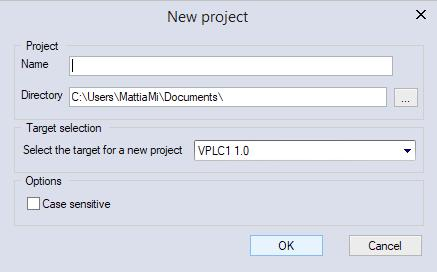

You are required to enter the name of the new project in the *Name* text area. The string 

you enter will also be the name of the folder which will contain all the files making up the

LogicLab project. The path name in the *Directory* area indicates the default location of 

this folder. 

 T *arget selection* allows you to specify the target device which will run the project.

Finally, you can make the project case-sensitive by activating the related option. Note 

that, by default, this option is not active, in compliance with IEC 61131-3 standard: when 

you choose to create a case-sensitive project, it will not be standard-compliant.

When you confirm your decision to create a new project and the whole required informa

tion has been provided, LogicLab completes the operation, creating the project directory 

and all project files; then, the project is opened.

The list of devices, from which you can select the target for the project you are creating, 

depends on the contents of LogicLab catalog, which contains the list of available target 

devices

If the desired target is missing, either you have run the wrong setup executable or you 

have to run a separate setup which is responsible to update the catalog to include the 

target device. In both cases, you should contact your hardware supplier for support.

### 4.2 UPLOADING THE PROJECT FROM THE TARGET DEVICE 

Depending on the target device you are interfacing with, you may be able to upload a 

working LogicLab project from the target itself.

In order to upload the project from the target device, follow the procedure below:

1) Click the *File>Import project from target* menu voice of the LogicLab main window, 

which opens the Target list dialog box.

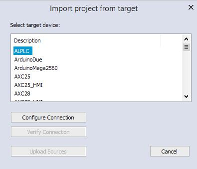

LogicLab user manual 

172) From the shown list select the target device from which you want to upload the pro

ject.

*3)* *Configure Connection* with correct parameters (see Paragraph 8.1 for more details).

4) You can test the connection with the target device by *Verify Connection* button. Logi

cLab tries to establish the connection and reports the test result.

5) If the connection is available confirm the operation by clicking on the *Upload Sources*

button. When the application upload completes successfully, the project is open and 

ready for editing.

### 4.3 SAVING THE PROJECT 

#### 4.3.1 PERSISTING CHANGES TO THE PROJECT 

When you make any change to the project (for example, you add a new Program Organi

zation Unit) you are required to save the project in order to persist that change.

To save the project, you can select the corresponding item *File>Save project* .

#### 4.3.2 SAVING TO AN ALTERNATIVE LOCATION 

You can also use the *File>Save project As ...* command to rename the project, change its 

format or modify the location of where you want save the file.

LogicLab asks you to select the new destination (which must be an empty directory), then 

saves a copy of the project to that location and opens this new project file for editing.

#### 4.3.3 AUTOSAVE 

LogicLab includes an  AutoSave  feature that periodically saves your project as you work 

on it.

 AutoSave  saves data in a separate folder, called  Backup , stored at the same location of 

the project folder.

 AutoSave  protects your project in the event that LogicLab unexpectedly quits. When Logi

cLab is started again, if the  Backup  folder is present, you are asked to restore the last 

18 

LogicLab user manualvalid backup file of the project.

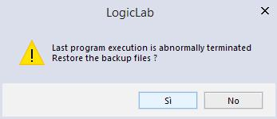

When you close LogicLab correctly the *Backup* folder and its contents are deleted. You can specify the interval time (in minutes) between saving.

#### 4.3.4 BACKUP COPIES 

LogicLab includes a backup feature of the previous version of the project on which you 

are working.

When you explicitly save the project, LogicLab saves the current version (before save) of 

the project in the *PreviousVersions* folder stored at the same location of the project folder;

You can set the upper limit of the backup files to be kept on your PC. By default this is 10,

set to 0 if you want to disable this feature (see Paragraph 3.6 for more details).

### 4.4 MANAGING EXISTING PROJECTS 

#### 4.4.1 OPENING AN EXISTING LOGICLAB PROJECT 

To open an existing project, click *File>Open project* of LogicLab’s main window, or in the 

*Welcome page* (when no project is open). This causes a dialog box to appear, which lets 

you load the directory containing the project and select the relative project file.

#### 4.4.2 EDITING THE PROJECT 

In order to modify an element of a project, you need first to open that element by double

clicking its name, which you can find by browsing the tree structure of the project tab of

the *Workspace* bar.

By double-clicking the name of the object you want to modify, you open an editor consist

ent with the object type: for example, when you double-click the name of a project POU, 

the appropriate source code editor is shown; if you double-click the name of a global vari

able, the variable editor is shown.

Note that LogicLab prevents you from applying changes to elements of a project, when at 

least one of the following conditions holds:

\- you are in debug mode.

\- It is an object of an included library (whereas you can modify an object that you im

ported from a library).

\- The project is opened in read-only mode (view project).

LogicLab user manual 

19
#### 4.4.3 CLOSING THE PROJECT 

You can terminate the working session either by explicitly closing the project or by exiting 

LogicLab. In both cases, when there are changes not yet persisted to file, LogicLab asks 

you to choose between saving and discarding them.

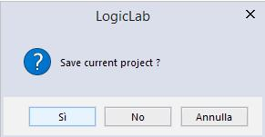

To close the project, select the item *File>Close project* ; LogicLab shows the *Welcome* 

*page*, so that you can rapidly start a new working session.

### 4.5 DISTRIBUTING PROJECTS 

When you need to share a project with another developer you can send him/her either a 

copy of the project file(s) or a redistributable source module (RSM) generated by Logi

cLab.

In the former case, the number of files you have to share depends on the format of the

project file:

\- PLC single project file ( . *ppjs* file extension): the project file itself contains the whole

information needed to run the application (assuming the receiving developer has an ap

propriate available target device) including all source code modules, so that you need 

to share only the  . *ppjs* file.

\- PLC multiple project file ( . *ppjx* or  . *ppj* file extension): the project file contains only the

links to the source code modules composing the project, which are stored as single files

in the project directory. You need to share the whole directory.

\- Full XML PLC project file (.*plcprj*): the project file is generated entirely in XML language.

The information contained in the project file and its behaviour are the same as .*ppjs*

file extension.

Alternatively, you can generate a redistributable source module (RSM) with the corre

sponding item *Project>Generate redistributable source module* .

LogicLab notifies you of the name of the RSM file and lets you choose whether to protect

the file with a password or not. If you choose to protect the file, LogicLab asks you to 

insert the password.

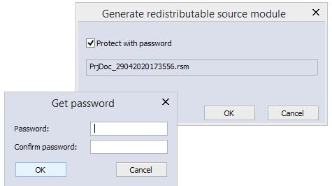

The advantages of the RSM file format are:

\- the source code is encoded in binary format, thus it cannot be read by third parties 

which do not use LogicLab, making a transfer over the Internet more secure;

\- it can be protected with a password, which will be required by LogicLab on file opening;

\- being a binary file, its size is reduced.

20 

LogicLab user manual
### 4.6 PROJECT OPTIONS 

You can edit some significant project properties choosing *Project>Options...* .

#### 4.6.1 GENERAL 

Here you can set some basic properties related to the project, such as its application 

name and version.

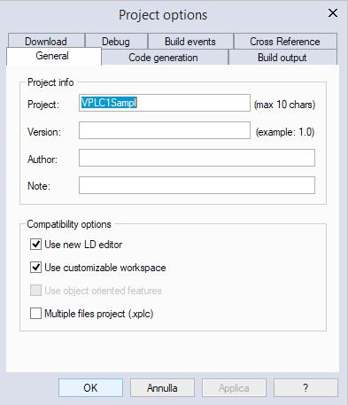

\- *Use new LD editor*: the new Ladder Diagram editor is easier to use, by helping you in 

common operations working on the diagram will be faster and more efficient. Note that,

by default, this option is active.

\- *Use customizable workspace*: allows you to manage your project tree in order to reach 

a more efficient workspace. Note that, by default, this option is active.

\- *Use object oriented feature:* allows you to use object oriented programming; this fea

ture may not be always available, it depends on the target device implementation.

\- *Multiple files project:* allows you to save project in .xplc format.

#### 4.6.2 CODE GENERATION 

Here you can edit some properties about code generation.

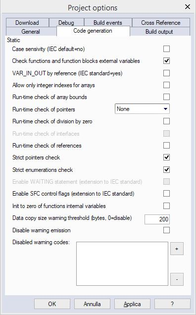

LogicLab user manual 

21- *Case sensitivity*: you can set the project as case-sensitive checking this option. Note 

that, by default, this option is not active.

\- *Check function and function block external variables*: if this option is disabled, all func

tions and function blocks can access to global variables without declaring them as ex

ternal variables. Note that, by default, this option is enabled respecting the IEC 61131-3 

standard.

\- *VAR_IN_OUT by reference*: if checked, the variables declared as VAR_IN_OUT of a func

tion block will be treated as reference variables, accordingly to IEC standards.

\- *Allow only integer indexes for arrays*: if this option is checked you cannot use *BYTE,* 

*WORD* or *DWORD* as array indexes.

\- *Run-time check of array bounds*: if this option is checked some check code is added to 

verify that array indexes are not out of bounds during run-time. This option can be set 

depending on target device.

\- *Run-time check of pointers*: this combo allows you to choose if and when the pointer 

will be tested for their validity before their use. Selecting *NONE,* the check will never 

be done; selecting *FULL*, the check will always be done, under every circumstances; 

selecting *ONLY IF NOT NULL*, the check will be done only if the pointer value is not null.

The check is done by calling a user-defined function checkptr on target. Therefore this 

option can be set depending on target device.

\- *Run-time check of division by zero*: if this option is checked some check code is added 

to verify that divisions by zero are not performed on arrays during run-time. This option 

can be set depending on target device.

\- *Run-time check of references*: if this option is checked, allows a references validity 

check; if a reference is dereferenced to *null*, a runtime error is generated. This option 

can be set depending on target device

\- *Strict pointers check*: if enabled, pointer and pointed type validity check is added. The 

type of a pointer variable must be the same of its pointed variable; if not, an error is 

generated.

\- *Strict enumerations check*: if enabled, enumeration assignment type validity check is 

added. You can assign enum only to the same type; if not, an error is generated.

\- *Enable WAITING statement (extension to standard)*: if this option is checked the *WAIT*

*ING* construct for the ST language is added as IEC 61131-3 extension (see Paragraph 

11.7.3 for more details).

\- *Enable SFC control flags (extension to standard)*: if this option is checked, HOLD and 

RESET flags for SFC POU are enabled.

\- *Init to zero of function internal variables*: if this option is checked, the initial value of the 

internal varaibles of the functions, will be set to zero as default.

\- *Data copy size warning threshold (bytes, 0=disable)*: when arrays or structures are 

copied, if their dimension exceed the specified threshold, a warning is emitted in order

to inform the possible loss of performance of the PLC. If the threshold is set to 0, no 

warnings are emitted.

\- *Disable warning emission*: if this option is checked warning emissions are not printed 

on the output window.

\- *Disable warning codes*: you can specify a list of warning code that will not be printed on 

the output window.

#### 4.6.3 BUILD OUTPUT 

Here you can edit some significant properties of the output files generated by compiling

operation.

22 

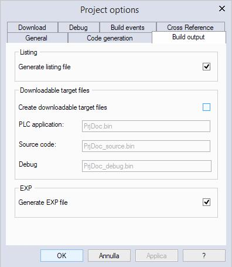

LogicLab user manual Listing section 

\- *Generate listing file*: if this option is checked the compiler will generate a listing file

named as *projectname.lst*.

 Downloadable target files section 

\- *Create downloadable target files*: if this option is checked the compiler will generate the 

binary files that can be downloaded to the target. You can specify custom filenames or

use default ones.

 Please note that only valid Windows filename are accepted! 

\- *PLC application* (active only if *Create downloadable target files* is checked): this field

specifies the name of the PLC application binary file. By default *projectname.bin *.  

\- *Source code* (active only if *Create downloadable target files* is checked): this field

specifies the name of the Source code binary file. By default *projectname._source.bin*. 

\- *Debug* (active only if *Create downloadable target files* is checked): this field specifies

the name of the Debug symbol binary file. By default *projectname._debug.bin*

 Generate EXP file section 

\- *Generate EXP file*: if this option is checked the compiler will generate an EXP file named

as *projectname.exp*

#### 4.6.4 DOWNLOAD 

Here you can edit some significant properties of the download behaviour (see Paragraph

8.3.1 for more information).

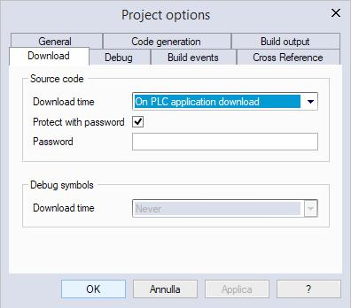

LogicLab user manual 

23

#### 4.6.5 DEBUG 

Here you can edit some significant properties of the debug behaviour.

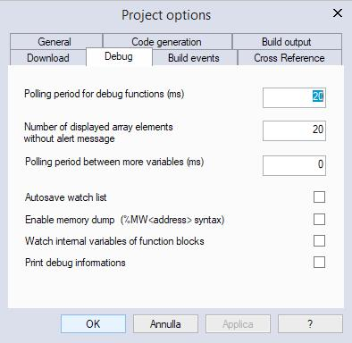

\- *Polling period for debug function* (ms): set the active sampling period of the functions’s 

status.

\- *Number of displayed array elements without alert message*: specifies the maximum

number of array elements to be added in watch window without being alerted.

\- *Polling period between more variables* (ms): set the sleep period between sampling 

two variables.

\- *Autosave watch list*: if checked (not by default) the watch list status will be saved into 

a file, when the project is closed (see Paragraph 9.1.7 for more details).

\- *Enable memory dump*: advanced debug feature, allows the user to put in watch directly 

physical memory addresses (with format %MW without subindexes)

\- *Watch internal variables of function block*: when putting a function block instance in 

watch you’ll see also the internal variable values; with this option disabled, only the 

input and output variables of that function block will be displayed in the watch.

\- *Print debug informations*: when compiling, additional information are shown in the out

put window.

#### 4.6.6 BUILD EVENTS 

Here you can specify commands that run before the build starts or after the build finishes.

You can also use a set of defined environment variables listed on the top of the window.

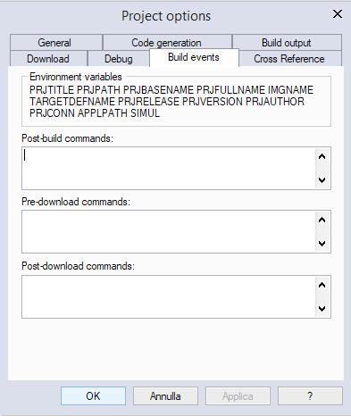

24 

LogicLab user manual

 #### 4.6.7 CROSS REFERENCE 

This window allows you to enable the cross reference.

Since using the cross reference will generate additional information, making the project a 

little heavier, it has to be explicitly enabled.

This window allows you also to set the list of elements that will be searched when execut

ing a cross reference research.

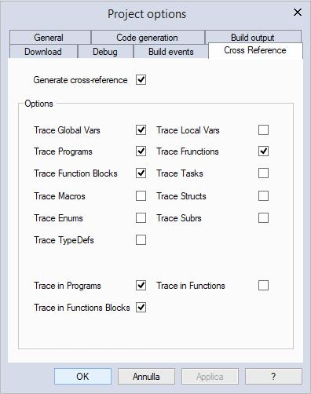

##### 4.6.7.1 USING THE CROSS REFERENCE 

Once the cross reference has been enabled, open the relative window selecting 

*View > Tool window > Cross reference* ; the following window should be opened:

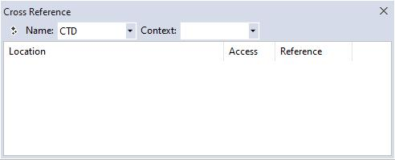

In the menu labeled *Name:* you will see a collection of all the symbols found by the 

system looking into the groups selected in the Cross reference panel. You can select a 

symbol from that menu, or you can press the automatic cross reference button:

and simply select a symbol from the project tree.

LogicLab user manual 

25Once you have selected a symbol, the cross reference window will show you all the oc

currences of that symbol and information such as: location of the POU where it’s used, 

how it is used and where it is used inside the POU.

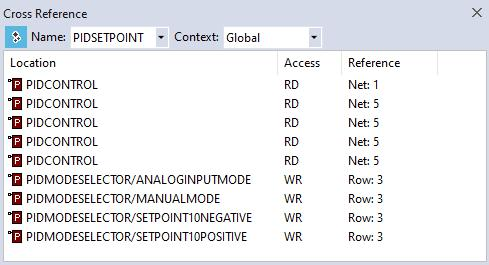

From the menu labeled *Context:* you can filter the result.

By double clicking one of the occurrences in the result list, the relative POU window will 

be opened and the element (code line or block) where the symbol is used will be high

lighted.

### 4.7 SELECTING THE TARGET DEVICE 

You may need to port a PLC application on a target device which differs from the one you

originally wrote the code for. Follow the instructions below to adapt your LogicLab project 

to a new target device.

1) Click *Project>Select target* menu of the LogicLab main window. This causes the fol

lowing dialog box to appear.

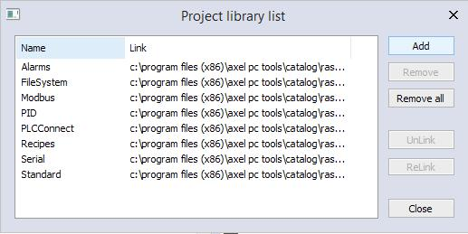

2) Select one of the target devices listed in the combo box.

3) Click *Change* to confirm your choice, *Cancel* to abort.

4) If you confirm, LogicLab displays the following dialog box.

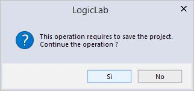

Press *Yes* to complete the conversion, *No* to quit.

If you press *Yes*, LogicLab updates the project to work with the new target.

26 

LogicLab user manualIt also makes a backup copy of the project file(s) in a sub-directory inside the project

directory, so that you can roll-back the operation by manually (i.e., using Windows 

Explorer) replacing the project file(s) with the backup copy. 

### 4.8 WORKING WITH LIBRARIES 

Libraries are a powerful tool for sharing objects between LogicLab projects. Libraries are 

usually stored in dedicated source file, whose extension is  .pll .

#### 4.8.1 THE LIBRARY MANAGER

The library manager lists all the libraries currently included in a LogicLab project. It also 

allows you to include or remove libraries.

To access the library manager, click *Project>Library manager* .

##### 4.8.1.1 INCLUDING A LIBRARY 

The following procedure shows you how to include a library in a LogicLab project, which 

results in all the library’s objects becoming available to the current project.

Including a library means that a reference to the library’s *.pll* file is added to the current

project, and that a local copy of the library is made. Note that you cannot edit the ele

ments of an included library, unlike imported objects.

If you want to copy or move a project which includes one or more libraries, make sure 

that references to those libraries are still valid in the new location.

1) Click *Project>Library manager* , which opens the *Library manager* dialog box.

2) Press the *Add* button, which causes an explorer dialog box to appear, to let you select 

the *.pll* file of the library you want to open.

3) When you have found the *.pll* file, open it either by double-clicking it or by pressing

the *Open* button. The name of the library and its absolute pathname are now dis

played in a new row at the bottom of the list in the white box.

4) Repeat step 1, 2, and 3 for all the libraries you wish to include.

5) When you have finished including libraries, press either *OK* to confirm, or *Cancel* to 

quit. 

##### 4.8.1.2 REMOVING A LIBRARY 

The following procedure shows you how to remove an included library from the current 

project. Remember that removing a library does not mean erasing the library itself, but 

the project’s reference to it.

1) Click *Project>Library manager* menu of the LogicLab main window, which opens the 

*Library manager* dialog box.

LogicLab user manual 

27Select the library you wish to remove by clicking its name once. The *Remove* button 

is now enabled.

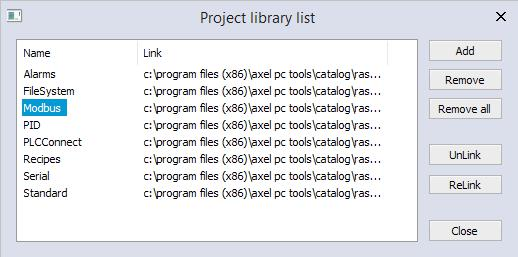

2) Click the *Remove* button, which causes the reference to the selected library to disap

pear from the *Project library* list.

3) Repeat for all the libraries you wish to remove. Alternatively, if you want to remove 

all the libraries, you can press the *Remove all* button.

4) When you have finished removing libraries, press either *OK* to confirm, or *Cancel* not 

to apply changes.

#### 4.8.2 EXPORTING TO A LIBRARY 

You may export an object from the currently open project to a library, in order to make 

that object available to other projects. The following procedure shows you how to export 

objects to a library.

1) Look for the object you want to export by browsing the tree structure of the project 

tab of the *Workspace* bar, then click once the name of the object.

2) Click *Project>Export object to library* . This causes the following dialog box to appear.

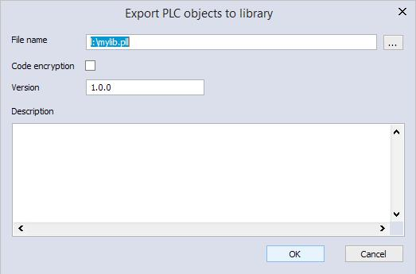

3) Enter the destination library by specifying the location of its *.pll* file. You can do this

by:

\- typing the full pathname in the white text box;

\- clicking the *Browse* button , in order to open an explorer dialog box which allows 

you to browse your disk and the network.

4) You may optionally choose to encrypt the source code of the POU you are exporting, 

28 

LogicLab user manualin order to protect your intellectual property.

5) If you chose and already existing library file, you can enter a version number in the

*version* field in order to keep track of library changes.

6) Click *OK* to confirm the operation, otherwise press *Cancel* to quit.

If at Step 3 of this procedure you enter the name of a non-existing *.pll* file, LogicLab cre

ates the file, thus establishing a new library.

##### 4.8.2.1 UNDOING EXPORT TO A LIBRARY 

So far, it is not possible to undo export to a library. The only possibility to remove an ob

ject is to create another library containing all the objects of the current one, except the 

one you wish to delete.

#### 4.8.3 IMPORTING FROM A LIBRARY OR ANOTHER SOURCE 

You can import an object from a library in order to use it in the current project. When 

you import an object from a library, the local copy of the object loses its reference to the 

original library and it belongs exclusively to the current project. Therefore, you can edit 

imported objects, unlike objects of included libraries. 

There are two ways of getting a POU from a library. The following procedure shows you 

how to import objects from a library.

1) Click *Project>Import objects* . This causes an explorer dialog box to appear, which 

lets you select the *.pll* file of the library you want to open.

2) When you have found the *.pll* file, open it either by double-clicking it or by pressing

the *Open* button. The dialog box of the library explorer appears in foreground. Each 

tab in the dialog box contains a list of objects of a type consistent with the tab’s title.

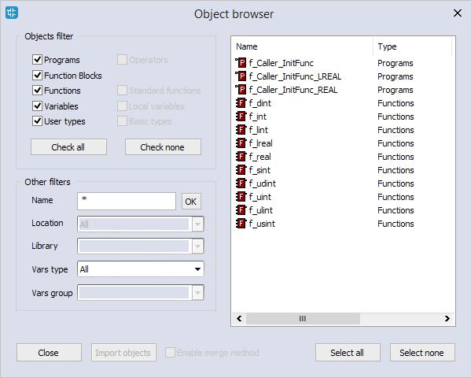

3) Select the tab of the type of the object(s) you want to import. You can also make 

simple queries on the objects in each tab by using *Filters*. However, note that only the 

*Name* filter actually applies to libraries. To use it, select a tab, then enter the name

of the desired object(s), even using the   * wildcard, if necessary.

4) Select the object(s) you want to import, then press the *Import object* button.

5) When you have finished importing objects, press indifferently *OK* or *Cancel* to close 

the *Library* browser.

LogicLab user manual 

29 
##### 4.8.3.1 UNDOING IMPORT FROM A LIBRARY 

When you import an object in a LogicLab project, you actually make a local copy of that 

object. Therefore, you just need to delete the local object in order to undo import.

##### 4.8.3.2 MERGE FUNCTION 

When you import objects in a LogicLab project or insert a copied mapped variable, you 

may encounter an overlapping address or duplicate naming warning.

By setting the corresponding environment options (see Paragraph 3.6 for more details) 

you can choose the behaviour that LogicLab should keep when encountering those prob

lems.

The possible actions are:

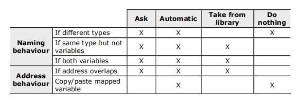

\- *Ask* (default): user has to decide every time an action is required.

\- *Automatic*: a valid name or address is automatically generated by LogicLab and as

signed to the imported object.

\- *Take from library*: the name or the address is taken from the imported object.

\- *Do nothing*: the name or the address of the objects in the project are not modified.

After importing objects, LogicLab generates a log file in the project folder with detailed

info.

#### 4.8.4 UPDATING EXISTING LIBRARIES 

If you edit a linked library file you can refresh its content on the project without closing

LogicLab.

1) Click *Project>Refresh all libraries* .

2) If the file is correct, LogicLab updates the linked library content and prints a success

ful message in the output window, otherwise no changes are made on the existing 

linked library.

30 

LogicLab user manual 
