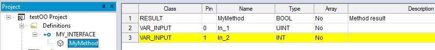

## 5. MANAGING PROJECT ELEMENTS 

This chapter shows you how to deal with the elements which compose a project, namely: 

Program Organization Units (briefly, POUs), tasks, derived data types, and variables.

### 5.1 PROGRAM ORGANIZATION UNITS 

A POU is a Program Organization Unit of type Program, Function or Function block.

This paragraph shows you how to add new POUs to the project, how to edit and eventu

ally remove them.

In paragraph 5.1 we will be using a program as example of a generic POU, but the same 

can be achieved also for functions and function blocks

#### 5.1.1 CREATING A NEW PROGRAM ORGANIZATION UNIT 

In order to Add a POU select the appropriate voice of the menu 

*Project>New Object>New program* 

Please note that the item of the sub-menu may change according to the type of the POU 

you want to create.

LogicLab will show you a dialog box in where you must select the specific language for the

new POU and enter its name.

Confirm the operation by clicking on the OK button.

Alternatively, you can create a new POU from the context menu by selecting a folder or 

the root element of the project (see Paragraph 5.7.4).

After creating a new program, an alert icon (interrogation mark) appears below the new 

program icon.

This alert icon indicates that the program is not yet associated to a task. Refer to para

graph 5.3.1 to assign the program to the desired task.

LogicLab user manual 

31
##### 5.1.1.1 ASSIGNING A PROGRAM TO A TASK AT CREATION TIME 

When creating a new program, LogicLab gives you the chance to assign that program to 

a task at the same time: select the task you want the program to be assigned to from the 

list shown in the  Task  section of the  New program  window.

#### 5.1.2 EDITING POUS 

To edit a POU, open it by double-clicking it from the project tree. The relative editor opens 

and lets you modify the source code of the POU. 

 Changing the name of the POU: 

Select a POU from the project tree then open its context menu by right-clicking on its 

icon, choose *Rename Program* . 

 Duplicating a POU: 

Select a POU from the project tree then choose the appropriate voice of the menu 

*Project>Duplicate object* . 

Enter the name of the new duplicated POU and confirm the operation.

 Deleting POUs 

Select a POU from the project tree then choose the appropriate voice of the menu 

*Project>Delete Object* .

Confirm the operation to delete the POU.

 Editing POU properties 

Select a POU from the project tree then open its context menu by right-clicking on its 

icon, choose *Edit Program Properties* .

32 

LogicLab user manualA window will appear allowing you to edit information such as version number, description 

and, if the POU is a function or a function block, also the icon and the image.

The icon must have a maximum size of 100x100 pixels; if added, the icon will be dis

played overlaying to the block when it is used in a graphic language (LD or FBD)

The images must have a maximum weight of 30 KB per image. You can display imported

images in the description windows by linking them with HTML syntax; check the *use HTML* 

*syntax* box and then use *;* to add the image to the description.

 View POU properties: 

Select a POU from the project tree then choose the appropriate voice of the menu 

*Project > View PLC object properties* .

 Exclude from build: 

Select a POU and right-click on it to open its context menu, from there select 

*Exclude from build* . Doing so the POU will be ignored when compiling the project, even if 

the POU is used in the project.

For example: if a program as been already assigned to a task, you can avoid to compile it 

by selecting “exclude from build” instead of removing the program from the task; this will 

allow you to change the project behaviour without changing the project tree.

Be careful, excluding from build a POU that is required by another element will generate 

an error message. For example: if you exclude from build a function which is called by a 

program, when compiling the program you’ll obtain en error message. 

#### 5.1.3 SOURCE CODE ENCRYPTION/DECRYPTION 

LogicLab can encrypt POUs and protect them with a password, hiding the source code of 

the POU.

 Encrypting a POU: 

Select a POU from the project tree then choose the *[Crypt]* voice of the context menu

Double enter the password and confirm the operation.

LogicLab shows in the project tree a special marker icon that overlays the standard POU 

icon in order to inform the user that the POU is crypted.

 Decrypting a POU: 

Select a POU from the project tree then choose the *[Decrypt]* voice of the context menu

 Encrypting all POUs: 

Select the root element from the project tree then choose the *[Crypt all objects]* voice of 

the context menu.

All POUs will be encrypted with the same password.

 Decrypt all POUs: 

Select the root element from the project tree then choose the *[Decrypt all objects]* voice 

of the context menu.

LogicLab user manual 

33
### 5.2 VARIABLES 

There are two classes of variables in LogicLab: global variables and local variables.

This paragraph shows you how to add to the project, edit, and eventually remove both 

global and local variables.

#### 5.2.1 GLOBAL VARIABLES 

Global variables can be seen and referenced by any module of the project.

##### 5.2.1.1 CLASSES OF GLOBAL VARIABLES 

Global variables are organized in special folders of the project tree called  G *lobal_vars*. 

Those variables are classified according to their properties as:

\- Automatics: the compiler automatically allocates them to an appropriate location in the 

target device memory.

\- Mapped: they have an assigned address in the target device logical addressing system, 

which shall be specified by the developer.

\- Constants: are declared having the CONSTANT attribute; They cannot be written.

\- Retains: they are declared having the RETAIN attribute; Their values are stored in a 

persistent memory area of the target device.

##### 5.2.1.2 CREATING A NEW GLOBAL VARIABLE 

1) In order to create a new global variable select a *Global variables group* from the project 

tree then choose the appropriate voice from the menu *Project>New Object>New variable*

(see Paragraph 5.7.4).

2) LogicLab will show you a dialog box where you must enter the name of the variable 

(remember that some characters, such as ‘?’, ‘.’, ‘/’, and so on, cannot be used: the 

variable name must be a valid IEC 61131-3 identifier).

3) Specify the type of the variable either by typing it or by selecting it from the list that 

LogicLab displays when you click on the *Browse* button.

If you want to declare an array, you must specify its size.

34 

LogicLab user manual4) You may optionally assign the initial value to the variable or to the single elements 

of the array.

If you create a new mapped variable, you are required to specify the address of the vari

able during its definition. In order to do so, you may do one of the following actions:

\- Click on the button to open the editor of the address, then enter the desired value.

\- Select from the list that LogicLab shows you the memory area you want to use: the tool 

automatically calculates the address of the first free memory location of that area.

##### 5.2.1.3 EDITING A GLOBAL VARIABLE 

To edit the definition of an existing global variable, open it by double-clicking it, or the

folder that it belongs to, from the project tree. The global variables editor opens and lets 

you modify its definition.

LogicLab user manual 

35 Changing the name of the variable: 

Select the variable you want to rename from the project tree then right-click on it and 

select *Rename Variable* from the context menu.

 Duplicating a variable: 

Select the variable you want to duplicate from the project tree then right-click on it and 

choose *Duplicate Variable* from the context menu.

Enter the name of the new duplicated variable and confirm.

 Deleting a variable: 

Select the variable you want to delete from the project tree then right-click on it and 

choose *Delete Variable* from the context menu.

Confirm the operation to delete the variable.

 Refactoring a variable: 

Refactoring will allow you to change the name of a global variable and consequently 

adjust all of its occurrences in the project.

Select the desired variable from the project tree, then right-click on it and choose 

*Refactoring* from the context menu.

A window will appear allowing you to insert a new variable name and showing you all 

the occurrences found for this symbol; if you change the name and press *OK*, all the 

shown occurrences will be modified.

#### 5.2.2 LOCAL VARIABLES 

Local variables are declared within a POU (either program, or function, or function block), 

the module itself is the only project element that can refer to and access them.

Local variables are listed in the project tree under the POU which declares them (only 

when that POU is open for editing), where they are further classified according to their

class (e.g., as input or inout variables).

36 

LogicLab user manualIn order to create, edit, and delete local variables, you have to open the POU for editing 

and use the local variables editor. The project needs to be saved in order to update the 

POU branch structure of the project tree, including the changes applied to the local vari

ables.

Refer to the corresponding section in this manual for details (see Paragraph 6.6.1.2).

#### 5.2.3 CREATING MULTIPLE VARIABLES 

LogicLab allows you to create multiple variables in one shot.

Open the POU for editing then choose the appropriate voice of the menu 

*Variables>Create multiple* .

LogicLab will show you a dialog box where you must specify the prefix and the suffix to

name of the new variables.

1) Select the type of the variables.

2) Choose type and attribute for the variables.

3) Insert the number of the variables you want to create specifying the start index, 

the end index and the step value. You can see an example of the generated variable 

names at the bottom of the dialog.

LogicLab user manual 

37
#### 5.2.4 TEXTUAL EDITOR FOR VARIABLES 

Both global and local variables can be created and edited also from a textual editor; refer 

to the corresponding section in this manual for details (see Paragraph 6.6)

### 5.3 TASKS 

#### 5.3.1 ASSIGNING A PROGRAM TO A TASK 

1) Select the task where you want to add the program from the project tree then choose 

the *[Add program]* voice of the context menu.

2) Select the program you want to be executed by the task from the list which shows up 

and confirm your choice.

3) The program has been assigned to the task, as you can see in the project tree.

Note that you can assign more than a program to a task. From the contextual menu you 

can sort and, eventually, remove program assignments to tasks.

38 

LogicLab user manual 
#### 5.3.2 TASK CONFIGURATION 

Depending on the target device you are interfacing with, you may have the chance to 

configure some of the PLC tasks’ settings.

Select the tasks element from the project tree then choose the *[Task configuration]* voice 

of the context menu.

In the *Task configuration* window you can edit the task execution period.

### 5.4 DERIVED DATA TYPES 

The derived data type is a complex classification that identifies one or various data types

and is made up of primitive data types. 

User has the flexibility to create those own types that have advanced properties and uses

far beyond those of the basic primitive data types.

In order to create a new data type you have to select the root element of the pro

ject tree, then you can either open the context menu and choose the appropriate 

voice from *Add > New definition* , or you can choose the appropriate voice from 

*Project > New Object > New definition* 

*.*

In both cases you will have to choose from six different derived data types, which will be

described in the following paragraphs

#### 5.4.1 TYPEDEFS 

##### 5.4.1.1 CREATING A NEW TYPEDEF 

In order to create a Typedef select *Typedef* voice when creating a new definition.

LogicLab will show you a dialog box where you must specify the name of the new typedef 

and select the type you are defining an alias for:

LogicLab user manual 

39(if you want to define an alias for an array type, you shall choose the array size).

Enter a meaningful description (optional) and confirm the operation.

##### 5.4.1.2 EDITING A TYPEDEF 

In order to edit an existing typedef you have to double-click it from the Project tree. The 

associated editor opens and lets you modify its definition.

##### 5.4.1.3 OTHER ACTIONS FOR TYPEDEFS 

If you open the context menu of a Typedef, by selecting it from the project tree and right

clicking it, you will see different actions that can be done with Typedefs:

 Deleting a Typedef: 

In order to delete a Typedef, select it from the Project tree then choose the *Delete*

voice of the context menu.

 Duplicating a Typedef: 

In order to duplicate a Typedef, select it from the Project tree then choose the *Duplicate*

voice of the context menu.

A window will appear asking you a new name for the duplicated Typedef.

 Refactoring a Typedef: 

Refactoring will allow you to change the name of a Typedef and consequently adjust all 

of its occurrences in the project.

Select the desired typedef from the project tree, then right-click on it and choose the

*Refactoring* voice from the context menu.

A window will appear allowing you to insert a new name and showing you all the oc

currences found for this symbol; if you change the name and press *OK*, all the shown 

occurrences will be modified.

 Typedef properties: 

In order to edit the properties of a Typedef, select it from the Project tree then choose 

*Edit properties* . A window will open allowing you to insert information such as ver

sion number, description, icon and images. Once imported, images can be used in the 

description by checking the *Use HTML syntax* checkbox and linking the imported image 

with HTML syntax, like .

40 

LogicLab user manualTo view the properties of a Typedef, select it form the project tree then choose 

*View properties* . 

#### 5.4.2 STRUCTURES 

##### 5.4.2.1 CREATING A NEW STRUCTURE 

In order to create a structure select *Structure* voice when creating a new definition.

LogicLab will show you a dialog box where you must specify the name of the new struc

ture and a meaningful description, then confirm the operation.

##### 5.4.2.2 EDITING A STRUCTURE 

In order to edit an existing structure, open it by double-clicking it from the Project tree. 

The associated editor opens and lets you modify its definition and fields.

##### 5.4.2.3 OTHER ACTIONS FOR STRUCTURES 

If you open the context menu of a Structure, by selecting it from the project tree and 

right-clicking it, you will see different actions that can be done with Structures:

 Deleting a Structure: 

In order to delete a Structure, select it from the Project tree then choose the *Delete*

voice of the context menu.

 Duplicating a Structure: 

In order to duplicate a Structure, select it from the Project tree then choose the 

*Duplicate* voice of the context menu.

A window will appear asking you a new name for the duplicated Structure.

 Refactoring a Structure: 

Refactoring will allow you to change the name of a Structure and consequently adjust all 

of its occurrences in the project.

Select the desired Structure from the project tree, then right-click on it and choose the

*Refactoring* voice from the context menu.

A window will appear allowing you to insert a new name and showing you all the oc

currences found for this symbol; if you change the name and press *OK*, all the shown 

occurrences will be modified.

LogicLab user manual 

41 Structure properties: 

In order to edit the properties of a Structure, select it from the Project tree then choose 

*Edit properties* . A window will open allowing you to insert information such as ver

sion number, description, icon and images. Once imported, images can be used in the 

description by checking the *Use HTML syntax* checkbox and linking the imported image 

with HTML syntax, like .

To view the properties of a Structure, select it form the project tree then choose 

*View properties* . 

#### 5.4.3 ENUMERATIONS 

##### 5.4.3.1 CREATING A NEW ENUMERATION 

In order to create a new Enumerations select *Enumeration* voice when creating a new 

definition.

LogicLab will show you a dialog box where you must specify the name of the new enu

meration and a meaningful description, then confirm the operation.

##### 5.4.3.2 EDITING AN ENUMERATION 

In order to edit an existing structure, open it by double-clicking it from the Project tree. 

The associated editor opens and lets you modify its definition and the initialization values

of its elements.

##### 5.4.3.3 OTHER ACTIONS FOR ENUMERATIONS 

If you open the context menu of an enumeration, by selecting it from the project tree and 

right-clicking it, you will see different actions that can be done with enumerations:

 Deleting an Enumeration: 

In order to delete an enumeration, select it from the Project tree then choose the 

*Delete* voice of the context menu.

 Duplicating an Enumeration: 

In order to duplicate an enumeration, select it from the Project tree then choose the 

*Duplicate* voice of the context menu.

A window will appear asking you a new name for the duplicated enumeration.

42 

LogicLab user manual Refactoring an Enumeration: 

Refactoring will allow you to change the name of an enumeration and consequently ad

just all of its occurrences in the project.

Select the desired enumeration from the project tree, then right-click on it and choose 

the *Refactoring* voice from the context menu.

A window will appear allowing you to insert a new name and showing you all the oc

currences found for this symbol; if you change the name and press *OK*, all the shown 

occurrences will be modified.

 Enumeration properties: 

In order to edit the properties of an enumeration, select it from the Project tree then 

choose *Edit properties* . A window will open allowing you to insert information such as 

version number, description, icon and images. Once imported, images can be used in 

the description by checking the *Use HTML syntax* checkbox and linking the imported im

age with HTML syntax, like .

To view the properties of an enumeration, select it form the project tree then choose 

*View properties* . 

#### 5.4.4 SUBRANGES 

##### 5.4.4.1 CREATING A NEW SUBRANGE 

In order to create a new subrange select *Subrange* voice when creating a new definition.

LogicLab will show you a dialog box where you must specify the name of the new sub

range, select its basic type and enter the minimum and the maximum values for the 

subrage; optionally you can enter a meaningful description.

##### 5.4.4.2 EDITING A SUBRANGE 

In order to edit an existing subrange, open it by double-clicking it from the Project tree. 

The associated editor opens and lets you modify its definition.

LogicLab user manual 

43

##### 5.4.4.3 OTHER ACTIONS FOR SUBRANGE 

If you open the context menu of a subrange, by selecting it from the project tree and 

right-clicking it, you will see different actions that can be done with subranges:

 Deleting a Subrange: 

In order to delete a subrange, select it from the Project tree then choose the *Delete*

voice of the context menu.

 Duplicating a Subrange: 

In order to duplicate a subrange, select it from the Project tree then choose the 

*Duplicate* voice of the context menu.

A window will appear asking you a new name for the duplicated subrange.

 Refactoring a Subrange: 

Refactoring will allow you to change the name of a subrange and consequently adjust all 

of its occurrences in the project.

Select the desired subrange from the project tree, then right-click on it and choose the

*Refactoring* voice from the context menu.

A window will appear allowing you to insert a new name and showing you all the oc

currences found for this symbol; if you change the name and press *OK*, all the shown 

occurrences will be modified.

 Subrange properties: 

In order to edit the properties of a subrange, select it from the Project tree then choose 

*Edit properties* . A window will open allowing you to insert information such as ver

sion number, description, icon and images. Once imported, images can be used in the 

description by checking the *Use HTML syntax* checkbox and linking the imported image 

with HTML syntax, like .

To view the properties of a subrange, select it form the project tree then choose 

*View properties* . 

#### 5.4.5 MACROS 

##### 5.4.5.1 CREATING A NEW MACRO 

In order to create a new macro select *Macro* voice when creating a new definition.

LogicLab will show you a dialog box where you must specify the name of the new macro 

and its language, only IL and ST are allowed (*see chapter 11.7.1 for further details*). 

44 

LogicLab user manual
##### 5.4.5.2 EDITING A MACRO 

In order to edit an existing macro, open it by double-clicking it from the Project tree. The 

associated editor opens and lets you modify its definition, the parameters and its code.

##### 5.4.5.3 OTHER ACTIONS FOR MACROS 

If you open the context menu of a macro, by selecting it from the project tree and right

clicking it, you will see different actions that can be done with macros:

 Deleting a macro: 

In order to delete a macro, select it from the Project tree then choose the *Delete* voice 

of the context menu.

 Duplicating a macro: 

In order to duplicate a macro, select it from the Project tree then choose the *Duplicate*

voice of the context menu.

A window will appear asking you a new name for the duplicated macro.

 Refactoring a macro: 

Refactoring will allow you to change the name of a macro and consequently adjust all of 

its occurrences in the project.

Select the desired macro from the project tree, then right-click on it and choose the

*Refactoring* voice from the context menu.

A window will appear allowing you to insert a new name and showing you all the oc

currences found for this symbol; if you change the name and press *OK*, all the shown 

occurrences will be modified.

 Macro properties: 

In order to edit the properties of a macro, select it from the Project tree then choose 

*Edit properties* . A window will open allowing you to insert information such as ver

sion number, description, icon and images. Once imported, images can be used in the 

description by checking the *Use HTML syntax* checkbox and linking the imported image 

with HTML syntax, like .

To view the properties of a macro, select it form the project tree then choose 

*View properties* .

LogicLab user manual 

45

#### 5.4.6 INTERFACES 

##### 5.4.6.1 CREATING A NEW INTERFACE 

In order to create a new interface select *Interface* voice when creating a new definition;

note that interfaces can be created only if Object Oriented Programming is enabled (*see* 

*paragraph 4.6.1*), and that depends on target implementation.

LogicLab will show you a dialog box where you must specify the name of the new macro 

and its language, only IL and ST are allowed (*see chapter 11.7.1 for further details*). 

##### 5.4.6.2 EDITING AN INTRFACE 

Interfaces cannot be edited, but you can add method to an interface and edit the method.

To add a new method, open the context menu of the interface, by selecting it in the Pro

ject tree and right-clicking on it, then choose *Add method prototype* ; a window will appear 

asking you to insert name and description of the method prototype.

The method prototype will be added to the Project tree; now double-clicking it will open 

its editor, allowing you to modify the method prototype.

##### 5.4.6.3 OTHER ACTIONS FOR INTERFACES 

If you open the context menu of an interface, by selecting it from the project tree and 

right-clicking it, you will see different actions that can be done with interfaces; same

things can be done with the method prototypes in the same way

 Deleting an interface or a method prototype: 

In order to delete the element, select it from the Project tree then choose the *Delete*

voice of the context menu.

 Duplicating an interface or a method prototype: 

In order to duplicate the element, select it from the Project tree then choose the 

*Duplicate* voice of the context menu.

A window will appear asking you a new name for the duplicated element.

 Refactoring an interface or a method prototype: 

Refactoring will allow you to change the name of the element and consequently adjust 

46 

LogicLab user manualall of its occurrences in the project.

Select the desired element from the project tree, then right-click on it and choose the

*Refactoring* voice from the context menu.

A window will appear allowing you to insert a new name and showing you all the oc

currences found for this symbol; if you change the name and press *OK*, all the shown 

occurrences will be modified.

 Interface and method prototype properties: 

In order to edit the properties of an element, select it from the Project tree then choose 

*Edit properties* . A window will open allowing you to insert information such as ver

sion number, description, icon and images. Once imported, images can be used in the 

description by checking the *Use HTML syntax* checkbox and linking the imported image 

with HTML syntax, like .

To view the properties of an element, select it form the project tree then choose 

*View properties* .

### 5.5 BROWSE THE PROJECT 

Projects may grow huge, hence LogicLab provides two tools to search for an object within 

a project: the *Object browser* and the *Find in project* feature.

#### 5.5.1 OBJECT BROWSER 

LogicLab provides a useful tool for browsing the objects of your project: the *Object* 

*Browser.* 

This tool is context dependent, this implies that the kind of objects that can be selected 

and that the available operations on the objects in the different contexts are not the same.

*Object browser* can be opened in these three main ways:

\- *Browser* mode.

\- *Import object* mode.

\- *Select object* mode.

User interaction with *Object browser* is mainly the same for all the three modes and is 

described in the next paragraph.

LogicLab user manual 

47  
##### 5.5.1.1 COMMON FEATURES AND USAGE OF OBJECT BROWSER 

This section describes the features and the usage of the *Object browser* that are common 

to every mode in which *Object browser* can be used.

 Objects filter 

This is the main filter of the *Object browser*. User can check one of the available (enabled) 

object items.

In this example, *Programs, Function Blocks, Functions* are selected, so objects of this 

type are shown in the object list. *Variables* and *User types* objects can be selected by user 

but objects of that type are not currently shown in the object list. *Operators, Standard* 

*functions, Local variables,* and *Basic types* cannot be checked by user (because of the 

context) so cannot be browsed.

User can also click *Check all* button to select all available objects at one time or can click 

*Check none* button to deselect all objects at one time.

 Other filters 

Selected objects can be also filtered by name, symbol location, specific library and var

type.

Filters are all additive and are immediately applied after setting.

| **Function**            | Filters objects on the base of their name.                   |
| ----------------------- | ------------------------------------------------------------ |
| **Set of legal values** | All the strings of characters.                               |
| **Use**                 | Type a string to display the specific object whose name matches the string.                        Use the wildcard if you want to display all the objects whose name contains the string in the *Name* text box. Type if you want to disable this filter Press Enter when edit box is focused or click on the OK button near the edit box to apply the filter. |
| **Applies to**          | All object types.                                            |

48 

| **Function**            | Filters objects on the base of their location                |
| ----------------------- | ------------------------------------------------------------ |
| **Set of legal values** | All, Project, Target, Library, Aux. Sources.                 |
| **Use**                 | All= Disables this filter. Project= Objects declared in the LogicLab project. Target= Firmware objects. Library= Objects contained in a library. In this case, use simultaneously also the *Library* filter, described below. Aux sources= Shows aux sources only. |
| **Applies to**          | All objects types.                                           |

| **Function**            | Completes the specification of a query on objects contained in libraries. The value of this control is relevant only if the *Symbol location* filter is set to *Library*. |
| ----------------------- | ------------------------------------------------------------ |
| **Set of legal values** | All, libraryname1, libraryname2, ...                         |
| **Use**                 | All= Shows objects contained in whatever library. LibrarynameN= Shows only the objects contained in the library named librarynameN. |
| **Applies to**          | All objects types.                                           |

| **Function**            | Filters global variables and system variables (also known  as firmware variables) according to their type. |
| ----------------------- | ------------------------------------------------------------ |
| **Set of legal values** | All, Normal, Constant, Retain                                |
| **Use**                 | All= Shows all the global and system variables.  Normal= Shows normal global variables only. Constant= Shows constants only. Retain= Shows retain variables only. |
| **Applies to**          | Variables.                                                   |

| **Function**            | Filters objects on the base of their group.           |
| ----------------------- | ----------------------------------------------------- |
| **Set of legal values** | Every group known to the project                      |
|                         | Shows only variables belonging to the selected group. |
| **Applies to**          | Variables.                                            |

Object list shows all the filtered objects. List can be ordered in ascending or descending

way by clicking on the header of the column. So it is possible to order items by *Name,* 

*Type*, or *Description*. 

Double-clicking on an item allows the user to perform the default associated operation 

(the action is the same of the *OK, Import object,* or *Open source* button actions).

When item multiselection is allowed, *Select all* and *Select none* buttons are visible.

It is possible to select all objects by clicking on *Select all* button. *Select none* deselects 

all objects.

If at least one item is selected on the list operation, buttons are enabled.

 Resize 

Window can be resized, the cursor changes along the border of the dialog and allows the 

user to resize window. When reopened, *Object browser* dialog takes the same size and 

position of the previous usage.

##### 5.5.1.2 USING OBJECT BROWSER AS A BROWSER 

In order to use the object browser to simply look over through the element of the project 

choose the appropriate voice of the menu *Project > Object Browser* .

 Available objects 

In this mode you can list objects of these types:

\- Programs.

\- Function Blocks.

52 

LogicLab user manual- Functions.

\- Variables.

\- User types.

These items can be checked or unchecked in *Objects filter* section to show or to hide the 

objects of the chosen type in the list.

Other types of objects (Operators, Standard functions, Local variables, Basic types) can

not be browsed in this context so they are unchecked and disabled).

 Available operations 

Allowed operations in this mode are:

**Open source, default operation for double-click on an item**

| **Function** | Opens the editor by which the selected object was created and displays the relevant source code. |
| ------------ | ------------------------------------------------------------ |
| **Use**      | If the object is a program, or a function, or a function block, this button opens the relevant source code editor. If the object is a variable, then this button opens the variable editor.Select the object whose editor you want to open, then click on the *Open source* button. |

**Export to library**

| **Function** | Exports an object to a library.                       |
| ------------ | ----------------------------------------------------- |
| **Use**      | Select the objects you want to export, then press the |

**Delete objects**

| **Function** | Allows you to delete an object.                              |
| ------------ | ------------------------------------------------------------ |
| **Use**      | Select the object you want to delete, then press the *Delete* |

 Multi selection 

Multi selection is allowed for this mode, *Select all* and *Select none* buttons are visible.

##### 5.5.1.3 USING OBJECT BROWSER FOR IMPORT 

Object browser is also used to support objects importation in the project from a desired 

external library.

In order to use the object browser to import external library to the project, select 

*Project>Import object* , then an explorer dialog will be prompted to allow you to choose 

the source library; once selected a library, an *Object Borwser Window* will appear, allowing 

you to select the objects you wish to import.

LogicLab user manual 

53 Available objects 

In this mode you can list objects of these types:

\- Programs.

\- Function blocks.

\- Functions.

\- Variables.

\- User types.

These items can be checked or unchecked in *Objects filter* section to show or to hide the 

objects of the chosen type in the list.

Other types of objects (Operators, Standard functions, Local variables, Basic types) can

not be imported so they are unchecked and disabled.

 Available operations 

*Import objects* is the only operation supported in this mode. It is possible to import se

lected objects by clicking on *Import objects* button or by double-clicking on one of the 

objects in the list.

 Multi selection 

Multi selection is allowed for this mode, *Select all* and *Select none* buttons are visible.

##### 5.5.1.4 USING OBJECT BROWSER FOR OBJECT SELECTION 

Object browser dialog is useful for many operations that requires the selection of a single 

PLC object. So Object browser can be used to select the program to add to a task, to se

lect the type of a variable, to select an item to find in the project, etc..

 Available objects 

Available objects are strictly dependent on the context, for example in the program as

signment to a task operation the only available objects are programs objects.

It is possible that not all available objects are selected by default.

 Available operations 

54 

LogicLab user manualIn this mode it is possible to select a single object by double-clicking on the list or by click

ing on the *OK* button, then the dialog is automatically closed.

 Multi selection 

Multi selection is not allowed for this mode, *Select all* and *Select none* buttons are not 

visible.

#### 5.5.2 SEARCH WITH THE FIND IN PROJECT COMMAND 

The *Find in project* command retrieves all the instances of a specified character string in

the project.

In order to use this functionality choose the appropriate voice of the menu 

 *Edit > Find in project* .

LogicLab will show you the following dialog box:

1) In the *Find what* text box, type the name of the object you want to search. 

Otherwise, click the *Browse* button to the right of the text box, and select the name 

of the object from the list of all the existing items.

2) Select one of the values listed in the *Location* combo box, so as to specify a constraint 

on the location of the objects to be inspected.

3) The frame named *Object type* contains a set of checkboxes, each of which, if ticked, 

enables research of the string among the object it refers to.

4) The frame named *Find options* contains a set of checkboxes, each of which, if ticked, 

modify the way the research is done. For example, check *Match case* if you want your 

research to be case-sensitive.

5) Press *Find* (or *Find & close*) to start the search, otherwise click *Cancel* to abandon. 

LogicLab user manual 

The results will be printed in the  Find in project  tab of the  Output  window.

### 5.6 WORKING WITH LOGICLAB EXTENSIONS 

LogicLab’s *Workspace* window may include a section whose contents completely depend 

on the target device the IDE is interfacing with: the *Resources* panel.

If the *Resources* panel is visible, you can access some additional features related to the 

target device (configuration elements, schemes, wizards, and so on).

Information about these features may be found in a separate document: refer to your 

hardware supplier for details.

### 5.7 PROJECT CUSTOM WORKSPACE 

The custom workspace functionalities allow you to organize your project tree according to 

your needs, in order to obtain more efficiency in the management of the project.

All organizations units of the custom workspace are logical: creating and editing those 

units will no triggers any effects on the PLC code.

56 

LogicLab user manual

#### 5.7.1 ENABLE THE CUSTOM WORKSPACE INTO AN EXISTING  

 PROJECT 

To enable this feature see the *Project>Options...* (see Paragraph 4.6.1), once enabled the 

project needs to be reloaded.

By default this features is enabled depending on targets.

#### 5.7.2 WORKSPACES MIGRATION 

Whenever this feature is switched, LogicLab tries to reorder the workspace maintaining 

the user customization by this logic:

 Static (old) workspace to custom (new) 

Fixed logic units (Ex. Function blocks folder) are converted into new dynamic folders with 

the same names. Fixed global group units (Ex. Mapped variables) are converted into new 

global dynamic groups with the same names. All global variables that do not belong to any 

group will be grouped into a new group called *Ungrouped global vars*. 

 Custom (new) workspace to static (old) 

All custom units will be destroyed and all POUs and global variables will be grouped into 

the default fixed units (Ex. Function blocks folder and Mapped Variables).

#### 5.7.3 CUSTOM WORKSPACE BASIC UNITS 

In the new custom workspace you can work using two different main logic units:

\- *Folder*: this is an optional logical unit that can contain POUs, folders (you can nest fold

ers into another one) and global variables group.

\- *Global variables group*: this logical unit can only contain global variables. In order to 

create a global variable you need to have at least one global variables group defined

into your custom workspace.

LogicLab user manual 

57
#### 5.7.4 CUSTOM WORKSPACE OPERATIONS 

Different useful operations can be performed in order to give a better organization of your

project.

 Creating a folder 

In order to create a folder select the root item of the project tree or, if you want to nest 

it, an existing folder then choose the *[Add>New folder]* voice of the context menu.

This operation adds a new customizable folder (by default named *New folder*) unit ready 

to be renamed.

 Editing folder properties - Set folder as read-only 

You can edit the folder properties choosing *Edit folder properties* from its context menu. 

Once inside the folder properties window, you can choose to mark the folder as read 

only; doing so you’ll be asked to set a password. The content of the folder is now not 

modifiable until someone remove the read only attribute by inserting the correct pass

word.

 Editing folder properties - Set folder as a library folder 

Still from the folder properties window, you can mark the folder as a library folder 

(select *Enable* from the *Library generation options* section). Doing so you’ll be allowed 

to set other informations about the library folder (like the version number or a descrip

tion).

If your folder is a library folder, it’ll be represented with a different icon in the tree:

In the context menu of the folder, now, you’ll find a new voice: *Generate library* ; select

ing it will create a new .plcprj library in the project folder (inside AutoGeneratedLibraries 

sub folder) with the name of the library folder and all of its content. 

This is an easy and efficient way to create complex libraries.

 Creating a Global variables Group 

In order to create a global variables group select the root item of the project tree or an ex

isting folder then choose the *[Add>New global variables group]* voice of the context menu.

This operation adds a new customizable folder (by default named *New_var_group1*) unit 

ready to be renamed.

 Rename a unit (folder or Global variables group) 

In order to rename a global variables group or a folder select it than choose *[Rename]*

voice of the context menu.

This operations makes the name of the unit ready to be renamed.

 Deleting a unit (folder or Global variables group) 

In order to delete a global variables group or a folder select it than choose *[Delete]* voice 

of the context menu.

If the units contains any child you will be prompted for three possibilities:

1) Delete all child elements too (this may impact the PLC).

2) Do not delete child elements, they will be moved upwards following the project tree.

3) Cancel the operations and do nothing.

 Export objects to library 

58 

LogicLab user manualIn order to export all elements of a global variables group or a folder, select it than choose 

*[Export objects to library]* voice of the context menu.

This operation allows you to export recursively all child elements of the selected item into 

a library (see 4.8.2 for more information about new library).

 Export objects as PLCopen 

LogicLab allows you to export all elements of a global variables group or a folder in PLCo

pen format. Like *Export to library* you can export the selected elements to an existing .xml 

file or to a new .xml file (in the latter case the file will be created), the PLCopen format

will be maintained.

This operation allows you to export recursively all child elements of the selected item into 

a PLCopen file.

 Moving Unit 

You can simply drag&drop units to a different location of the tree in order to organize

your project workspace. All children are moved if the parent item is moved, following the 

original structure.

Moving variables is also possible both from project tree (single selection) and from the 

variable grid (single and multiple selections) (see Paragraph 6.6 for more information 

about variables editor).

#### 5.7.5 WORKSPACE ELEMENTS WITH LIMITATIONS 

Some elements of the workspace are fixed and not customizable. They are automatically

generated by LogicLab and no special custom operations are allowed on.

 Root Project Element 

You can not move, rename or delete this element. It can contain customizable units as 

children.

 POUs Children Elements 

These elements are generated following the structure of the POU they belong to. You can 

not move, rename or delete these elements directly from the tree. For more information 

about POUs (see Paragraph 5.1).

 SFC Children Elements 

These elements follow the aforesaid rules but especially for the SFC children nodes the 

rename or delete operations are not allowed also on the POUs that belong to Actions or 

Transitions elements. For more information about SFC language (see Paragraph 6.5).

 Aux Variables Element 

You can not move, rename or delete this element and his children. They are automatically 

generated by LogicLab.

 Tasks Element 

You can not move, rename or delete these elements. They are automatically generated by 

LogicLab. For more information about SFC language (see Paragraph 5.3).

LogicLab user manual 

5960 

LogicLab user manual
