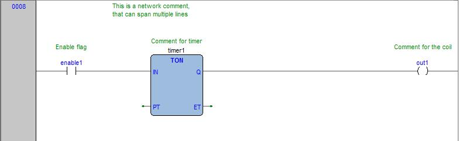
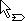
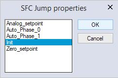
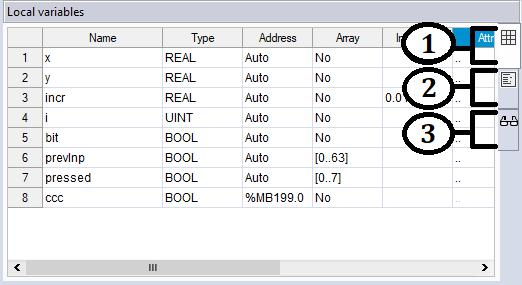

## 6. EDITING THE SOURCE CODE 

 PLC editors 

LogicLab includes five source code editors, which support the whole range of IEC 61131-

3 programming languages: Instruction List (IL), Structured Text (ST), Ladder Diagram 

(LD), Function Block Diagram (FBD), and Sequential Function Chart (SFC).

Moreover, LogicLab includes a grid-like editor to support the user in the definition of local

variables.

All editors, both graphical and text one, support tooltips. By enabling them (see Para

graph 3.6.1.4), LogicLab will show some information about symbols on which the user 

move the mouse.

This chapter focuses on all these editors.

### 6.1 INSTRUCTION LIST (IL) EDITOR 

The IL editor allows you to code and modify POUs using IL (Instruction List), one of the 

IEC-compliant languages.

#### 6.1.1 EDITING FUNCTIONS 

The IL editor is endowed with functions common to most editors running on a Windows 

platform, namely:

\- Text selection.

\- *Edit>Cut*  .  

\- *Edit>Copy* . 

\- *Edit>Paste*  .  

\- *Edit>Replace* . 

\- Drag-and-drop of selected text.

#### 6.1.2 REFERENCE TO PLC OBJECTS 

If you need to add to your IL code a reference to an existing PLC object, you have two 

options:

\- You can type directly the name of the PLC object.

\- You can drag it to a suitable location. For example, global variables can be taken from 

the *Workspace* window, whereas standard operators and embedded functions can be 

dragged from the *Libraries* window, whereas local variables can be selected from the 

local variables editor.

 

61
#### 6.1.3 AUTOMATIC ERROR LOCATION 

The IL editor also automatically displays the location of compiler errors. To know where a 

compiler error occurred, double-click the corresponding error line in the *Output* bar.

#### 6.1.4 BOOKMARKS 

You can set bookmarks to mark frequently accessed lines in your source file. Once a book

mark is set, you can use a keyboard command to move to it. You can remove a bookmark 

when you no longer need it.

##### 6.1.4.1 SETTING A BOOKMARK 

Move the insertion point to the line where you want to set a bookmark, then press *Ctrl+F2*. 

The line is marked in the margin by a light-blue circle.

##### 6.1.4.2 JUMPING TO A BOOKMARK 

Press *F2* repeatedly, until you reach the desired line 

##### 6.1.4.3 REMOVING A BOOKMARK 

Move the cursor to anywhere on the line containing the bookmark, then press *Ctrl+ F2*.

### 6.2 STRUCTURED TEXT (ST) EDITOR 

The ST editor allows you to code and modify POUs using ST (i.e. Structured Text), one of 

the IEC-compliant languages.

#### 6.2.1 CREATING AND EDITING ST OBJECTS 

See the Creating and Editing POUs section (see Paragraphs 5.1.1 and 5.1.2).

#### 6.2.2 EDITING FUNCTIONS 

The ST editor is endowed with functions common to most editors running on a Windows 

platform, namely:

62 

LogicLab user manual- Text selection.

\- *Edit>Cut*  .  

\- *Edit>Copy*

\- *Edit>Paste* . 

\- *Edit>Replace*  .  

\- Drag-and-drop of selected text.

#### 6.2.3 REFERENCE TO PLC OBJECTS 

If you need to add to your ST code a reference to an existing PLC object, you 

have two options:

\- You can type directly the name of the PLC object.

\- You can drag it to a suitable location. For example, global variables can be taken from 

the *Workspace* window, whereas embedded functions can be dragged from the *Libraries*

window, whereas local variables can be selected from the local variables editor.

#### 6.2.4 AUTOMATIC ERROR LOCATION 

The ST editor also automatically displays the location of compiler errors. To know where a 

compiler error has occurred, double-click the corresponding error line in the *Output* bar.

#### 6.2.5 BOOKMARKS 

You can set bookmarks to mark frequently accessed lines in your source file. Once a book

mark is set, you can use a keyboard command to move to it. You can remove a bookmark 

when you no longer need it.

##### 6.2.5.1 SETTING A BOOKMARK 

Move the insertion point to the line where you want to set a bookmark, then press *Ctrl+F2*. 

The line is marked in the margin by a light-blue circle.

##### 6.2.5.2 JUMPING TO A BOOKMARK 

Press *F2* repeatedly, until you reach the desired line.

##### 6.2.5.3 REMOVING A BOOKMARK 

Move the cursor to anywhere on the line containing the bookmark, then press *Ctrl+F2*.

 

63

### 6.3 LADDER DIAGRAM (LD) EDITOR 

The LD editor allows you to code and modify POUs using LD (i.e. Ladder Diagram), one of 

the IEC-compliant languages.

#### 6.3.1 CREATING A NEW LD DOCUMENT 

See the Creating and Editing POUs section (see Paragraphs 5.1.1 and 5.1.2).

#### 6.3.2 ADDING/REMOVING NETWORKS 

Each POU coded in LD consists of a sequence of networks. A network is defined as a

maximal set of interconnected graphic elements. The upper and lower bounds of every 

network are fixed by two straight lines, while each network is delimited on the left by a

grey raised button containing the network number.

On each LD network the right and the left power rail are represented, according to the LD 

language indication.

On the new LD network a horizontal line links the two power rails. It is called the “power 

link”. On this link, all the LD elements (contacts, coils and blocks) have to be placed.

You can perform the following operations on networks:

\- To add a new blank network, click *Scheme>Network>New* , or press one of the equivalent 

buttons in the  Network  toolbar.

\- To assign a label to a selected network, give the *Scheme>Network>Label* . This enables 

jumping to the labeled network.

\- To display a background grid which helps you to align objects, click *View>Grid* . 

\- To add a comment, click *Scheme>Object>New>Comment* .

64 

 
### 6.3.3 LABELING NETWORKS 

You can modify the usual order of execution of networks through a jump statement, which 

transfers the program control to a labeled network. To assign a label to a network, double

click the raised grey button on the left, which bears the network number.

This causes a dialog box to appear, where you can type the label you want to associate 

with the selected network.

If you press  OK , the label is printed in the top left-hand corner of the selected network.

#### 6.3.4 INSERTING CONTACTS 

To insert new contacts on the network apply one of the following options:

\- Select a contact, a block, a pin of block, or a connection point, that will act as the in

sertion point. Insert the new contact choosing between the connection type (serial or 

parallel) and choosing the position (before or after the currently selected object) by 

using the *Sheme>Object>New* . For serial insertion, the new contact will be inserted on 

the left or right side of the selected contact/block or in the middle of the selected con

nection depending on the element selected before the insertion. For parallel insertions, 

several contacts can be selected before performing the insertion; the new contact will 

be inserted above or below the group of selected contacts.

 

 

\- Drag a boolean variable to the desired place over an object. For example, global vari

ables can be taken from the *Workspace* window, whereas local variables can be selected 

from the local variables editor. Contacts inserted with drag and drop will always be in

serted in series after the destination object.

 

65
#### 6.3.5 INSERTING COILS 

To insert new coils on the network apply one of the following options:

\- Click *Scheme>Object>New>Coil* . The new coil will be inserted and linked to the right 

power rail. If other coils, return or jumps are already present in the network, the new 

coil will be added in parallel with the previous ones.

 

\- Drag a boolean variable on the network, over an existing output of the network (coil, 

return, jump). For example, global variables can be taken from the *Workspace* window, 

whereas local variables can be selected from the local variables editor. 

#### 6.3.6 INSERTING BLOCKS 

To insert blocks on the network apply one of the following options:

\- Select a contact, connection or block then click *Scheme>Object>New>Block* , which 

causes a dialog box to appear listing all the objects of the project, then choose one 

item from the list.

\- Drag the selected object (from the *Workspace* window, the *Libraries* window or the local 

variables editor) over the desired connection.

If the object has at least one *BOOL* input and one *BOOL* output pins, they will be con

nected to the power link (and it will possible to add *EN/ENO* pins later with the provided 

command); otherwise the *EN/ENO* pins will be automatically added.

Operators, functions and function blocks can only be inserted into an *LD* network on the 

main power link, or on the power link of a branch (so they can not be inserted on the par

allel of a contact); it is also not possible to create a contact in parallel of a block.

If a block has a *BOOL* input pin, it is possible to create another logical sub-network of 

contacts and blocks before it; otherwise, you can connect only variables, constants or 

expressions (that nevertheless can be connected to *BOOL* pins) to non-*BOOL* input pins.

#### 6.3.7 EDITING COILS AND CONTACTS PROPERTIES 

The type of a contact (normal, negated, positive, negative) or a coil (normal, negated, 

set, reset, positive, negative) can be changed by one of the following operations:

\- Double-click on the element (contact or coil).

\- Select the element and then press the *Enter* key.

\- Select the element, activate the pop-up menu, then select *[Properties]* .

An apposite dialog box will appear. Select the desired element type from the presented 

list and then press *OK*.

Otherwise, select the desired contact or coil, and change its type using the six provided 

buttons in the *LD* toolbar or the six commands in the *Scheme* menu.

#### 6.3.8 EDITING NETWORKS 

The *LD* editor is endowed with functions common to most graphic applications running on 

a Windows platform, namely:

\- Selection of a block.

66 

LogicLab user manual- Selection of a set of adjacent contacts by pressing *Ctrl+Left* button on each contact to 

select; if the selection spans across different parallel branches, more contacts will be

automatically added in the selection.

\- *Edit>Cut*  ,  *Edit>Copy*  ,  *Edit>Paste* operations of a single block as well as of a 

set of blocks.

\- *Drag-and-drop* of the selected object or group, to move it inside or outside the current 

network.

Adding, moving, deleting or copy/pasting objects will automatically recalculate the layout 

of the network objects; because of this, it is not possible to manually “draw” connection 

lines or freely placing objects without connecting them to the network.

#### 6.3.9 MODIFYING PROPERTIES OF BLOCKS 

\- Click *Scheme>Increment pins* , to increment the number of input pins of some opera

tors and embedded functions.

 

\- Click *Scheme>Enable EN/ENO pins* , to display the enable input and output pins.

 

*EN/ENO* pins can be removed only if the selected block has at least one *BOOL* input and 

one *BOOL* output; otherwise, they will be automatically added when creating the block 

and it will not be possible to remove them (the *Enable EN/ENO*  pins  command will be 

disabled).

If a block has more than one *BOOL* output pin, it is possible to choose which pin will 

bring the *signal* out of the block and so continue the power link: select the desired out

put pin and click the *Scheme>Set output line* menu command.

\- Click *Scheme>Object>Instance name* , to change the name of an instance of a function 

block.

#### 6.3.10 GETTING INFORMATION ON A BLOCK 

You can always get information on a block that you added to an LD document, by selecting 

it and then performing one of the following operations:

\- click *Scheme>Object>Open source* , to open the source code of a block.

\- Click *Scheme>Object properties* in the menu, to see properties and input/output pins 

of the selected block.

#### 6.3.11 AUTOMATIC ERROR RETRIEVAL 

The LD editor also automatically displays the location of compiler errors. To reach the 

block where a compiler error occurred, double-click the corresponding error line in the 

Output bar.

 

67
#### 6.3.12 INSERTING VARIABLES 

To connect a variable to an input or output pin of a block apply one of the following op

tions:

\- select the pin of a block, and then click the *Scheme>Object>New>Variable* menu com

mand; then double-click the new variable object (or press  ENTER ) and enter the variable 

name.

\- Drag the selected variable (from the *Workspace* window, the *Libraries* window or the 

local variables editor) over the desired pin of a block.

#### 6.3.13 INSERTING CONSTANTS 

To connect a numeric constant to an input pin of block, select the pin and click the 

 *Scheme>Object>New>Constant* menu command; then double-click the new constant ob

ject (or press  ENTER ) and enter the numeric constant value.

#### 6.3.14 INSERTING EXPRESSION 

To connect a complex expression to an input pin of block, select the pin and click the 

 *Scheme>Object>New>Expression* menu command; then double-click the new expression 

object (or press  ENTER ) and enter any  ST  expression:

(a+b)*c

TO_INT(n)

ADR(x)

#### 6.3.15 COMMENTS 

It is possible to insert two types of comments:

\-  network  comments: activate the network by clicking on the header on the left or inside the 

grid (but without selecting any object), and then click the *Scheme>Object>New>Comment*

menu command. The network comment will be displayed at the top of the network, and 

if necessary will be expanded to show all the text lines of the comment.

\-  Object  comments: they are activated with the apposite menu command in 

*View>Show comments for objects* ; above any contact, function block or coil the descrip

tion of the associated PLC variable (if present) will be initially shown, but with the  Com 

 ment  command you can modify it to enter a specific object comment that will override

the PLC variable description.

68 

LogicLab user manual
#### 6.3.16 BRANCHES 

The main power line can be branched to create sub-networks, that can be further branched 

themselves: to add a branch, select the object after you want to create the branch and 

then click the *Scheme>Object>New>Branch* menu command.

The start of the new branch is marked as a big dot on the source line; deleting all objects 

on a branch deletes the branch itself.

Selecting an object on a branch effectively selects the branch, so for example selecting a

contact on a branch and then clicking the *Scheme>Object>New>Coil* adds the coil on the 

branch instead of adding it on the main power line.

### 6.4 FUNCTION BLOCK DIAGRAM (FBD) EDITOR 

The FBD editor allows you to code and modify POUs using FBD (Function Block Diagram), 

one of the IEC-compliant languages.

#### 6.4.1 CREATING A NEW FBD DOCUMENT 

See the Creating and editing POUs section (see Paragraphs 5.1.1 and 5.1.2).

#### 6.4.2 ADDING/REMOVING NETWORKS 

Every POU coded in FBD consists of a sequence of networks. A network is defined as a

maximal set of interconnected graphic elements. The upper and lower bounds of every 

network are fixed by two straight lines, while each network is delimited on the left by a

grey raised button containing the network number.

You can perform the following operations on networks:

\- To add a new blank network, click *Scheme>Network>New* . 

\- To display a background grid which helps you to align objects, click *View>View grid* . 

\- To add a comment, click *Scheme>Object>New>Comment* .

#### 6.4.3 LABELING NETWORKS 

You can modify the usual order of execution of networks through a jump statement, which 

transfers the program control to a labeled network. To assign a label to a network, double

click the raised grey button on the left, that bears the network number; or, after selecting 

a network, choose *Scheme>Network>Label* .

This causes a dialog box to appear, which lets you type the label you want to associate 

with the selected network.

70 

LogicLab user manualIf you press *OK*, the label is printed in the top left-hand corner of the selected network.

#### 6.4.4 INSERTING AND CONNECTING BLOCKS 

This paragraph shows you how to build a network.

Add a block to the blank network, by applying one of the following options:

\- Click *Scheme>Object>New>Function Block* which causes a dialog box to appear list

ing all the objects of the project, then choose one item from the list. If the block is a 

constant, a return statement, or a jump statement, you can directly press the relevant 

buttons in the *FBD* toolbar.

\- Drag the selected object to the suitable location. For example, global variables can be 

taken from the *Workspace* window, whereas standard operators and embedded func

tions can be dragged from the *Libraries* window, whereas local variables can be selected 

from the local variables editor.

Repeat until you have added all the blocks that will make up the network.

Then connect blocks:

\- Click *Edit>Connection mode* , or simply press the space bar of your keyboard. Click 

once the source pin, then move the mouse pointer to the destination pin: the FBD editor 

draws a logical wire from the former to the latter.

\- If you want to connect two blocks having a one-to-one correspondence of pins, you can 

enable the auto connection mode by clicking *Scheme>Auto connect* . Then take the two 

blocks, drag them close to each other so as to let the corresponding pins coincide. The 

FBD editor automatically draws the logical wires.

If you delete a block, its connections are not removed automatically, but they become 

invalid and they are redrawn red. Click *Scheme>Delete invalid connection* .

#### 6.4.5 EDITING NETWORKS 

The FBD editor is endowed with functions common to most graphic applications running 

on a Windows platform, namely:

\- Selection of a block.

\- Selection of multiple elements: by pressing *Shift* + *left button* and drawing a frame 

including the blocks to select, or *Ctrl + left button* and select one by one the elements.

\- *Edit>Cut*  ,  *Edit>Copy*  ,  *Edit>Paste* operations of a single block as well as of a 

set of blocks.

 

71- Drag-and-drop.

#### 6.4.6 MODIFYING PROPERTIES OF BLOCKS 

\- Click *Scheme>Increment pins* , to increment the number of input pins of some opera

tors and embedded functions.

 

\- Click *Scheme>Enable EN/ENO pins* , to display the enable input and output pins.

 

\- Click *Scheme>Object>Instance name* , or click *Scheme>Object properties* , to change the 

name of an instance of a function block.

#### 6.4.7 GETTING INFORMATION ON A BLOCK 

You can always get information on a block that you added to an FBD document, by select

ing it and then performing one of the following operations:

\- Click *Scheme>Object>Open source* , or double-click the block, to open its source code.

\- Click *Scheme>Object properties* , to see properties and input/output pins of the se

lected block.

#### 6.4.8 AUTOMATIC ERROR RETRIEVAL 

The FBD editor also automatically displays the location of compiler errors. To reach the 

block where a compiler error occurred, double-click the corresponding error line in the 

*Output* bar.

### 6.5 SEQUENTIAL FUNCTION CHART (SFC) EDITOR 

The SFC editor allows you to code and modify POUs using SFC (i.e. Sequential Function 

Chart), one of the IEC-compliant languages.

#### 6.5.1 CREATING A NEW SFC DOCUMENT 

See the creating and editing POUs section (see Paragraphs 5.1.1 and 5.1.2).

#### 6.5.2 INSERTING A NEW SFC ELEMENT 

\- Click *Scheme>Object>New>Step* . 

\- Click *Scheme>Object>New>transition* . 

\- Click *Scheme>Object>New>Jump* .

72 

LogicLab user manualIn either case, the mouse pointer changes to:

 for steps;

 for transitions;

 for jumps.

#### 6.5.3 CONNECTING SFC ELEMENTS 

Follow this procedure to connect SFC blocks:

\- Click *Edit>Connection mode* , or simply press the space bar on your keyboard. Click 

once the source pin, then move the mouse pointer to the destination pin: the SFC editor 

draws a logical wire from the former to the latter.

\- Alternatively, you can enable the auto connection mode by clicking *Scheme>Auto connect*

Then take the two blocks, and drag them close to each other so as to let the respective 

pins coincide, which makes the SFC editor draw automatically the logical wire.

#### 6.5.4 ASSIGNING AN ACTION TO A STEP 

This paragraph explains how to implement an action and how to assign it to a step.

##### 6.5.4.1 CREATING AN ACTION 

To create a new action: choose *Scheme>Code object>New action* or select the *Actions* 

folder in the *workspace* and choose *[New action]* from its context menu.

In either case, LogicLab displays a dialog box like the one shown below.

Select one of the languages and type the name of the new action in the text box at the 

bottom of the dialog box. Then either confirm by pressing *OK*, or quit by clicking *Cancel*.

##### 6.5.4.2 WRITING THE CODE OF AN ACTION 

To modify the code of and action you can double-click it on the project tree or select it and 

choose *Edit source* from its context menu.

Note that you are not allowed to declare new local variables, as the action that you are 

now editing is a component of the original SFC module, which is the POU where local vari

ables can be declared. The scope of local variables extends to all the actions and transi

tions making up the SFC diagram.

##### 6.5.4.3 ASSIGNING AN ACTION TO A STEP 

You can assign or change the action associated to a step by opening its properties win

dow; to do so, double-click the step in the SFC editor.

 

73Be careful, if the step has already one or two action associated, they will be shown on the 

block as a white square with a specific letter written inside, if you click the letter you will

open directly the action editor, not the step properties window.

Opening the step properties window will causes the following dialog box to appear.

From the list shown in the *Code N* box, select the name of the action you want to execute 

when the step is active.

From the list shown in the *Code P (Pulse)* box, you may optionally choose the name of 

the action you want to execute each time the step becomes active (which means the ac

tion is executed only once per step activation, regardless of the number of cycles the step 

remains active).

Confirm the assignments by pressing  OK .

 

In the SFC editor, the actions assigned to a step are represented by white square with a 

specific letter inside: action P with letter P in the top right corner; action N with letter N

in the bottom right corner.

Double-clicking directly a white square works as a shortcut to open that action editor.

#### 6.5.5 TRANSITIONS CONDITIONS 

##### 6.5.5.1 ASSIGN A CONSTANT/VARIABLE, AS A TRANSITION CONDITION 

As stated in the relevant section of the language reference, a transition condition can be 

assigned through a constant, a variable, or a piece of code. This paragraph explains how 

to use the first two means, while conditional code is discussed in the next paragraph.

First of all double-click the transition you want to assign a condition to. This causes the 

following dialog box to appear.

Select *True* if you want this transition to be constantly cleared, *False* if you want the PLC 

program to keep executing the preceding block.

74 

LogicLab user manualInstead, if you select *Variable* the transition will depend on the value of a Boolean vari

able. Click the corresponding bullet, to make the text box to its right available, and to 

specify the name of the variable.

To this purpose, you can also make use of the objects browser, that you can invoke by 

pressing the button its right side.

Click *OK* to confirm, or *Cancel* to quit without applying changes.

##### 6.5.5.2 ASSIGN A CONDITIONAL CODE TO A TRANSITION 

This paragraph explains how to specify a condition through a piece of code, and how to 

assign it to a transition.

Start by creating a transition code: select *Scheme>Code object>New transition code* ; or 

select *[New transition]* from the context menu of the SFC POU in the *Workspace*

In either case, LogicLab displays a dialog box similar the one shown in the following pic

ture.

Note that you can use any language except SFC to code a condition. Select one of the 

languages and type the name of the new condition in the text box at the bottom of the 

dialog box. Then either confirm by pressing *OK*, or quit by clicking *Cancel*.

Now the transition code is added to the project tree; you can open its editor by double

clicking it, or by opening its context menu and selecting *Edit source* .

Note that you are not allowed to declare new local variables, as the module you are now 

editing is a component of the original SFC module, which is the POU where local variables 

can be declared. The scope of local variables extends to all the actions and transitions 

making up the SFC diagram.

To assign the transition code to the transition element, double-click the transition element 

in the SFC editor. This causes the following dialog box to appear.

 

75Select *Code*, and then choose the name of the condition you want to assign to this transi

tion from the list. Then confirm by pressing *OK*.

#### 6.5.6 SPECIFYING THE DESTINATION OF A JUMP 

To specify the destination step of a jump, double-click the jump element in the SFC edi

tor. This causes the dialog box shown below to appear, listing the name of all the existing 

steps.

 Select the destination step, then either press  OK  to confirm or  Cancel  to quit.

The name of the target step will be shown inside the jump element.

#### 6.5.7 EDITING SFC NETWORKS 

The SFC editor is endowed with functions common to most graphic applications running 

on a Windows platform, namely:

\- Selection of a block.

\- Selection of a set of blocks by pressing  Ctrl  + left button.

\- *Edit>Cut*  ,  *Edit>Copy*  ,  *Edit>Paste* operations of a single block as well as of a 

set of blocks.

\- Drag-and-drop.

### 6.6 VARIABLES EDITOR 

LogicLab includes a graphical editor for both global and local variables that supplies a 

user-friendly interface for declaring and editing variables: the tool takes care of the trans

lation of the contents of these editors into syntactically correct IEC 61131-3 source code.

As an example, consider the contents of the Global variables editor represented in the 

following figure.

The corresponding source code will look like this:

VAR_GLOBAL

 gA : BOOL := TRUE;

 gB : ARRAY[ 0..4 ] OF REAL;

 gC AT %MD60.20 : REAL := 1.0;

END_VAR

VAR_GLOBAL CONSTANT

76 

 gD : INT := -74; 

END_VAR

Alternatively, LogicLab includes also a textual editor for both global and local variables; 

using this editor will allow you to declare and edit the source code of the variables.

#### 6.6.1 OPENING A VARIABLES EDITOR 

##### 6.6.1.1 OPENING THE GLOBAL VARIABLES EDITOR 

In order to open the Global variables editor, expand the Global variables folder and any 

subfolder until you reach the desired Global variables group, then double-click on it. 

##### 6.6.1.2 OPENING A LOCAL VARIABLES EDITOR 

To open a local variables editor, just open the relative Program Organization Unit.

##### 6.6.1.3 SWITCH FROM GRAPHIC TO TEXTUAL EDITOR 

For both global and local variables, when you open their graphic editor, you’ll see on the 

far right border three tabs:

 

77The first, selected by default, is the graphic variables editor; this editor provides a user

friendly interface.

The second is the textual variables editor; this editor allows the user to declare and edit 

variables by modifying directly the source code. The textual editor can be really useful if 

you need to paste some variables declaration code, taken from another source.

Switching from the graphic editor to the textual editor, will show you the actual source 

code of the defined variables:

The third tab is the watch editor, refer to the appropriate chapter of this manual for de

tails (see Paragraph 9.1.1.1).

#### 6.6.2 CREATING A NEW VARIABLE 

In order to create a new variable, you may click *Variables>Insert* .

#### 6.6.3 EDITING VARIABLES 

Follow this procedure to edit the declaration of a variable in a variables editor (all the fol

lowing steps are optional and you will typically skip most of them when editing a variable):

1) Edit the name of the variable by entering the new name in the corresponding cell.

2) Change the variable type, either by editing the type name in the corresponding cell 

or by clicking on the button in its right and select the desired type from the *object* 

78 

LogicLab user manual*browser*.

3) Edit the address of the variable by clicking on the button in the corresponding cell 

and entering the required information in the window that shows up. Note that, in the 

case of global variables, this operation may change the position of the variable in the 

project tree.

4) In the case of global variables, you can assign the variable to a group. You have three 

ways to do so:

\- First create the group and then create the variable from inside the group.

\- You can drag&drop existing variable into a new group.

\- Specify the group the variable belongs to when creating the variable; to do so, choose 

the appropriate voice from the menu *Variables > Add* ; the following window will ap

pear, allowing you to specify also the variable group.

 

795) Choose whether a variable is an array or not; if it is, edit the size of the variable.

6) Edit the initial values of the variable: click on the button in the corresponding cell and 

enter the values in the window that pops up.

7) Assign an attribute to the variable (for example, CONSTANT or RETAIN), by selecting it 

from the list which opens when you click on the corresponding cell.

8) Type a description for the variable in the corresponding cell. Note that, in the case of 

global variables, this operation may change the position of the variable in the project 

tree.

9) Save the project to persist the changes you made to the declaration of the variable.

#### 6.6.4 DELETING VARIABLES 

In order to delete one or more variables, select them in the editor: you may use the *CTRL*

or the *SHIFT* keys to select multiple elements.

Then, click *Variables>Delete* .

Notice that you cannot delete the RESULT of an IEC61131-3 FUNCTION.

80 

LogicLab user manual
#### 6.6.5 SORTING VARIABLES 

You can sort the variables in the editor by clicking on the column header of the field you

want to use as the sorting criterion.

 

#### 6.6.6 COPYING VARIABLES 

The variables editor allows you to quickly copy and paste elements. You can either use 

keyboard shortcuts or the *Edit>Copy*  ,  *Edit>Paste* menu.

Note: overlapping addresses problems may occur by copying mapped variables. LogicLab can 

automatically assign new free address to the new pasted variable and fix the overlap. In

order to enable this functionality please refer to paragraph 

3.6 and 4.8.3.2 for further 

details.

### 6.7 OBJECT ORIENTED 

#### 6.7.1 ENABLE OBJECT ORIENTED PROGRAMMING 

LogicLab allow the users to work with the object oriented programming, enhancing the 

function blocks and treating them as classes; since this feature needs to be supported by 

the target device implementation, it is disabled by default; in order to enable it you have 

to select *Project > Options > Tab general*

 and check the *Use object oriented feature*s 

checkbox.

 

81Now the dialog that shows up when creating a new Function Block (as well as the Object 

Properties dialog), will show addittional content:

In the *Extends* field, you can specify another Function Block that will be treated as a father

class for the current function block; only one Function Block can be specified as a father.

The current Function Block will inherit every object of the father.

In the *Implements* field, you can specify one or more interfaces.

Please note that even if the Object Oriented feature is enabled, you can keep using the 

function blocks as normal function blocks.

82 

LogicLab user manual
#### 6.7.2 METHODS 

##### 6.7.2.1 CREATE NEW METHODS 

If the Object Oriented feature is enabled, you can consider a Function Block as a class; 

in order to create a new method: open the context menu of the Function Block by right

clicking on it’s instance in the project tree, then choose *New Methods*.

A dialog will appear asking you which language you wish to use to implement the method 

body, SFC cannot be used. Once created, the new method will be shown in the project 

tree:

You can define any number of methods for the same class, but you cannot define more

methods with the same name (even if their prototype is different).

##### 6.7.2.2 INVOKING METHODS 

Methods work like functions, except that they have access to the class context (which 

means, for example, the *Input variables* of the function block).

Methods can be invoked in a POU (for example in a program), like extensions to the Func

tion Block instance: 

Methods can be called from other methods of the same class, to do so use the *this.* speci

fier:

Methods can be called also from inside the relative Function Block body, but the Function 

Block body cannot be called from inside a method.

##### 6.7.2.3 INHERITED METHODS 

If in the *Extends* field, when creating a new Function Block, or inside it’s Object properties

window, you specify the name of another Function Block, the current one will inherit all 

of it’s methods.

Inherited methods are always considered as  virtual methods , which means that if the 

children Function Block implements a method with the same protorype of a method im

plemented by the father, no error is raised, as the children method will override the father 

method.

If you wish to explicitly call the father method, you can do it by using the *super.* specifier:

You can also call the father Function Block body, instead of a specific method, using

super(); alone.

You can see if a Function Block extends another function block, by looking at its prop

erty window.

84 

 6.7.2.4 METHODS POLIMORPHYSM 

LogicLab can handle polimorphysm with classes, to do so you’ll have to use the reference 

data type (*see paragraph 11.1.2.1*).

Create a variable of type reference to the father class; now valorize it usign the reference 

of a child class; now you can use the reference variable to call a method (or to access the 

class properties), LogicLab will be able to recognize which is the correct method to call.

In this example, fRef^.method_1() will call method_1 of fb_Class_2 even if fRef is a refer

ence to fb_Class_1.

#### 6.7.3 INTERFACES 

##### 6.7.3.1 CREATE NEW INTERFACES 

In order to create a new interface, after having enabled the Object Oriented program

ming, select *Project > New object > New definition > Interface* . A dialog will be shown ask

ing you to specify the name of the interface and (optionally) a description.

After creation, the interface will appear as a new element in the project tree.

Now you can add a method prototype: from the interface context menu, select *Add meth*

*od prototype;* a dialog will appear asking you to insert the name of the method and (op

tionally) a description.

After creation, the method prototype will appear in the project tree as a subelement of 

the interface element.

By double clicking on the method prototype element, a new editor will be opened in the 

editor window, allowing you specify the method prototype (which means the required 

input variables).

An interface can extend another interface (only one), in a father-child hierarchy; doing so, 

the children interface will inherit all the method prototypes of the father interface.

To extend an interface select *Edit properties* from the interface context menu, a new di

alog will be shown allowing you to modify several properties, included the extend field.

86 

LogicLab user manualYou can see if an interface extends another interface by looking at its property window.

##### 6.7.3.2 IMPLEMENTING INTERFACES 

The methods prototype of an interface can be implemented by a function block.

Upon creation of the function block, or editing its properties, you can specify one or more 

interfaces in the *Implements* field; the interface and its methods will appear in the project

tree as subelements of the Function Block that implements them.

In the example of the above picture, fb_class_2 implements intf_1; and intf_1 extends 

intf_2. 

In order to implement a method prototype of an interface, you need to create a method 

which has the same prototype (name and input variables) of the method prototype you 

wish to implement. Compiling a project with method prototypes not correctly implement

ed, will raise errors.

To implement a method prototype you can create a new method (see paragraph 6.7.2.1) 

which has the same prototype of the method you wish to implement, or you can right-click 

on the method prototype and select *Implement method*; this way a new method will be 

 

87created, already with the correct prototype.

Method prototypes can have different icons, with different meaning:

 method prototype correctly implemented.

there is a method with the same name but different prototype from the one you wish

to implement.

 no method has been found with the same name of the method prototype you wish to 

implement.

 the previous icons can also have a blue arrow on their right side, that means the 

method prototype is inherited from a different interface

##### 6.7.3.3 INTERFACES POLIMORPHYSM 

LogicLab can handle polimorphysm with interfaces, create a variable of type interface and 

valorize it usign the instance of a class that implements the method prototypes of that 

interface; now you can use the interface variable to call methods, LogicLab will be able 

to recognize which is the correct method to call, even if there may be more classes that 

implement the same interface.

Also, using the query interface operator IMOVE ( ?= ), you can use a variable to an in

terface to valorize a varaible to a second interface which is extended by the first one;

LogicLab will be able to analyze the object behind the source interface, and will use the 

correct method to valorize the destination interface variable.

In the baove example: the interface intf_1 extends the interface intf_2; the interface 

intf_1 is implemented by both fb_class_1 and fb_class_2. 

i1, variable of type intf_1, is valorized using myClass_2, an instance of fb_class_2, which 

is a Function Block that implements intf_1; now calling i1.method_201 will correctly call 

method_201 of fb_class_2.

i2, variable of type intf_2, which is an interface extended by intf_1, is valorized with i1 

using the IMOVE operator; thanks to this operator there’s no error even if i1 and i2 are 

not of the same type (because LogicLab understand that i1 extends i2) and i2 is valor

ized with a reference to the instance of myClass_2; so if around your project you call 

i2.method201, you will be calling method_201 of fb_class_2.

88 

LogicLab user manual
### 6.7.4 OBJECT ORIENTED IN GRAPHIC LANGUAGES 

In graphic languages, in case the object oriented programming is enabled, LogicLab will 

prompt a dialog to ask the user which element he wish to select in case of ambiguity.

For example: if you have a function block with methods and you drag it into an FBD pro

gram source editor, LogicLab will ask you if you want to call the body of the function block 

or a specific method.

 

