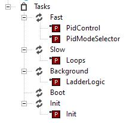
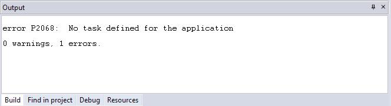
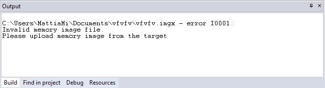
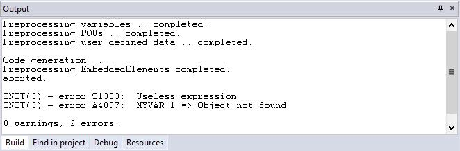
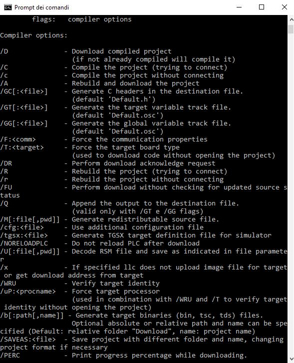

## 7. COMPILING 

Compilation consists of taking the PLC source code and automatically translating it into 

binary code, which can be executed by the processor on the target device.

### 7.1 COMPILING THE PROJECT 

Before starting actual compilation, make sure that at least one program has been as

signed to a task.

When this pre-condition does not hold, compilation aborts with a meaningful error mes

sage.

In order to start compilation, click *Project>Compile* .

Note that LogicLab automatically saves all changes to the project before starting the 

compilation.

#### 7.1.1 IMAGE FILE LOADING 

Before performing the actual compilation, the compiler needs to load the image file (. imgx  

 file ), which contains the memory map of the target device. If the target is connected 

when compilation is started, the compiler retrieve the image file directly from the tar

get. Otherwise, it loads the local copy of the image file from the working folder. If the

target device is disconnected and there is no local copy of the image file, compilation

cannot be carried out: you are then required to connect to a working target device or 

to refresh your working folder, loading the image file from the installed catalog (select

*Project > Refresh current target* ).

LogicLab user manual 

91
### 7.2 COMPILER OUTPUT 

If the previous step was accomplished, the compiler performs the actual compilation, 

then prints a report in the *Output* window. The last string of the report has the following 

format:

m warnings, n errors

It tells the user the outcome of compilation.

| **Condition** | **Description**                                              |
| ------------- | ------------------------------------------------------------ |
| n>0           | Compiler error(s). The PLC code contains one or more serious errors, which cannot be worked around by the compiler; the binary output file is not generated, the project cannot be downloaded. |
| m>0           | Emission of warning(s). The PLC code contains one or more minor errors, which the compiler automatically spotted and worked around. However, you are informed that the PLC program may act in a  different way from what you expected: you are encouraged to get rid of these warnings by editing and re-compiling the application until no warning messages are emitted. Even if you do not correct the warnings, the binary output file is  generated and you can download the project. |
| n=m=0         | PLC code entirely correct, compilation accomplished. You should  always work with 0 warnings, 0 errors. The binary output file is generated and you can download the project. |

#### 7.2.1 COMPILER ERRORS 

When your application contains one or more errors, some useful information is printed in 

the *Output* window for each of those errors.

As you can see, the information includes:

\- the name of the Program Organization Unit affected by the error;

\- the number of the source code line which procured the error;

\- whether it is a fatal error (error) or one that the compiler could work around (warn

ing);

\- the error code;

\- the error description.

Refer to the appropriate section for the compiler error reference.

If you double-click the error message in the *Output* bar, LogicLab opens the source code 

and highlights the line containing the error.

You can then fix the problem and re-compile.

92 

LogicLab user manual 
### 7.3 COMMAND-LINE COMPILER 

LogicLab’s compiler can be used independently from the IDE: in LogicLab’s directory, you 

can find an executable file, named *LLC.exe*, which is a command-line compiler that can 

be invoked (for example, in a batch file) with a number of options.

In order to get information about the syntax and the options of this command-line tool, 

just launch the executable without parameters.

LogicLab user manual 

9394 

LogicLab user manual
