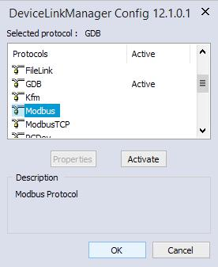
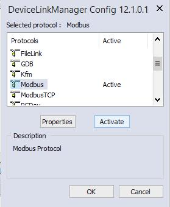
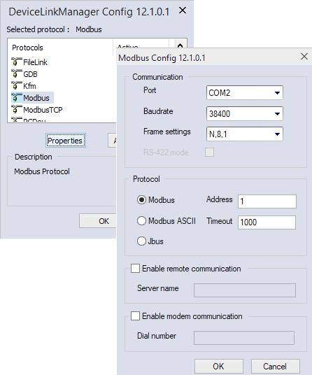
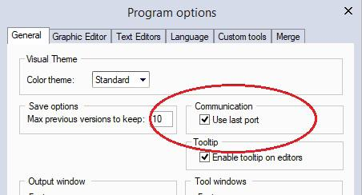
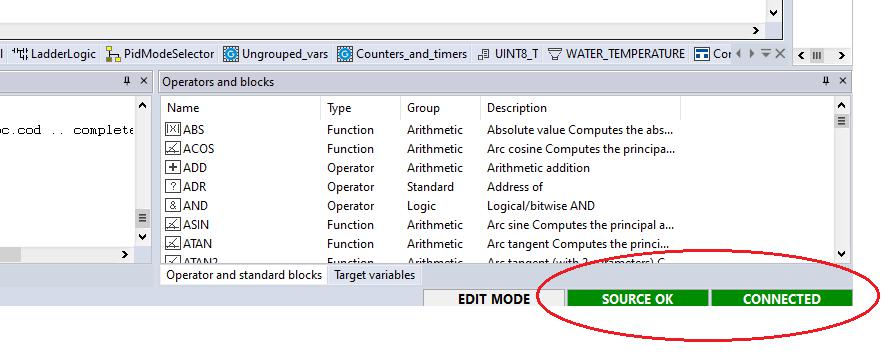
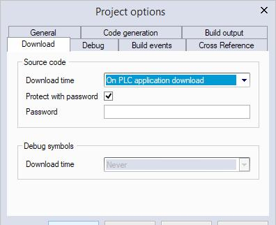
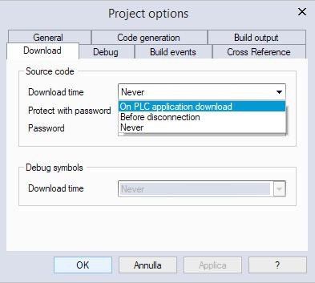
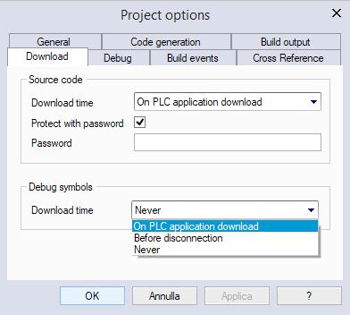

## 8. LAUNCHING THE APPLICATION 

In order to download and debug the application, you have to establish a connection with 

the target device. This chapter focuses on the operations required to connect to the tar

get and to download the application, while the wide range of LogicLab’s debugging tools 

deserves a separate chapter (see Chapter 9).

### 8.1 SETTING UP THE COMMUNICATION 

In order to establish the connection with the target device, make sure the physical link is 

up (all the cables are plugged in, the network is properly configured, and so on).

Follow this procedure to set up and establish the connection to the target device:

1) Click *On-line>Set up communication...* menu of the LogicLab main window. This causes 

the following dialog box to appear.

The elements in the list of communication protocols you can select from depend on 

the setup executable(s) you have run on your PC (refer to your hardware provider if 

a protocol you expect to appear in the list is missing).

2) Choose the appropriate protocol and make it the active protocol by clicking on the 

*activate* button.

LogicLab user manual 

953) Now, by clicking on the *Properties* button, you can fill in all the protocol-specif

ic settings (for example, the target address and baudrate or the communication 

timeout - that is how long LogicLab must wait for an answer from the target before 

displaying a communication error message). 

 

4) Apply the changes you made to the communication settings by pressing the *OK* but

ton; otherwise, if you press the *Cancel* button, all changes will be undone.

Now you can establish a communication by clicking *On-line>Connect* menu.

#### 8.1.1 SAVING THE LAST USED COMMUNICATION PORT 

Given the fact that many modern PCs have only one COM port, you will usually use the 

same port when connecting to target devices using a serial protocol; LogicLab allows you 

to save the last used COM port and configuration, in order to override the project setting

procedure. This feature proves especially useful when you share projects with other de

velopers, which may use a different COM port to connect to the target device.

In order to save your COM port settings, enable the *Use last port* option in *File>Options...*

menu.

LogicLab user manual
### 8.2 ON-LINE STATUS 

At the bottom-right of LogicLab window, next to the right border of the *Status Bar*, there 

are other two boxes: the first is the *application status*, the second is the *connection sta*

*tus.*

#### 8.2.1 APPLICATION STATUS 

The application status box gives information about the status of the application currently 

executing on the target device; such information are available only when you’re con

nected with the target device.

The application can have on of the following status:

\- No code: no application is executing on the target device.

\- Diff. code: the application currently executing on the target device is not the same as 

the one currently open in the IDE; moreover, no debug information consistent with the 

running application is available: thus, the values shown in the watch window or in the 

oscilloscope are not reliable and the debug mode cannot be activated. 

\- Diff. code, Symbols OK: the application currently executing on the target device is 

not the same as the one currently open in the IDE; however, some debug information 

consistent with the running application is available (for example, because that applica

tion has been previously downloaded to the target device from the same PC): the values 

shown in the watch window or in the oscilloscope are reliable, but the debug mode still 

cannot be activated.

\- Source OK: the application currently executing on the target device is the same as the 

one currently open in the IDE: the debug mode can be activated.

#### 8.2.2 CONNECTION STATUS 

The communication status gives you information about the status of the actual communi

cation with the target device.

If you have not yet attempted to connect to the target, the status of communication is 

LogicLab user manual 

97set to *Not connected*. 

When you try to connect to the target device, the state of communication becomes one 

of the following:

\- Error: the communication cannot be established. You should check both the physical 

link and the communication settings.

\- Connected: the communication has been correctly established.

### 8.3 DOWNLOADING THE APPLICATION 

A compiled PLC application must be downloaded to the target device in order to have 

the processor execute it. This paragraph shows you how to send a PLC code to a target 

device. Note that LogicLab can download the code to the target device only if the latter is 

connected to the PC where LogicLab is running. See the related section for details.

To download the application, click *On-line>Download code* .

LogicLab checks whether the project has unsaved changes. If this is the case, it automati

cally starts the compilation of the application. The binary code is eventually sent to the 

target device, which then undergoes automatic reset at the end of transmission. Now the 

code you sent is actually executed by the processor on the target device.

#### 8.3.1 CONTROLLING SOURCE CODE DOWNLOAD 

Whether the source code of the application is downloaded along with the binary code or 

not, depends on the target device you are interfacing with: some devices host the appli

cation source code in their storage, in order to allow the developer to upload the project 

in a later moment.

If this is the case, you can control some aspects of the source code download process, as 

explained in the following paragraphs.

##### 8.3.1.1 PROTECTING THE SOURCE CODE WITH A PASSWORD 

You may want to protect the source code downloaded to the target device with a pass

word, so that LogicLab will not open the uploaded project unless the correct password is 

entered.

Click the *Project>Options...* menu and set the password.

You may opt to disable the password, instead.

98 

LogicLab user manual 

##### 8.3.1.2 SOURCE CODE AND DEBUG SYMBOLS DOWNLOAD TIME 

As stated before, LogicLab allows you to download also the source code on the target 

device; this way you can retrieve the source code in a later time having the certainty to 

work with the exact project that is running on the target device. 

The availability of this feature depends on the device implementation.

LogicLab allows you to choose when the download of the source code must be done; from 

the menu *Project > Options > Download* you can choose one of the following voices:

\- *On PLC application download*: the Source code will be downloaded to the target to

gether with PLC application.

\- *Before disconnection*: the Source code will be downloaded before target disconnection.

\- *Never*: the Source code will be never downloaded to the target.

As well as the Source code, also the Debug symbols download time can be set using the 

following select menu with the same options.

### 8.4 SIMULATION 

Depending on the target device you are interfacing with, you may be able to simulate 

the execution of the PLC application with LogicLab’s integrated simulation environment: 

LogicLab.

In order to start the simulation, just click *Debug>Simulation mode* .

Refer to LogicLab’s manual to gain information on how to control the simulation.

### 8.5 CONTROL THE PLC EXECUTION 

The PLC application execution can be controlled using the related functions in the project 

bar or by the command presents in the On-line menu.

LogicLab user manual 

99
#### 8.5.1 HALT 

You can stop the PLC execution by clicking *On-line>Halt*

#### 8.5.2 COLD RESTART 

The PLC application execution will be restarted and both retain and non-retain variables 

will be resetted.

You can cold restart the PLC execution by clicking *On-line>Cold restart* .

#### 8.5.3 WARM RESTART 

The PLC application execution will be restarted and only non-retain variables will be reset

ted.

You can warm restart the PLC execution by clicking *On-line>Warm restart* .

#### 8.5.4 HOT RESTART 

The PLC application execution will be restarted and no variables will be resetted.

You can hot restart the PLC execution by clicking *On-line>Hot restart* .

#### 8.5.5 REBOOT TARGET 

You can reboot the target by clicking *On-line>Reboot target* .

100 

LogicLab user manual 
