## 1. 初识树莓派

Raspberry Pi(中文名为“树莓派”,简写为RPi，只有信用卡大小的微型电脑，其系统基于Linux。树莓派基于[ARM](https://baike.baidu.com/item/ARM)的微型电脑主板，以SD/MicroSD卡为内存硬盘，卡片主板周围有USB接口和一个以太网接口（A型没有网口），可连接键盘、鼠标和网线，同时拥有视频模拟信号的电视输出接口和HDMI高清视频输出接口，以上部件全部整合在一张仅比信用卡稍大的主板上，具备所有PC的基本功能。

标准的树莓派硬件特别适合PLC软件平台的学习与原型研发开发试验，但是并不适合应用于工业控制领域，主要是因为标准树莓派硬件应用环境温度不符合工业现场的要求，并且没有EMC&RoHS欧洲标准的认证，因此选择工业级树莓派核心板Compute Modules 3+实现工业级的控制器设备。

基于标准树莓派硬件或者工业级树莓派核心板Compute Modules 3+与开放式的Linux操作系统，可以在面向工业控制领域应用时增加SoftPLC的软件核心，这样可以将标准的树莓派硬件改造成一个开放式的工业PLC控制器，例如可以将LogicLab运行时核心嵌入到树莓派Linux操作系统里，这样就完成一个包含基础功能的工业PLC控制器产品：

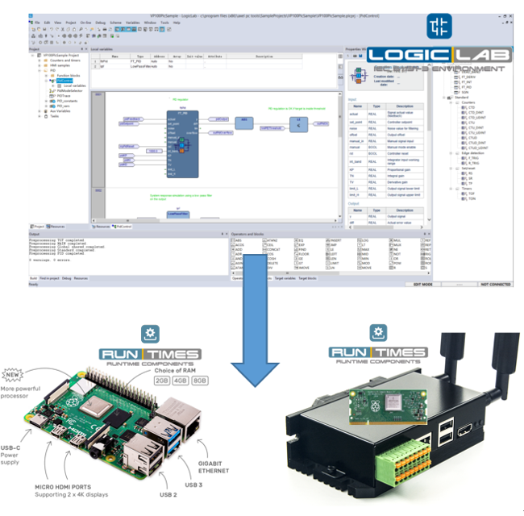

## 2. LogicLab支持的树莓派硬件

树莓派开放式社区（www.raspiberrypi.org） 为每一位嵌入式技术爱好者提供了一个非常低成本高性能的开放式平台，可以自由实现自己的创意，在教育和创新领域打造了全新的技术社交，融入创客们的理想和态度，形成了一种非常可贵的技术情怀。官方社区甚至也提供了用于工业级产品设计的Compute Module 3B+核心板，从而可以将树莓派应用于环境更加复杂的工业控制领域。

 

翌控科技基于LogicLab软件平台提供支持树莓派3B/3B+/4B与欧比特测控EdgeBox-RPI硬件的IEC61131-3 PLC解决方案，为了更好实现PLC的实时控制，目前已经在标准系统镜像软件中集成了Linux Preempt-RT实时补丁：

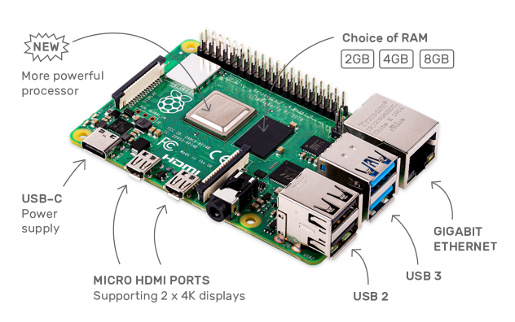

并且除了树莓派上传统的C/C++编程、Python等等编程语言以外，LogicLab还可以实现如下功能：

\- 支持主流PLC符合IEC61131-3标准五种编程语言FBD、LD、ST、SFC、IL进行PLC编程与调试

\- Modbus RTU/TCP 主从站通讯

\- CANopen主站通讯

\- NodeRED物联网开放式平台

\- EtherCAT主站通讯（*由于硬件架构限制，EtherCAT主站功能仅支持树莓派4B平台）

\- LogicLab PLC内核中的功能可以通过开放式SDK进行二次扩展开发，通过C语言实现用户自己的功能、功能块、I/O驱动、共享内存等等

### 2.1. 标准树莓派3B/3B+/4B

Raspberry Pi 极致的开源硬件价格，让全世界无数的技术爱好者有机会在这个平台上面去实现自己的想法和创意，在教育和创新领域打造了全新的技术社交，融入创客们的理想和态度，形成了一种非常可贵的技术情怀。

 

对于应用于工业现场的PLC产品来说，虽然标准的树莓派是无法在工业现场稳定可靠运行，但是作为学习与开发平台来说，已经绰绰有余。同时标准树莓派硬件价格相对较低，非常容易购买，并且外部扩展模块众多，非常适合用于学习、初期研发、搭建原型系统。

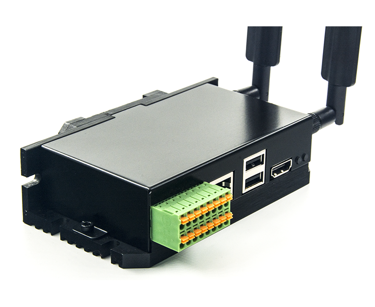

### 2.2. 欧比特测控EdgeBox-RPI

EdgeBox-RPI是由欧比特测控公司基于树莓派工业级核心板Compute Module 3+研发的一款应用于边缘计算控制器，它的设计便于安装和快速部署典型的工业应用，如状态监测，设施管理，数字标志和公用事业的远程控制。具有4核心高性能ARM Cortex-A53处理器，主频高达1.2GHZ。其超轻巧紧凑的设计是在空间受限环境中应用的答案，确保了它可以在包括车载应用在内的各种极端环境中可靠运行。

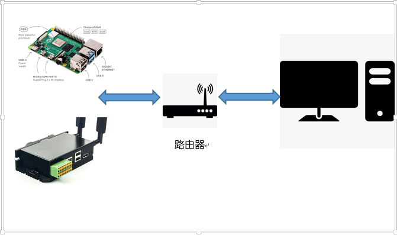

注意：为了确保正确应用翌控科技提供的IEC61131-3解决方案，请选用内置32GB存储器的EdgeBox-RPI硬件。

 

购买此硬件，请向欧比特测控要求默认出厂烧写好LogicLab最新镜像，详情请查看欧比特测控官网与淘宝店：

https://www.openembed.com/products/51.html

https://item.taobao.com/item.htm?spm=a230r.1.14.66.30ac530evWFYSE&id=603991102464&ns=1&abbucket=6#detail

 

关于更多使用心得请参考B站上的相关视频：

https://www.bilibili.com/video/BV1DT4y1G73V

## 3. 准备工作

无论是单独购买标准树莓派硬件，还是EdgeBox-RPI工业级产品，都需要使用由翌控科技提供的完整树莓派系统镜像才可以使用符合IEC61131-3标准的LogicLab软件解决方案，初次安装、调试、配置时需要准备如下硬件资源：

\- 安装了Windows系统的PC（推荐安装Win10操作系统）

\- 路由器（用于树莓派硬件自动获取IP地址）

\- 标准树莓派3B/3B+/4B硬件或者欧比特测控的EdgeBox-RPI硬件

### 3.1. 硬件连接

准备好对应的硬件资源，需要将PC以及树莓派硬件连接至同一个路由器上，从而保证PC与树莓派的网络在同一个网段内，并且路由器会给树莓派自动分配IP地址，如下图所示：

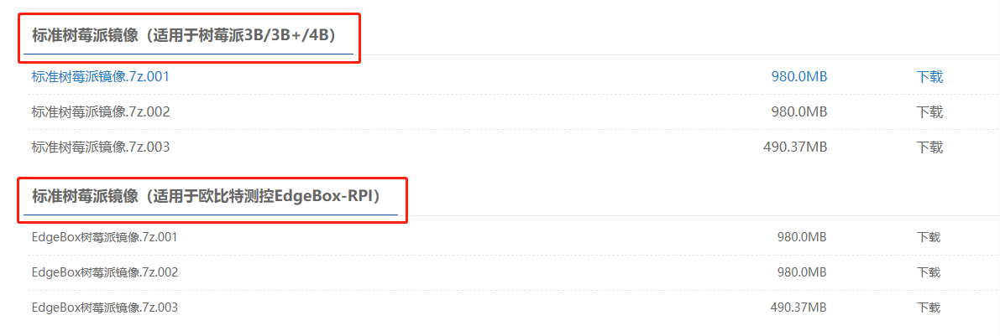

### 3.2  下载翌控科技定制版本的树莓派专用镜像文件

登录翌控科技官网下载专区: http://www.nxtrol.com/download.html， 下载对应树莓派硬件平台的镜像文件（下载前需要您首先注册为会员），请下载标准树莓派3B/3B+/4B硬件专用镜像或者针对欧比特测控的EdgeBox-RPI硬件的专用镜像，如下图所示：

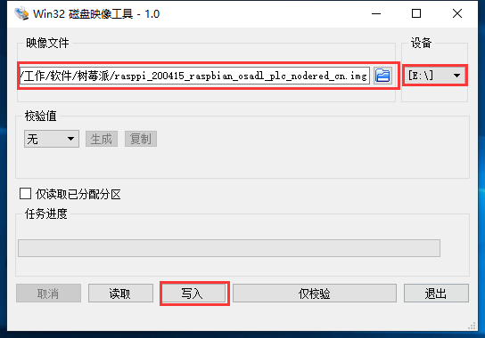

注意：由于镜像文件较大，因此网站上会拆分为几个压缩包，请使用360压缩工具或者7zip工具进行解压缩，解压完成后会生成一个._images后缀的镜像文件。

### 3.3. 烧写树莓派专用镜像文件

对于标准树莓派硬件采用TF卡（推荐使用SANDISK的16GB TF存储卡）方式存储操作系统镜像，因此需要在PC上使用Win32DiskImager工具2.2章节下载的镜像文件烧写至TF卡中。

 

针对欧比特测控的EdgeBox-RPI硬件，订购该硬件时请向该硬件厂商要求烧写好翌控科技针对EdgeBox-RPI硬件的完整镜像，可以跳过烧写树莓派镜像章节。如果一定需要自行烧写，请参考FAQ章节中内容自行购入相关的烧写设备与自行拆解EdgeBox-RPI进行烧写。本章节烧写过程仅仅针对标准树莓派3B/3B+/4B硬件。

 

步骤1: 使用USB读卡器将TF卡插上并插入PC上的USB口。

步骤2: 使用Win32DiskImager选择标准树莓派3B/3B+/4B系统镜像，并勾选对应的USB读卡器设备，选择写入

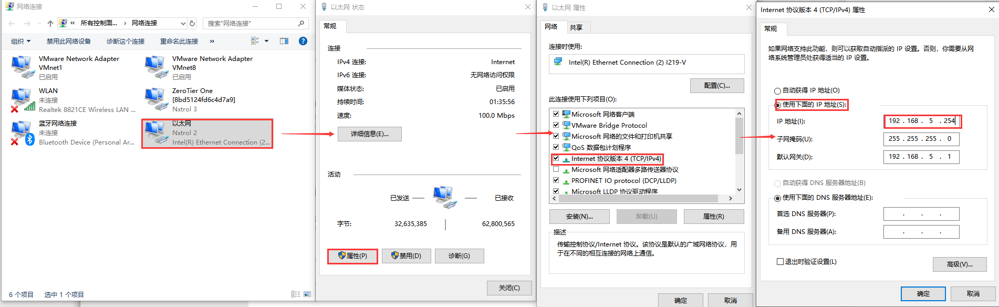

步骤3: 待写入完成后，将PC上的USB读卡器拔出，同时将TF卡插入到树莓派硬件上，并启动电源。

### 3.4. 树莓派初次开机与新建工程

将树莓派硬件网口与PC进行连接并启动电源，因为树莓派默认IP地址192.168.5.99 ，需更改PC的IP地址，在192.168.5.X的网段下，如下图所示：

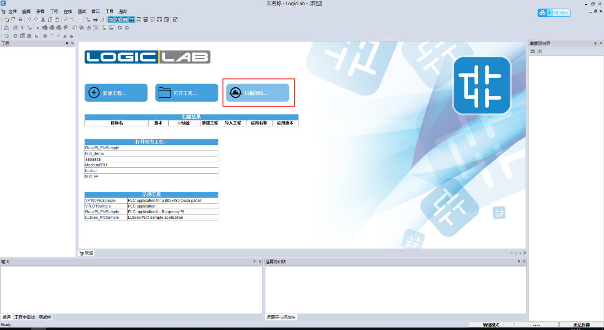

（附：如果更改树莓的IP地址，请参考6.7节树莓派设定固定IP地址）

打开LogicLab编程软件点击扫描网络：

待树莓派设备正常启动完毕后，LogicLab返回的扫描结果中即可得知该树莓派硬件设备的IP地址与设备名称（如果使用标准树莓派显示为Raspberry PI或者Raspberry PI EtherCAT，如实使用欧比特EdgeBox显示为EdgeBox-RPI），并可以通过新建工程按钮来创建针对该设备的工程：

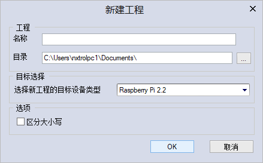

### 3.5. 树莓派硬件授权购买与激活

基于树莓派硬件（树莓派3B/3B+/4B、欧比特EdgeBox-RPI）的PLC核心可以没有任何限制运行1个小时，时间到期后，系统会自动停机，此时需要重新启动树莓派硬件。因此如果期望没有任何时间限制运行基于树莓派的PLC系统，请访问翌控科技官网在线商店进行购买（https://www.nxtrol.com/product_rpi.html#_pp=123_1025）：

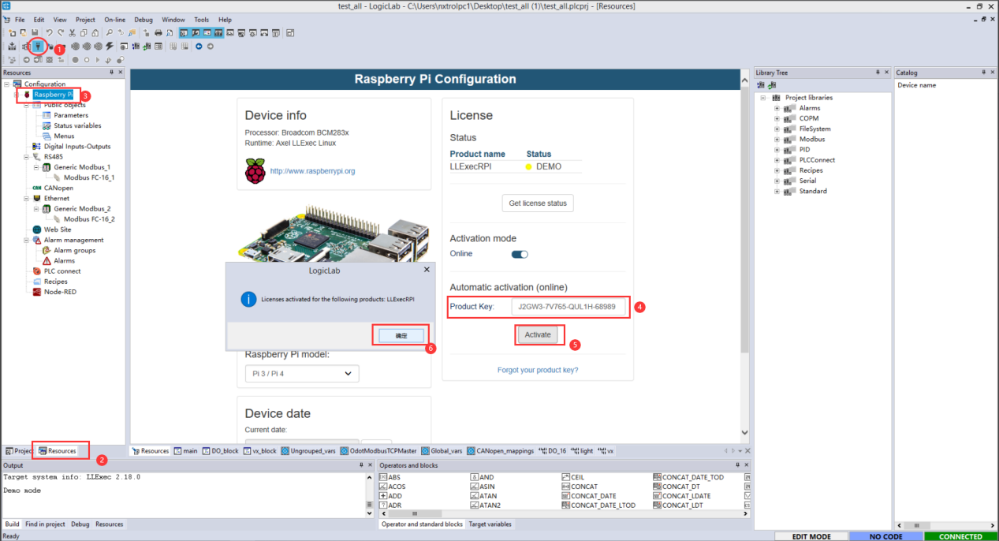

如果购买了LogicLab树莓派正式运行授权后，您会通过邮件接收到一串序列码，并通过下面步骤可以进行在线激活：

步骤1：启动LogicLab编程工具，成功连接树莓派在设备信息主页面显示当前License状态，并可以选择在线(Online)激活

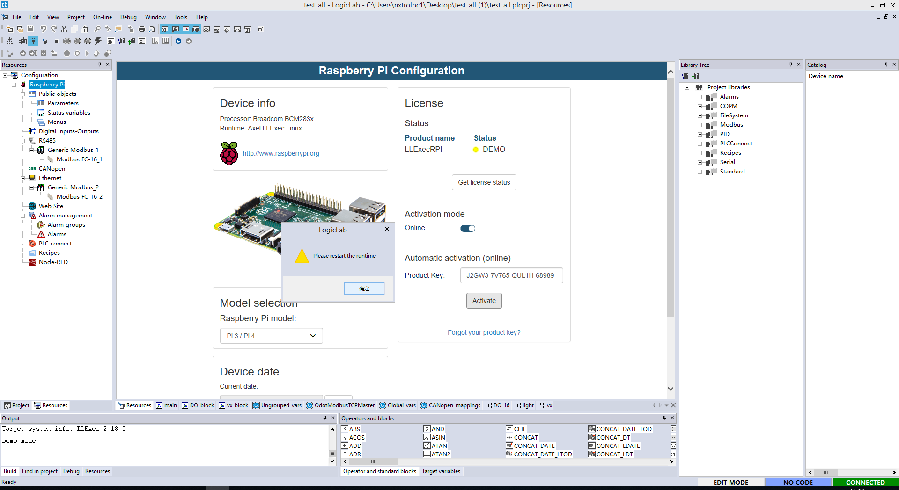

步骤2：等待激活提示为”Please restart the runtime”后，点击确定并手动重启树莓派。

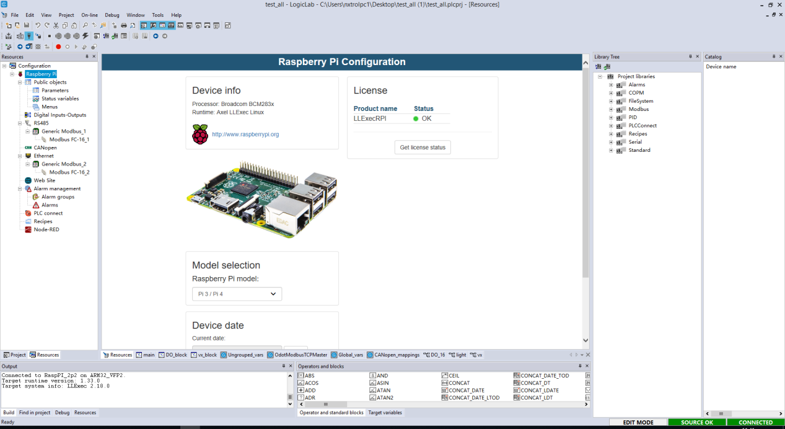

步骤3：重启树莓派后，连接到在线状态，状态如下图所示，代表激活成功。

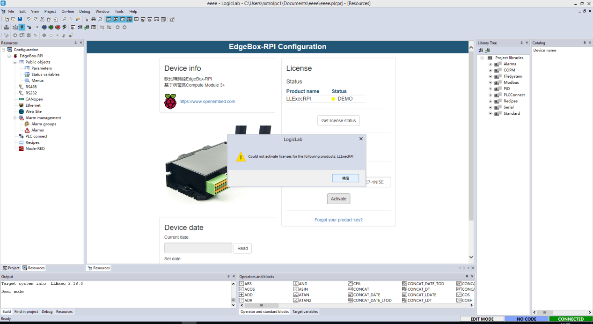

注意：在网络状况不佳的情况下，点击activate后，可能会提示 “could not activate licenses for the following products”，这时只需重复点击Activate即可。

## 4. 基于树莓派的LogicLab入门操作

LogicLab通用使用方法请参考<<LogicLab编程指南.pdf>>，在本章节内容中，主要涉及树莓派相关功能在LogicLab上的操作：

\- 标准树莓派硬件GPIO

\- Modbus TCP

\- Modbus RTU

\- EtherCAT主站（仅支持树莓派4B）

\- NodeRED物联网开发平台

### 4.1. 标准树莓派硬件GPIO控制

按照如下图方式，进入标准树莓派I/O配置页面（注意：如果使用的是欧比特EdgeBox-RPI硬件，此功能则会被禁用）：

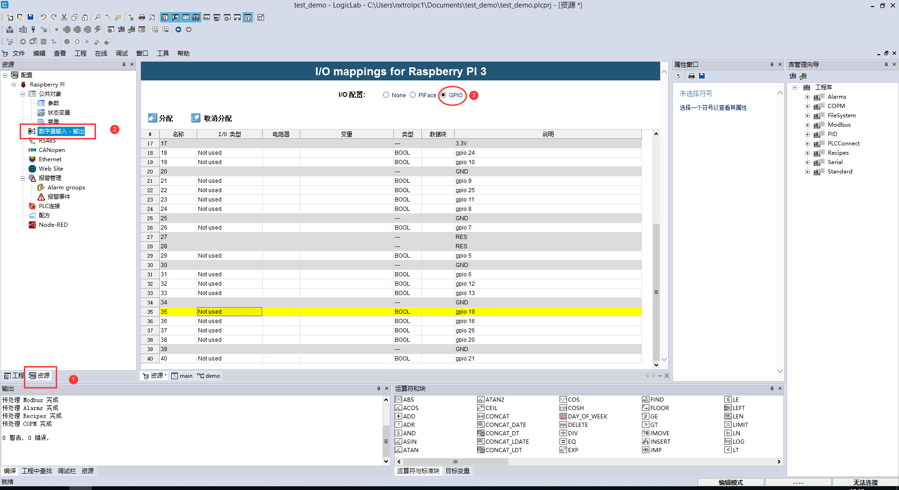

选择需要配置的I/O点 点击下拉按钮选择I/O类型（我们设定的I/O口33作为输出类型）。

，并给I/O点添加PLC变量名称，用于通过此PLC变量访问该I/O信息：

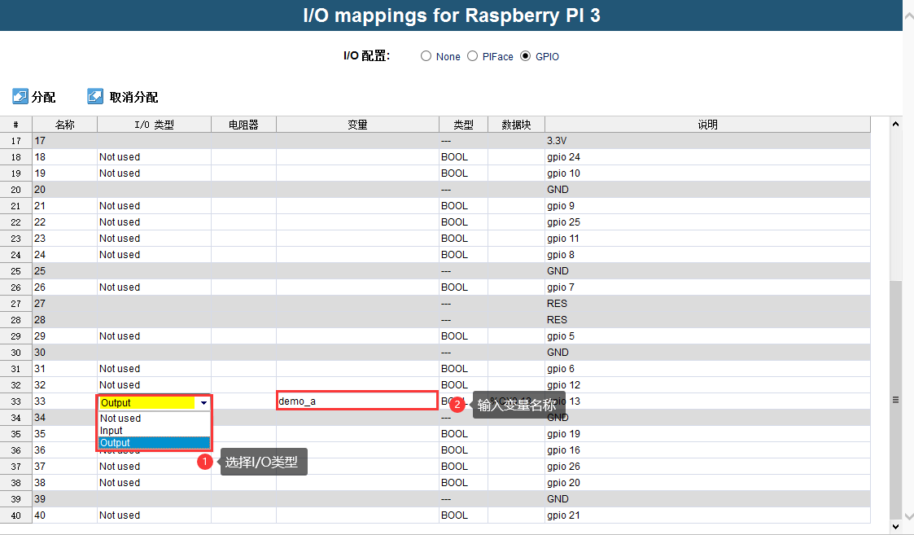

此时切换回LogicLab工程界面，可以在I_O_mappings 中找到该I/O对应的变量信息，编译下载当前PLC程序后，可以切换调试状态，并且在线查看到该I/O信息，如果该I/O配置为输出类型，那么可以直接在线修改对应的变量值，从而来控制该I/O信号。

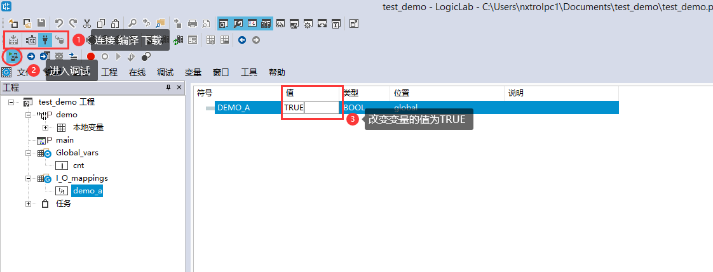

### 4.2. Node-RED物联网开发平台

Node-RED是构建物联网应用程序的一个强大工具，其重点是简化代码块的"连接"以执行任务。它使用可视化编程方法，允许开发人员将预定义的代码块（也叫做"节点"）连接起来执行任务。连接的节点，通常是输入节点、处理节点和输出节点的组合，当它们连接在一起时，构成一个"流"。最初是IBM在2013年末开发的一个开源项目，以满足他们快速连接硬件和设备到Web服务和其他软件的需求--作为物联网的一种粘合剂--它很快发展成为一种通用的物联网编程工具。重要的是，Node-RED已经迅速开发出一个重要的、不断增长的用户基础和一个活跃的开发人员社区。

 

LogicLab作为符合IEC61131-3标准的PLC平台，编写PLC逻辑控制对象主要是工业自动化现场层的信号，也即是OT(Operational Technology)，而Node-RED优势在于面向IT(Information Technology)的数据处理与通讯，实现开放式IT&OT融合的边缘计算控制器，LogicLab与Node-RED将是最佳搭档。

#### 4.2.1 Node-RED基础操作入门

LogicLab编程工具正常与树莓派4B连接情况下，可以直接通过LogicLab编程工具中的Node-RED选项自动打开浏览器进入Node-RED界面，如下图所示：

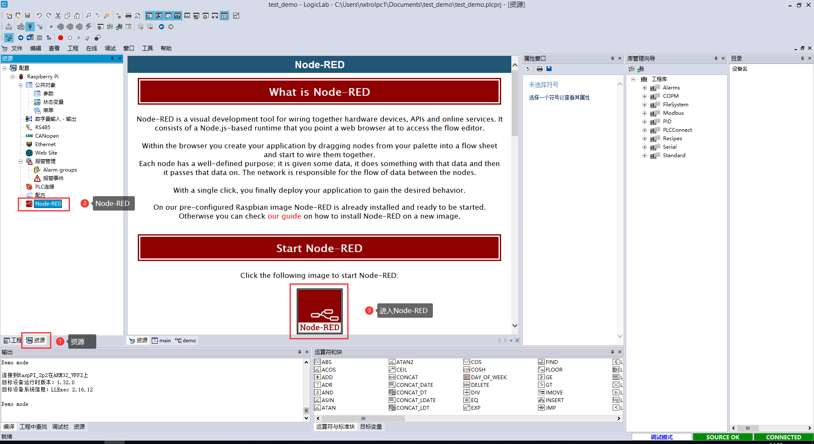

登录Node-RED系统需要用户名与密码，并且不同用户具有不同的操作权限，下面为Node-RED默认用户名密码信息：

\- 管理员用户名:admin, 密码:nxtrol

\- 访客用户名:guest, 密码:guest

 

登录至Node-RED主界面以后，可以通过拖拽左侧的节点至流程编辑区，并且将节点之间进行连接，从而完成节点间的数据流程。下图中拖拽了inject(注入), function(功能)与 debug(调试)这是三个节点到流程编辑区，并进行连接：

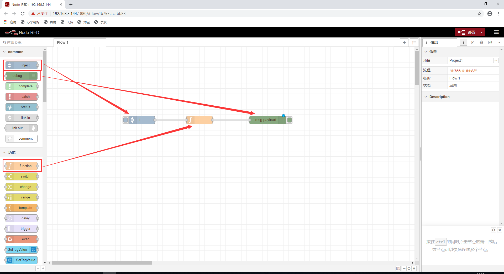

双击inject节点，可以选择内容类型为数字，输入值为1，重复类型可以根据自己的需要进行配置，如下图所示：

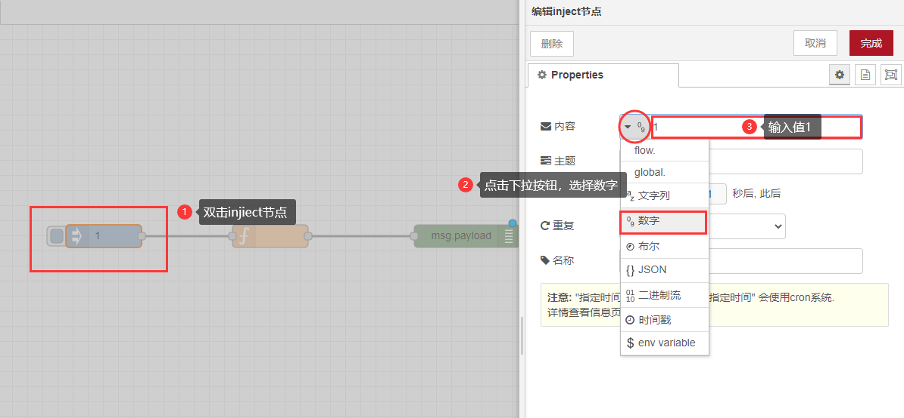

双击function节点，可以通过自行编辑javascript代码对输入的数据进行处理，结果输出给下一个节点。在下图示例代码中，该function第1行的msg.payload是由前个节点inject传入的值，而第3行的msg.payload的值将会传给后个节点debug：

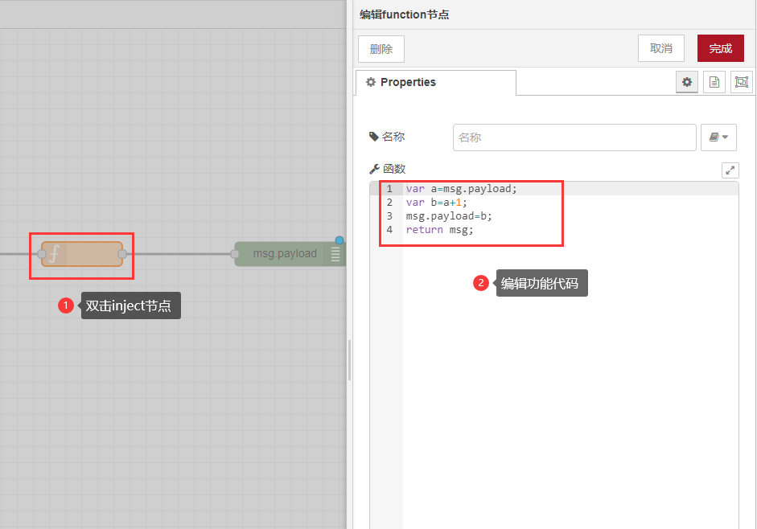

点击右上角的部署按钮，完成当前Node-RED流程部署，如下图所示：

部署完成后，在右侧窗口中打开调试信息窗口，如下图所示：

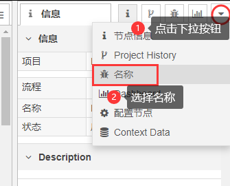

点击inject左边的注入按钮 上方显示成功注入 右边调试窗口显示结果，证明当前Node-RED流程已经执行，如下图所示：

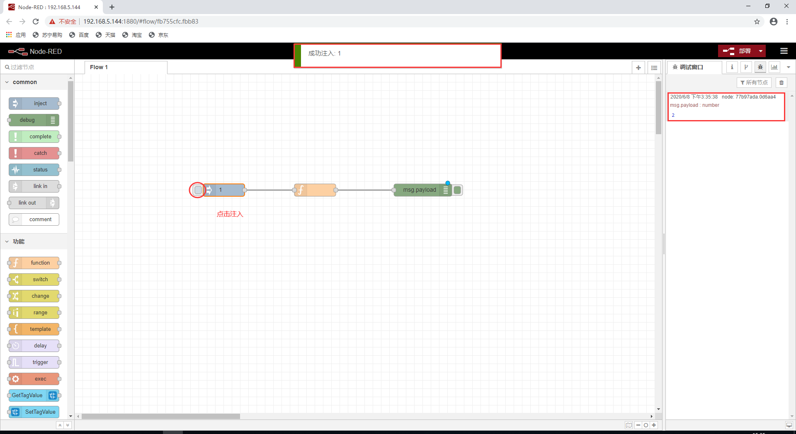

## 5.Q&A
### 5.1. 树莓派PLC镜像下载地址？

登录https://www.nxtrol.com/download.html 根据使用的树莓派硬件型号进行下载（实际镜像文件会持续更新，发布日期可能会有不一样）：

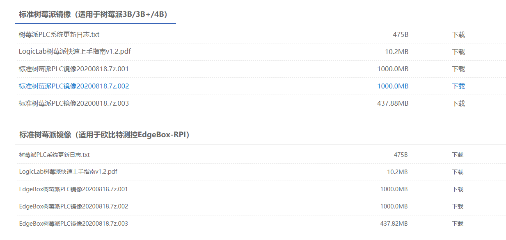

下载完毕后使用7ZIP或者360压缩工具进行解压缩获得最终镜像。镜像文件中包含了存放有校验码的文件”Hash校验码.txt”，可以通过网站下方的辅助工具包中的HASH工具对解压缩出来的img镜像文件进行校验，如果获得的校验码与”Hash校验码.txt”中的值不一样，则该镜像解压缩过程中可能存在数据不一致情况，此时需要重新解压缩或者下载上述镜像文件重新解压缩。

### 5.2. 如何购买正式版的树莓派PLC授权

试用版本的树莓派PLC内核会在运行1个小时左右停机一次，需要重启系统后才可以继续使用，试用版本功能上没有任何限制。购买树莓派PLC内核授权可以没有任何时间限制运行PLC内核，在线购买链接地址如下：

[http://www.nxtrol.com/product_rpi.html](https://www.nxtrol.com/product_rpi.html)

进入购买页面后，点击“立即购买”，并填写好联系人手机（用于我们与您取得联系）以及邮箱地址（用于我们发送授权码到您邮箱），由于授权码可以与任何树莓派硬件完全绑定，因此不支持退货，因此购买前建议在试用版中详细进行评估。目前在线支付方式仅仅支持微信支付：

### 5.3. 树莓派授权激活

激活需要在翌控科技官网购买的授权码，如果未拥有授权码，请前往翌控科技官方网站购买。

一个授权码只和一个树莓派绑定，可以重复激活，但不能激活多台设备。

#### 5.3.1. LogicLab在线激活：

打开logiclab，连接控制器至在线状态，在资源窗口双击树莓派打开树莓派配置界面，输入授权码输入栏输入授权码后，点击激活。如下图所示

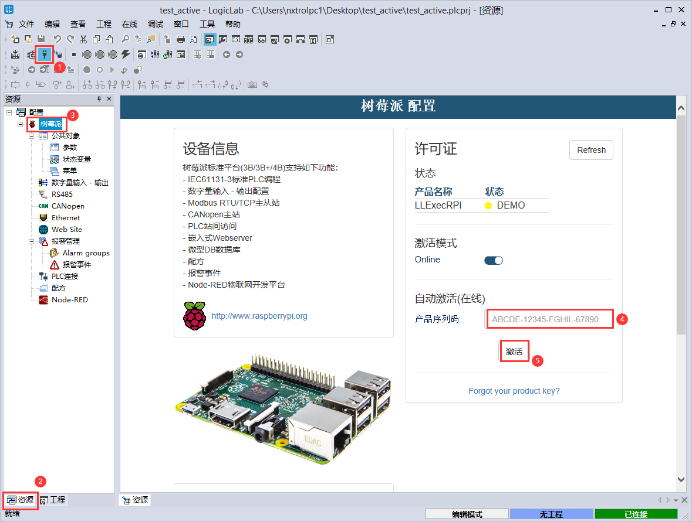

重启树莓派设备，刷新状态，激活成功，如下图所示：

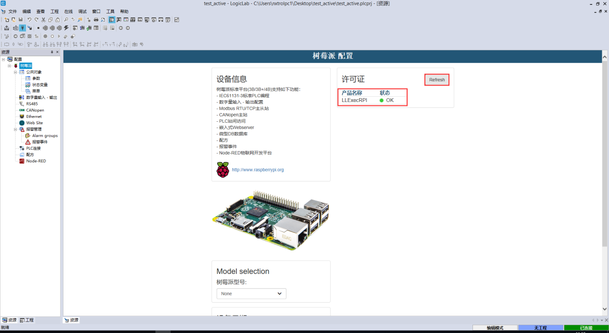

网络状态不佳，可能导致激活失败，出现如下图所示提示，可尝试进行多次重复激活，如仍未成功，可采用网页服务器的方式进行激活。

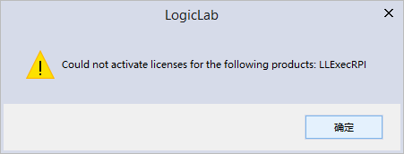

#### 5.3.2. 网页服务器激活：

树莓派可上外网的状态下，在网页网址栏输入设备的IP地址，打开设备的web server界面。如下图所示：

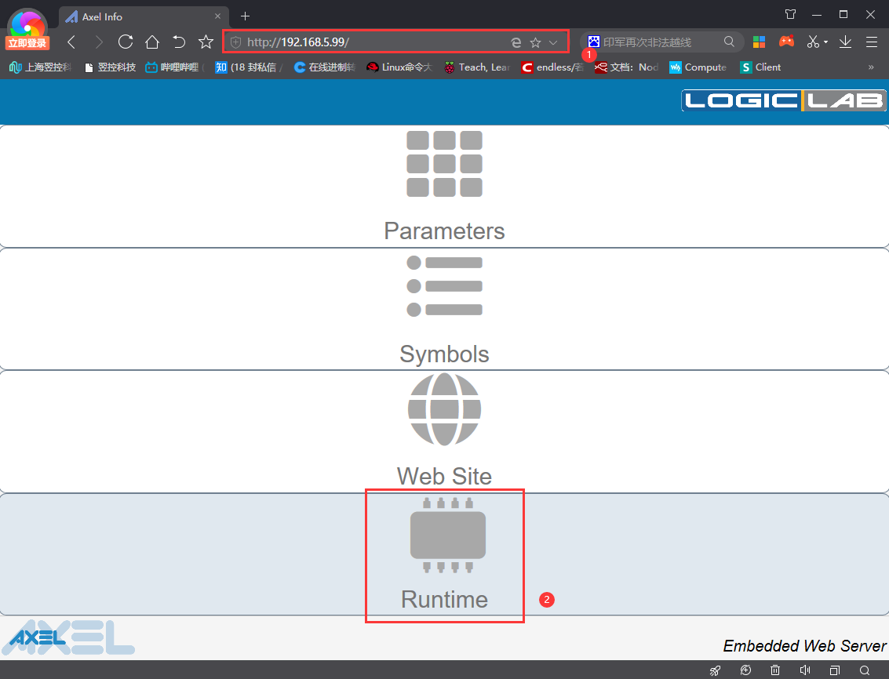

打开授权码激活页面，在激活输入栏输入授权码，点击激活。如下图所示：

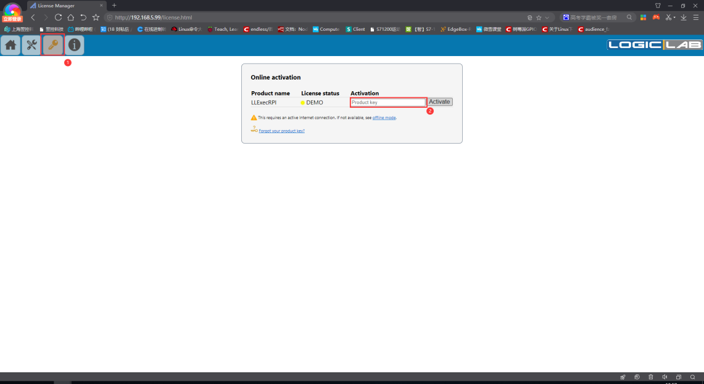

系统提示激活成功，需重启设备，如下图所示：

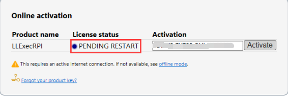

重启树莓派设备，刷新网页，激活成功，如下图所示：

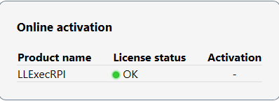

### 5.4.树莓派PLC镜像登录用户名与密码是多少？

翌控科技树莓派PLC镜像文件可以通过SSH工具进行登录（推荐使用PUTTY），其中Linux系统的默认用户名与密码如下：

\- 默认用户名:pi 密码:nxtrol

\- 管理员用户名:root 密码:nxtrol

 

Node-RED开发环境默认用户名与密码如下:

\- 管理员用户名:admin 密码:nxtrol

\- 访客用户名:guest 密码:guest

### 5.5. 通过ssh工具登录树莓派命令行终端

树莓派硬件的以太网接口与无线路由器的网口进行连接，同时安装了LogicLab Automation Suite的PC也通过网线/WIFI连接至该路由器上，确保PC与树莓派硬件处于同一个局域网内，连接树莓派硬件的电源，等待约60秒，树莓派硬件内置的PLC系统将启动完毕。

​                

打开LogicLab编程软件，在主界面上点击”扫描网络”，如果通讯一切正常，那么在扫描结果下会出现当前网络中所有树莓派设备的信息，包括其IP地址，因此在任何时候如果忘记树莓派硬件IP地址时，都可以使用此方法来进行确认。

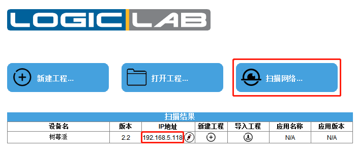

获得树莓派硬件的IP地址后，可以通过SSH串口终端（推荐使用Putty软件）远程连接至树莓派，如下图所示：

输入用户名:pi，密码:nxtrol后即可进入树莓派硬件的Linux系统终端。

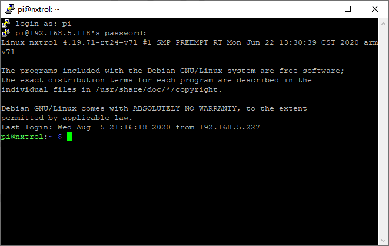

### 5.6. 树莓派设定固定IP地址

树莓派的IP地址与PC需在同一网段，首先查看PC的IP地址；

打开网络连接控制面板，如下图所示：

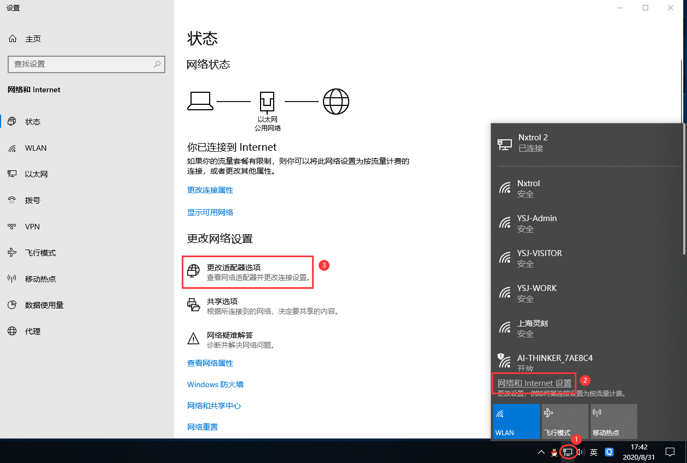

 

查看PC端IPV4的地址，如下图所示：

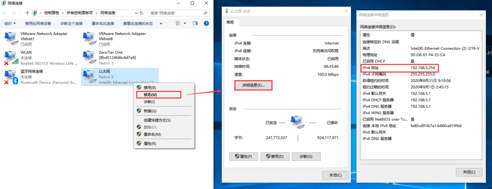使用Putty软件通过ssh登录树莓派Linux终端，（树莓派初始默认IP地址192.168.5.99）。

输入 sudo nano /etc/dhcpcd.conf 命令开启命令行文本编辑器，在文件结尾添加如下配置：

interface eth0

static ip_address=你的内网ip地址/24

static routers=内网网关ip地址

static domain_name_servers=内网路由器的IP地址

如下图所示：

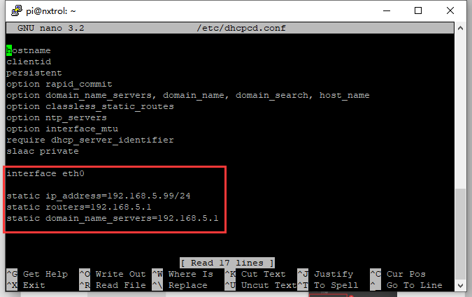

ctrl+o保存编辑 ctrl+x退出编辑 重启树莓派

重新登入树莓派终端输入 ifconfig 命令可以查看树莓派IP地址，如下图所示：

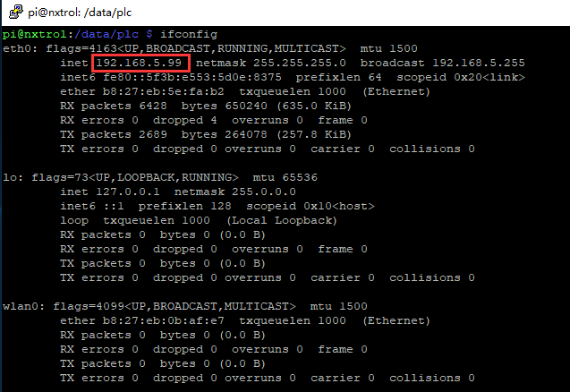

验证树莓派IP地址是否设置成功并与电脑是否连接

打开PC端命令终端命令终端，输入ping+IP地址指令,如下图所示：

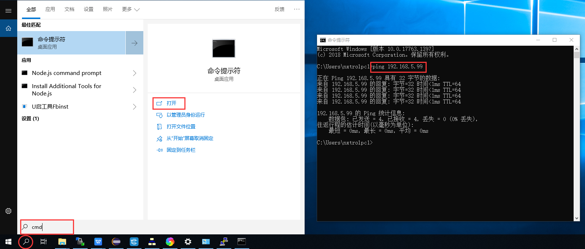

###  5.7. 启用树莓派的WIFI功能（树莓派3B/3B+/4B）

使用Putty软件通过ssh登录树莓派Linux终端，输入下面命令开启树莓派设置界面:sudo raspi-config, 如下图所示：

选择Network Options后，按回车键可以进入网络设置界面，如下图所示：

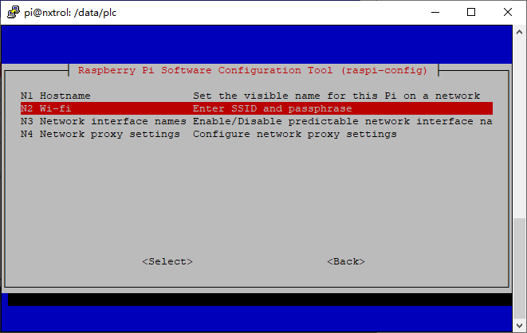

选择Wi-fi选项，回车键进入WIFI用户名与密码设置，如下图所示：

输入无线路由器的WIFI名称SSID以及在后续界面中设定WIFI密码（请按照当前使用的无线路由器实际值来进行设定），如下图所示：

设定WIFI信息完成后，键盘选择OK，并在配置主界面中选择Finish完成WIFI设置，此时建议断开树莓派硬件与无线路由器的网线后，重新上电，并等待约60s后，再次使用LogicLab扫描网络，此时如一切正常的话，LogicLab可以再次扫描到树莓派的设备，此时可以确定树莓派的WIFI工作正常。

如发生扫描不到树莓派设备的情况，请参考如下步骤进行排查：

1. 树莓派4B的WIFI连接到的无线路由器名称SSID与密码是否正确。

2. 树莓派4B是否与运行LogicLab Automation Suite的PC同时连接至同一个无线路由器。

3. 插上树莓派的网线至无线路由器上，重复以上步骤。

### 5.8 使用欧比特测控EdgeBox-RPI如何开启4G功能

购买了欧比特测控EdgeBox-RPI后，如果选配了4G模组，可以通过下面串口终端命令行开启或者关闭4G功能，开启4G功能之前确保已经插入SIM卡（推荐使用电信网络）：

\- 开启4G功能

sudo systemctl enable 4g.service

\- 关闭4G功能

sudo systemctl disable 4g.service

### 5.9 如何自行烧写欧比特测控EdgeBox-RPI的树莓派核心板镜像

购买欧比特测控的EdgeBox-RPI设备，可以向厂家要求烧写好最新版本的翌控科技LogicLab树莓派镜像文件，一般情况下无需自主烧写。如果需要自主烧写镜像，需要购买微雪电子的树莓派Compute Module底板，拆开EdgeBox-RPI硬件取出核心板，插入在微雪电子的树莓派Compute Module底板上，并通过下面教程进行烧写（注意烧写的镜像必须在翌控科技官网上下载，下载地址参考6.1章节）：

http://www.waveshare.net/wiki/Compute_Module_IO_Board_Plus

视频烧写教程请参考如下链接：

https://www.bilibili.com/video/BV1Lp4y1973E

###	5.10 树莓派4B WIFI通讯设置
树莓派PLC镜像烧写至树莓派4B使用的TF卡中，通过网线将树莓派4B的以太网接口与无线路由器的网口进行连接，同时安装了LogicLab Automation Suite的PC也通过网线/WIFI连接至该路由器上，确保PC与树莓派4B处于同一个局域网内，连接树莓派4B的电源，等待约60秒，树莓派4B内置的PLC系统将启动完毕。

打开LogicLab编程软件，在主界面上点击”扫描网络”，如果通讯一切正常，那么在扫描结果下会出现当前网络中所有树莓派设备的信息，包括其IP地址，因此在任何时候如果忘记树莓派硬件IP地址时，都可以使用此方法来进行确认。
 

获得树莓派4B的IP地址后，可以通过SSH串口终端（推荐使用Putty软件）远程连接至树莓派4B，如下图所示：

 

输入用户名:pi，密码:nxtrol后即可进入树莓派4B的Linux系统终端。
 
 

通过输入下面命令开启树莓派设置界面:sudo raspi-config, 如下图所示：
 

选择Network Options后，按回车键可以进入网络设置界面，如下图所示：
 
 

选择Wi-fi选项，回车键进入WIFI用户名与密码设置，如下图所示：
 

输入无线路由器的WIFI名称SSID以及在后续界面中设定WIFI密码（请按照当前使用的无线路由器实际值来进行设定），如下图所示：
 
 

设定WIFI信息完成后，键盘选择OK，并在配置主界面中选择Finish完成WIFI设置，此时建议断开树莓派4B硬件与无线路由器的网线后，重新上电，并等待约60s后，再次使用LogicLab扫描网络，此时如一切正常的话，LogicLab可以再次扫描到树莓派4B的设备，此时可以确定树莓派4B的WIFI工作正常。

 

如发生扫描不到树莓派设备的情况，请参考如下步骤进行排查：
1. 树莓派4B的WIFI连接到的无线路由器名称SSID与密码是否正确。
2. 树莓派4B是否与运行LogicLab Automation Suite的PC同时连接至同一个无线路由器。
3. 插上树莓派4B的网线至无线路由器上，重复以上步骤。

###	5.11 树莓派4B EtherCAT接口与PLC配置文件设置
注意此步骤会修改树莓派4B的以太网接口信息，必须在5.4.1章节步骤成功完成后才可以开始。

使用SSH登录树莓派4B的Linux系统终端，进行如下配置文件拷贝操作：
cd /data/plc
sudo cp LLExecLinux.conf.EtherCAT LLExecLinux.conf
cd /etc
sudo cp dhcpcd.conf.EtherCAT dhcpcd.conf

 

注意使用sudo命令进行管理员权限操作，系统会在第一次输入带有sudo命令时提示输入密码，密码为:nxtrol

完成上述命令后，EtherCAT网络接口与PLC配置文件修改完成（该命令只需执行一次，如重新烧写树莓派4B的TF卡镜像后，需要重新5.4.1与5.4.2章节的操作），重新上电树莓派4B硬件，等待约60秒后，可以使用LogicLab软件执行网络扫描功能，扫描结果如下图所示：

 
此时树莓派4B的设备名称改变为”树莓派EtherCAT”，并且可以通过新建工程按钮直接新建适用于该树莓派4B的PLC工程（通过在线扫描方式新建工程，工程通讯参数已经自动设定，无需手动设定通讯参数）。