###	LogicLab中使用EtherCAT主站功能
通过正确建立新工程后，首先需要在如下位置导入需要使用到的EtherCAT从站设备ESI文件：
 
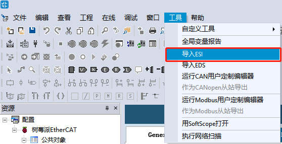

导入ESI文件完成后，鼠标左键选择EtherCAT节点下的”Main network”后，右侧的设备目录中将会显示新导入的ESI设备与LogicLab中内置的EtherCAT设备名称。
 
 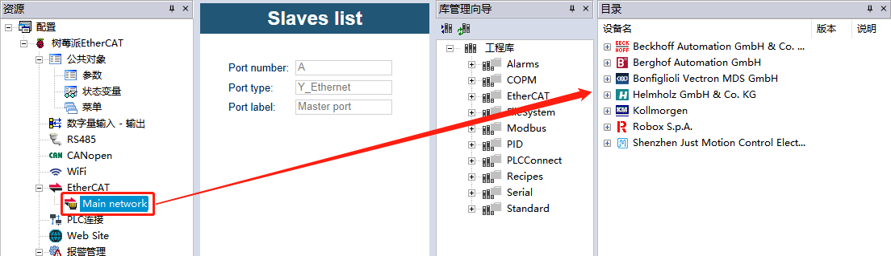

鼠标左键选择”EtherCAT”节点，通过勾选”Enabled”激活树莓派4B的EtherCAT主站功能，并设定”Divergence threshold”值为10000us（由于树莓派4B的实时Linux系统使用PREEMPT-RT补丁，最差Linux系统抖动约为100us-200us左右，因此该参数默认值250us并不能很好支持开启树莓派DC分布式时钟功能，如使用Xenomai Linux实时扩展则可以保持默认值250us）。选择”Online mode”后，可以切换至EtherCAT Online模式：
 
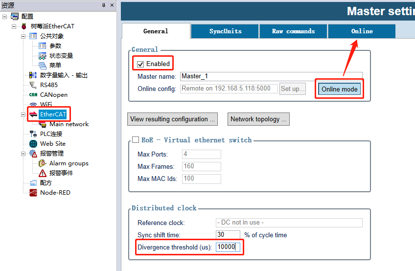

进入在线模式后，点击”Scan Network”扫描树莓派4B以太网口连接的所有EtherCAT设备（注意所有已连接的设备必须预先导入其ESI配置文件，否则可能无法扫描到对应的设备）。

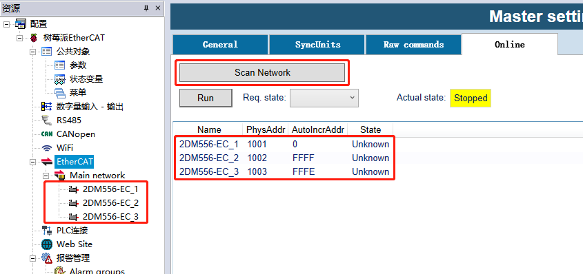 

如果已经扫描到设备支持DC分布式时钟，那么DC默认参考时钟为第一个支持DC分布式时钟的EtherCAT从站，LogicLab会自动进行设置：
 
 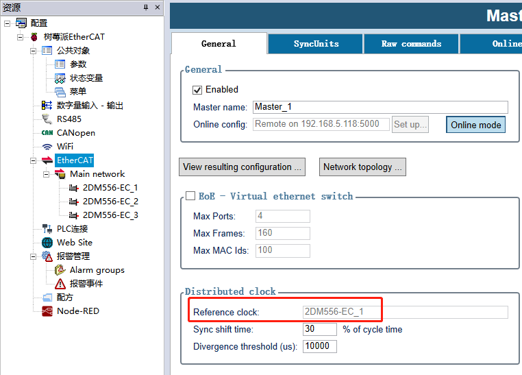

选择对应的EtherCAT从站设备，可以依次切换至对应的选项卡进行信息查看或者参数设定：
1. General - 基础信息查看
2. Startup - 初始化命令设置
3. Input - 输入变量映射
4. Output - 输出变量映射
5. Mailbox - 邮箱参数设置
6. DC - 分布式时钟设置
7. Online - 在线对象字典诊断
 
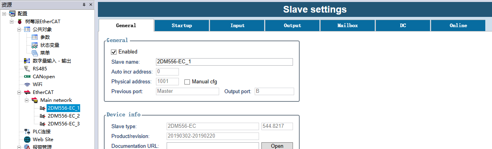

EtherCAT输入/输出与PLC变量关联非常简单与方便，可以在Input以及Output中的”PLC var”选项中直接输入期望的PLC变量名，按回车键即可将EtherCAT PDO与PLC变量关联，如下图所示：
 
 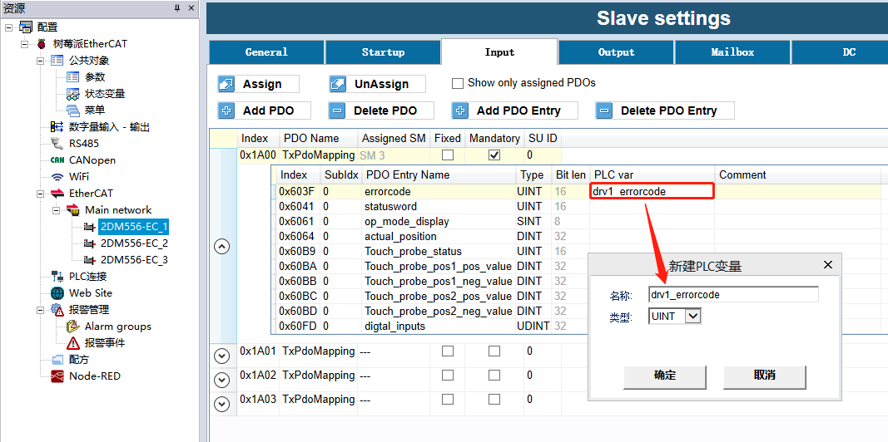

将所有需要的EtherCAT PDO对象新建对应的PLC变量与其关联后，在全局变量表格中可以找到对应的变量定义，后续操作EtherCAT从站设备可通过对这些PLC变量进行编程。编译下载PLC工程后，系统可能提示如下信息，直接选择”是”即可，等待PLC自动重新启动以及加载新设定的配置文件：
 
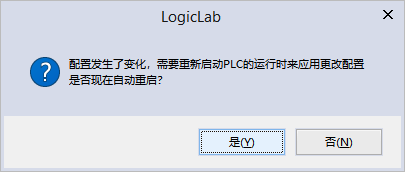

并且可以通过切换到变量列表在线监控模式直接进行监控，如下图所示：
 
 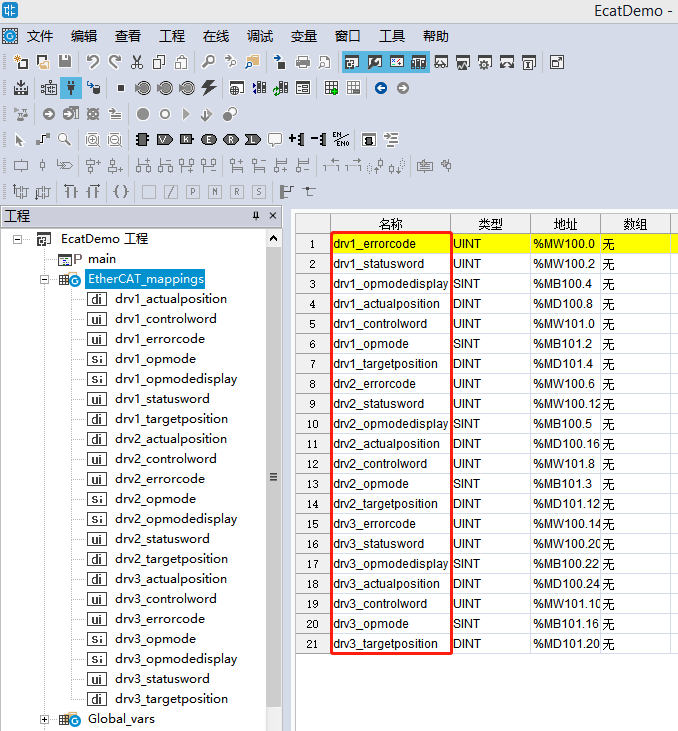
 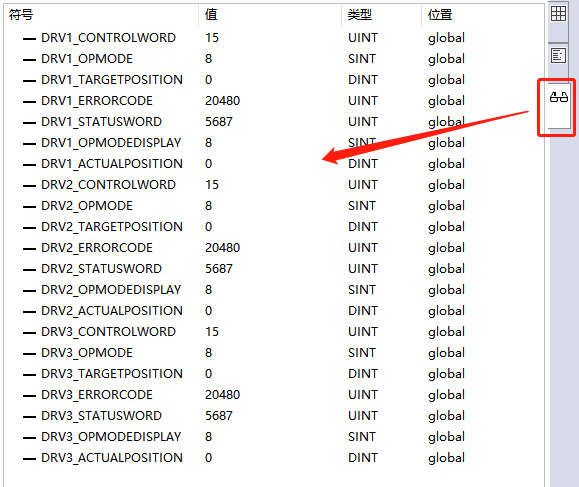

EtherCAT任务周期与Fast任务一致，如需要改变EtherCAT任务周期可以直接修改Fast任务的周期，重新编译下载工程：
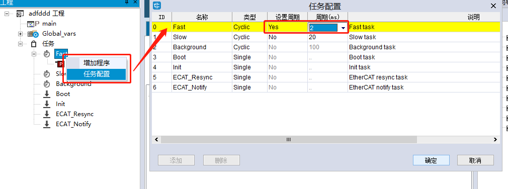