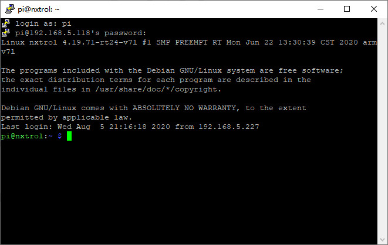
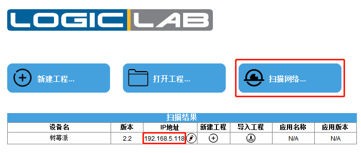

##	EtherCAT主站（仅支持树莓派4B）
基于树莓派4B可以实现EtherCAT主站功能，但由于树莓派Linux系统实时性影响，EtherCAT主站功能仅供评估与学习使用，请勿在商业产品中进行使用。因为标准树莓派4B硬件只包含有一个以太网口，并且树莓派PLC镜像默认已经使用该太网接口用于TCP/IP通讯，因此需要按照下面步骤首先设定树莓派4B的WIFI用于连接到无线路由器，用于TCP/IP通讯，然后基于LogicLab使用EtherCAT主站功能。
###	树莓派4B WIFI通讯设置
树莓派PLC镜像烧写至树莓派4B使用的TF卡中，通过网线将树莓派4B的以太网接口与无线路由器的网口进行连接，同时安装了LogicLab Automation Suite的PC也通过网线/WIFI连接至该路由器上，确保PC与树莓派4B处于同一个局域网内，连接树莓派4B的电源，等待约60秒，树莓派4B内置的PLC系统将启动完毕。

打开LogicLab编程软件，在主界面上点击”扫描网络”，如果通讯一切正常，那么在扫描结果下会出现当前网络中所有树莓派设备的信息，包括其IP地址，因此在任何时候如果忘记树莓派硬件IP地址时，都可以使用此方法来进行确认。
 

获得树莓派4B的IP地址后，可以通过SSH串口终端（推荐使用Putty软件）远程连接至树莓派4B，如下图所示：

 

输入用户名:pi，密码:nxtrol后即可进入树莓派4B的Linux系统终端。
 
 

通过输入下面命令开启树莓派设置界面:sudo raspi-config, 如下图所示：
 

选择Network Options后，按回车键可以进入网络设置界面，如下图所示：
 
 

选择Wi-fi选项，回车键进入WIFI用户名与密码设置，如下图所示：
 

输入无线路由器的WIFI名称SSID以及在后续界面中设定WIFI密码（请按照当前使用的无线路由器实际值来进行设定），如下图所示：
 
 

设定WIFI信息完成后，键盘选择OK，并在配置主界面中选择Finish完成WIFI设置，此时建议断开树莓派4B硬件与无线路由器的网线后，重新上电，并等待约60s后，再次使用LogicLab扫描网络，此时如一切正常的话，LogicLab可以再次扫描到树莓派4B的设备，此时可以确定树莓派4B的WIFI工作正常。

 

如发生扫描不到树莓派设备的情况，请参考如下步骤进行排查：
1. 树莓派4B的WIFI连接到的无线路由器名称SSID与密码是否正确。
2. 树莓派4B是否与运行LogicLab Automation Suite的PC同时连接至同一个无线路由器。
3. 插上树莓派4B的网线至无线路由器上，重复以上步骤。

###	树莓派4B EtherCAT接口与PLC配置文件设置
注意此步骤会修改树莓派4B的以太网接口信息，必须在5.4.1章节步骤成功完成后才可以开始。

使用SSH登录树莓派4B的Linux系统终端，进行如下配置文件拷贝操作：
cd /data/plc
sudo cp LLExecLinux.conf.EtherCAT LLExecLinux.conf
cd /etc
sudo cp dhcpcd.conf.EtherCAT dhcpcd.conf

 

注意使用sudo命令进行管理员权限操作，系统会在第一次输入带有sudo命令时提示输入密码，密码为:nxtrol

完成上述命令后，EtherCAT网络接口与PLC配置文件修改完成（该命令只需执行一次，如重新烧写树莓派4B的TF卡镜像后，需要重新5.4.1与5.4.2章节的操作），重新上电树莓派4B硬件，等待约60秒后，可以使用LogicLab软件执行网络扫描功能，扫描结果如下图所示：

 
此时树莓派4B的设备名称改变为”树莓派EtherCAT”，并且可以通过新建工程按钮直接新建适用于该树莓派4B的PLC工程（通过在线扫描方式新建工程，工程通讯参数已经自动设定，无需手动设定通讯参数）。

###	LogicLab中使用EtherCAT主站功能
通过正确新建树莓派4B工程后，首先需要在如下位置导入需要使用到的EtherCAT从站设备ESI文件：
 

导入ESI文件完成后，鼠标左键选择EtherCAT节点下的”Main network”后，右侧的设备目录中将会显示新导入的ESI设备与LogicLab中内置的EtherCAT设备名称。
 
 

鼠标左键选择”EtherCAT”节点，通过勾选”Enabled”激活树莓派4B的EtherCAT主站功能，并设定”Divergence threshold”值为10000us（由于树莓派4B的实时Linux系统使用PREEMPT-RT补丁，最差Linux系统抖动约为100us-200us左右，因此该参数默认值250us并不能很好支持开启树莓派DC分布式时钟功能，如使用Xenomai Linux实时扩展则可以保持默认值250us）。选择”Online mode”后，可以切换至EtherCAT Online模式：
 

进入在线模式后，点击”Scan Network”扫描树莓派4B以太网口连接的所有EtherCAT设备（注意所有已连接的设备必须预先导入其ESI配置文件，否则可能无法扫描到对应的设备）。

 

如果已经扫描到设备支持DC分布式时钟，那么DC默认参考时钟为第一个支持DC分布式时钟的EtherCAT从站，LogicLab会自动进行设置：
 
 

选择对应的EtherCAT从站设备，可以依次切换至对应的选项卡进行信息查看或者参数设定：
1. General - 基础信息查看
2. Startup - 初始化命令设置
3. Input - 输入变量映射
4. Output - 输出变量映射
5. Mailbox - 邮箱参数设置
6. DC - 分布式时钟设置
7. Online - 在线对象字典诊断
 

EtherCAT输入/输出与PLC变量关联非常简单与方便，可以在Input以及Output中的”PLC var”选项中直接输入期望的PLC变量名，按回车键即可将EtherCAT PDO与PLC变量关联，如下图所示：
 
 

将所有需要的EtherCAT PDO对象新建对应的PLC变量与其关联后，在全局变量表格中可以找到对应的变量定义，后续操作EtherCAT从站设备可通过对这些PLC变量进行编程。编译下载PLC工程后，系统可能提示如下信息，直接选择”是”即可，等待PLC自动重新启动以及加载新设定的配置文件：
 

并且可以通过切换到变量列表在线监控模式直接进行监控，如下图所示：
 
 
 

EtherCAT任务周期与Fast任务一致，如需要改变EtherCAT任务周期可以直接修改Fast任务的周期，重新编译下载工程：
