##	Modbus TCP
树莓派标准硬件与欧比特测控的EdgeBox都可以支持基于以太网的Modbus TCP通讯协议，包括Modbus TCP主站与从站功能。
###	Modbus TCP从站
Modbus TCP从站功能需要在资源页面的”Ethernet”节点下进行配置，配置为Modbus TCP从站选项如下图所示：

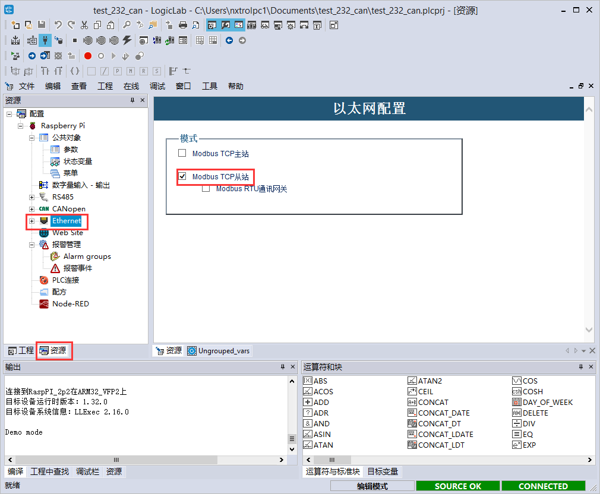

同时在公共对象中添加对应的数据源，默认地址从0开始，并关联PLC变量：

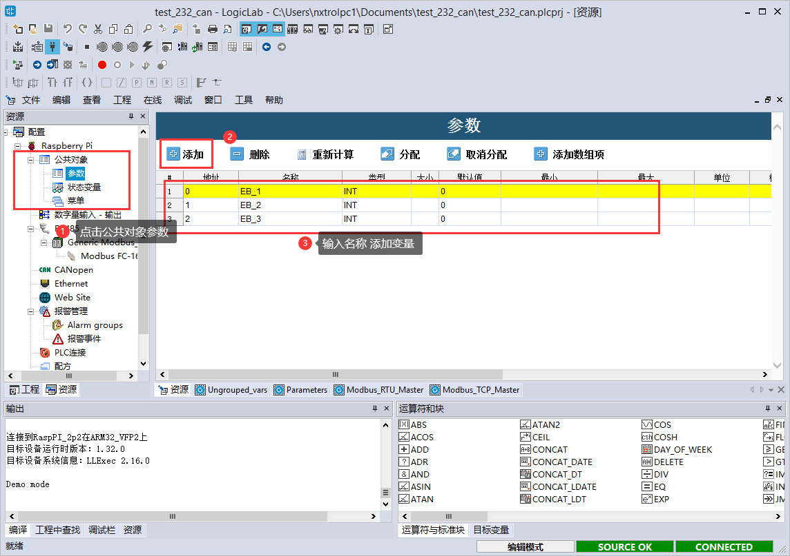

公共对象地址为全局唯一，因此同一个公共对象地址可以映射为多个Modbus地址，如需要同时支持多种不同类型的Modbus地址，请合理分配好公共对象的地址空间，其对应关系如下：

| 公共对象地址 | Modbus地址              |
| ------------ | ----------------------- |
| 0            | 00001/30001/40001/10001 |
| 1            | 00002/30002/40002/10002 |
| 2            | 00003/30003/40003/10003 |
| .....        | .....                   |

通过MODSCAN模拟主站可以验证树莓派Modbus TCP功能，配置如下树莓派以太网IP地址，并设定访问的Device ID为：255，寄存器类型等等信息：
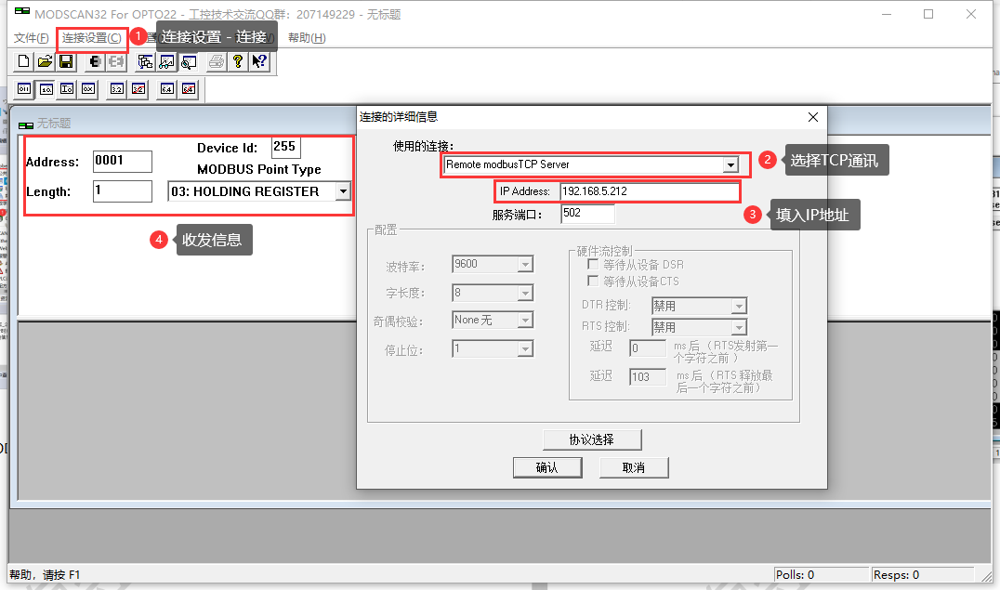

注意MODSCAN访问树莓派Modbus寄存器地址范围必须与LogicLab中定义的一致，否则树莓派可能会返回异常码。LogicLab中参数配置完成后需要确保该工程进行编译下载后，才能启动已经配置的Modbus TCP从站功能。

###	Modbus TCP主站
Modbus TCP主站功能需要在资源页面的”Ethernet”节点下进行配置，配置为Modbus TCP主站选项如下图所示：

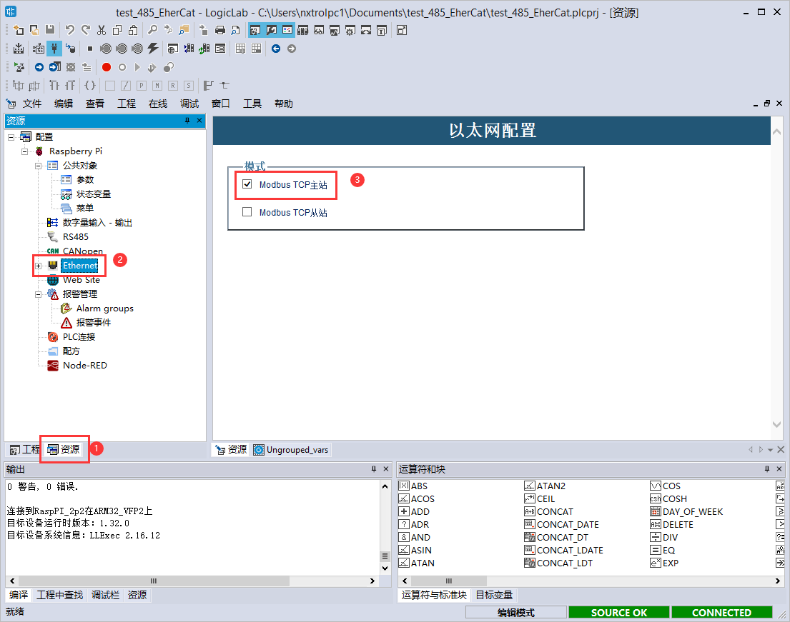

通过在”Ethernet”节点上的右键菜单添加设备，选择”Generic Modbus”设备：

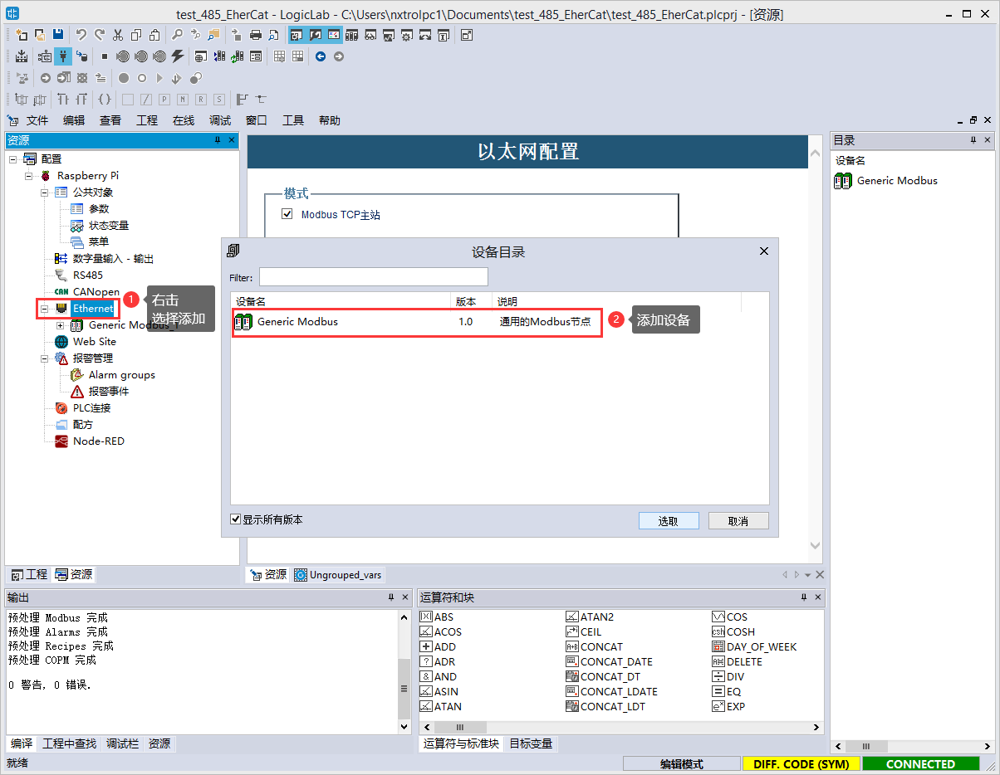

并在”Generic Modbus”节点中配置好需要访问的目标Modbus TCP从站的IP地址（本文使用PC仿真从站模拟，实际从站可以为I/O模块，传感器，或者其他Modbus TCP设备等），并可以在右侧设备目录找到目前支持的Modbus功能码，可以将期望访问的功能码鼠标左键拖入”Generic Modbus”节点下，如下图所示：

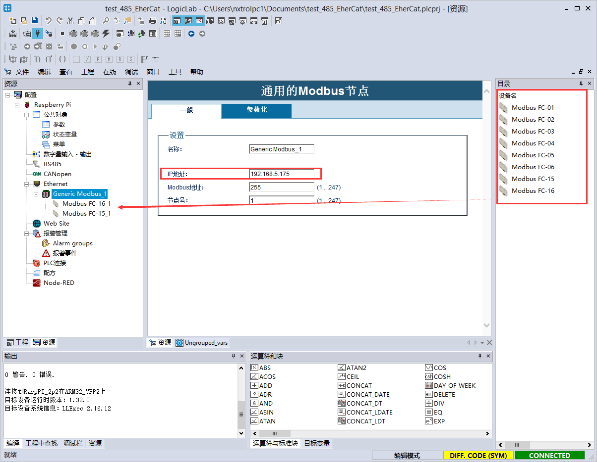

在对应的功能码节点下按照自己的需求填入PLC变量名称：

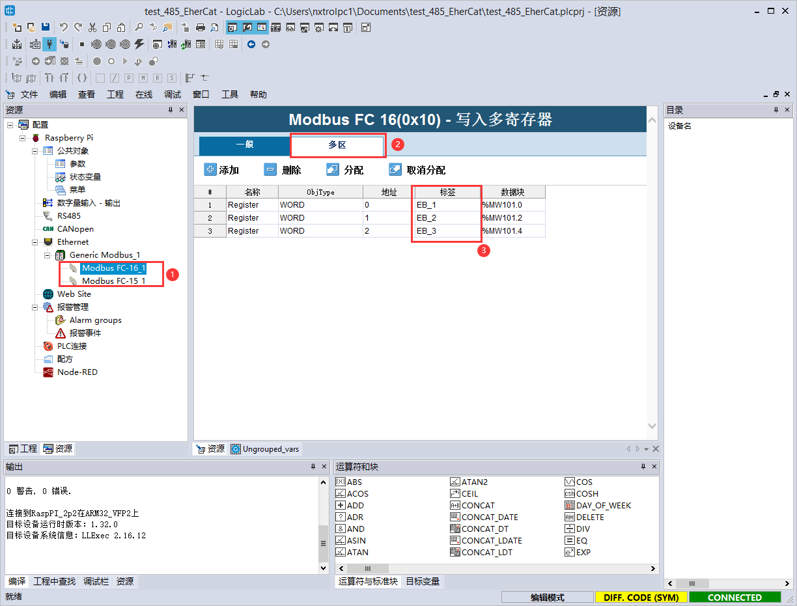

LogicLab会自动将该功能码对应的Modbus远程变量与PLC变量进行关联，用户实际最终通过该变量访问远程Modbus TCP从站的对应寄存器数据，如下图所示：

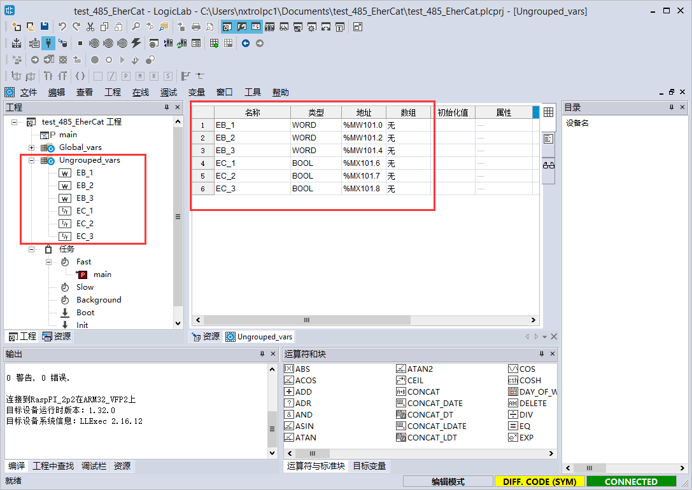

通过MODSIM软件可以在PC上仿真Modbus TCP从站，从而由树莓派设备中的LogicLab Modbus TCP主站进行访问，MODSIM软件配置流程如下：

在LogicLab中强制改变主站变量的值，在对应的MODSIM模拟从站中对应寄存器的值也会随之改变：

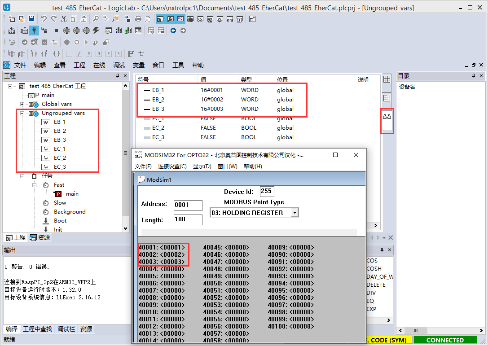

##	Modbus RTU
Modbus RTU使用方式与Modbus TCP一致，在参数配置界面上会有稍稍差别，本章节仅仅介绍Modbus RTU的主站与从站的参数配置界面。
###	Modbus RTU从站
Modbus RTU可以基于RS232或者RS485接口实现，目前在标准树莓派硬件上通过外接的USB转RS232/RS485设备或者独立的扩展板（推荐微雪RS485扩展板）实现支持RS232/RS485接口。欧比特测控EdgeBox-RPI设备可选配隔离的RS232&RS485接口版本。
Modbus RTU从站配置如下，标准树莓派硬件需要指定对应的设备名，该设备名为RS232/RS485在树莓派Linux系统下的设备驱动名称，默认为：/dev/ttyUSB0，可以根据实际选用的RS232/RS485设备来确定该设备名。对于欧比特测控EdgeBox-RPI设备，RS232与RS485，LogicLab已经默认配置好对应的设备名，用户无需配置。
波特率、串行模式与Modbus地址设定需要与当前网络使用的参数保持一致。

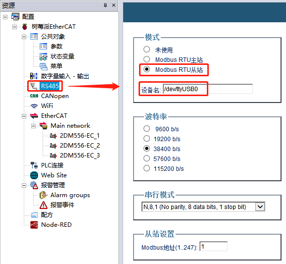

###	Modbus RTU主站
Modbus RTU主站参数配置与从站基本一致，如下图所示：

 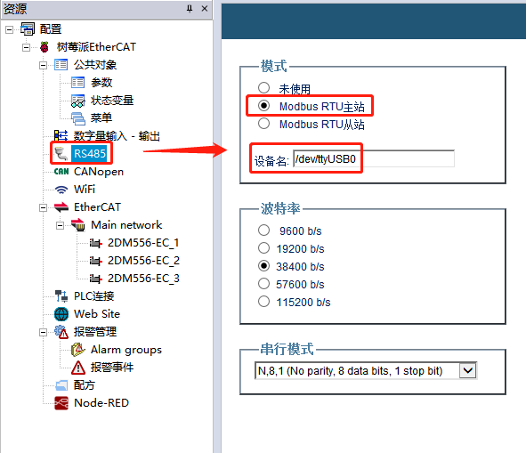
