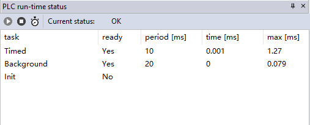

## 1. IEC61131-3标准软件LogicLab解决方案简介

LogicLab解决方案是专门为符合IEC61131-3标准的PLC控制器设计软件平台方案，主要分为运行在Windows平台上的编程工具与运行在控制器平台上的Runtime软件组件，应用LogicLab产品解决方案架构图如下：

同时LogicLab Runtime组件也支持如下处理器与操作系统：

## 2 LogicLab编程软件介绍

LogicLab是IEC61131-3标准的SoftPLC解决方案，支持五种IEC61131-3编程语言：功能块图（FBD），梯形图（LD），结构化文本（ST），指令表（IL）和顺序流程图（SFC）。支持不限数量的多任务架构，任务之间基于优先级进行调度，同时LogicLab支持在线断点调试，逻辑分析仪，仿真等等功能，界面如下图所示：

###  2.1 IEC61131-3编程语言

LogicLab支持五种IEC61131-3标准中的编程语言，分别如下：

\- 功能块图FBD(Function Block Diagram)

\- 梯形图LD(Ladder)

\- 结构化文本ST(Structure Text)

\- 指令表IL(Instruction List)

\- 顺序功能图SFC(Sequential Function Chart)

### 2.2 IEC61131-3功能（FU）/功能块（FB）

LogicLab支持IEC61131-3标准中定义的基础功能与功能块，同时可以使用IEC61131-3五种编程语言或者是C/C++（需购买LogicLab Runtime SDK）封装功能/功能块。

\- 基础功能与功能块

\- IEC61131-3编程语言实现功能/功能块(以FT_PID功能块为例)

\- C/C++编程语言实现功能/功能块

请参阅本文2.3章节

### 2.3. 基础变量Variable类型

目前LogicLab中支持如下基础变量类型：

### 2.4. 高级类型数组Array与结构体Structure

LogicLab中支持定义最多三维数组Array，大小不限（需要硬体存储器空间足够容纳数组以及其他变量的大小）：

LogicLab中支持定义不限元素数量的结构体Structure类型，大小不限（需要硬体存储器空间足够容纳数组以及其他变量的大小）

### 2.5. 扩展数据类型

LogicLab支持扩展的数据类型例如：宏Macro，枚举Enumeration，指针Pointer，类型重定义TypeDef。

### 2.6. 变量地址Variable Address

LogicLab支持IEC61131-3标准中的地址定义，包括输入Input、输出Output与内部存储器Memory，分别对应地址标识为%I，%Q，%M。在LogicLab Engineer中的输入Input、输出Output与内部存储器Memory区域对应于LogicLab Runtime中一个或者多个Data Block，具体实现概念请参阅本文4.2章节。

LogicLab地址定义由对应的窗口来简化用户的使用，如下图所示：

### 2.7. 任务Task类型

LogicLab中支持标准IEC61131-3中定义的周期类型（Cyclic）任务，事件类型(Event/Single)任务，空闲类型（Background/Idle）任务，并且不限制任务数量。所有任务都会在LogicLab Runtime中预先静态定义，LogicLab Engineer中可以通过设备描述文件来控制具体给用户开放哪些任务，以及设定其优先级参数，通过静态定义方式尽可能避免用户对任务误操作引起系统异常，能够让传统PLC（不支持多任务的PLC）可以尽可能简单切换到IEC61131-3的PLC系统上来。

### 2.8. 工程与库加密

LogicLab Engineer中的PLC工程元素（包括程序，功能，功能块等）可以进行源代码加密功能，尽可能保护应用工程师开发的行业应用算法与源代码资产。

单独加密POU：

或者导出POU加密：

### 2.9. 在线调试

LogicLab提供一系列的调试手段方便用户进行工程应用开发，包括：在线数据实时显示、强制修改变量值、离散/集中数据监控、断点BreakPoint与单步Step调试、专业级软件示波器与Runtime状态监控等等功能。

\- 在线数据实时显示（以LD与ST为例）

\- 强制修改变量值

\- 离散/集中数据监控

离散数据监控是指在变量列表中监控已经定义的变量，集中数据监控是指用户添加自己需要监控的变量到Watch Window中，在独立的窗口中查看当前数据值。

离散数据（适用于局部变量与全局变量表格）监控如下图所示：

集中数据监控如下图所示的Watch Windows显示：

\- 断点BreakPoint与单步Step调试

\- 专业级软件示波器Oscilloscope

应用于伺服驱动器上的专业示波器组件，默认采集1ms分辨率的数据，定制版本可达到100us采集的频率（主要应用于伺服驱动器Servo Drive调试诊断工具中）。

\- Runtime状态监控

### 2.10. LogicLab支持的启动模式

LogicLab支持的启动模式由冷(Cold)、暖(Warm)与热(Hot)启动，分别含义如下：

\- 冷启动(Cold Start)

执行逻辑代码前所有变量值恢复为初始值（如若未设定初始值，则其默认值为0）。

 

\- 暖启动(Warm Start)

勾选了RETAIN属性的变量值保持其上次断电或者程序停止时的值，其他变量值恢复为初始值（如若未设定初始值，则其默认值为0）。PLC上电默认执行暖启动，如果暖启动失败则进行冷启动。

 

\- 热启动(Hot Start)

仅仅在调试模式下停止当前程序执行后，才可以执行热启动，所有的变量值维持不变，继续以当前的变量值参与逻辑运算。

 

### 2.11. LogicLab帮助系统支持

\- 功能/功能块帮助系统

在LogicLab中功能/功能块帮助系统可以直接通过选中功能/功能块后的右键菜单”Object Properties”查看，LogicLab的Properties Window会直接显示该功能/功能块的使用帮助。PLC开发工程师也可以将自己的功能/功能块说明通过文本或者HTML添加至Property中，用户可以直接通过同样的方式查看到由PLC厂商开发的功能/功能块说明，如下图所示：

\- LogicLab使用手册帮助

LogicLab使用手册支持英文与简体中文翻译版本，简体中文翻译版本由Nxtrol持续更新维护。

## 3.  技术支持与服务

如果您在使用树莓派镜像中有任何问题或者建议都可以通过下面地址提交给我们或者邮件联系：

技术问题提交地址: https://www.nxtrol.com/service.html

技术支持邮箱:support@nxtrol.com