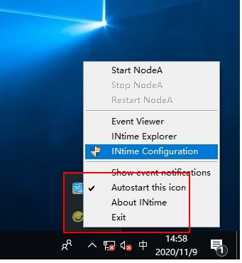

选择安装组件如下：

通过产品序列号正式激活：

使用版激活：fingerprint 和 HardwareID 发送到support@nxtrol.com 获取试用产品序列号。

手动激活试用版本：打开隐藏框内INtime configuration

打开License Manager

导入使用产品序列号License文件

激活成功如下图所示：

以上步骤试用激活完成 

重启电脑，系统自动提示以下界面，自动启动配置系统

选择EtherCAT所使用的网卡（推荐Intel i210系列网卡芯片）并勾选Advanced Setting （推荐使用默认配置）

点击确定，系统提示重启

windows系统重启后，PLC配置参数已完成 系统将自动启动PLC内核

系统启动如下，进入Demo模式

