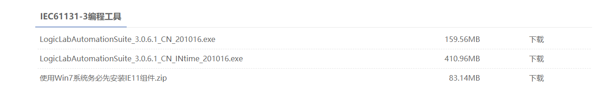
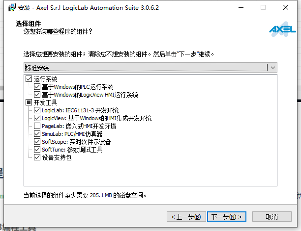
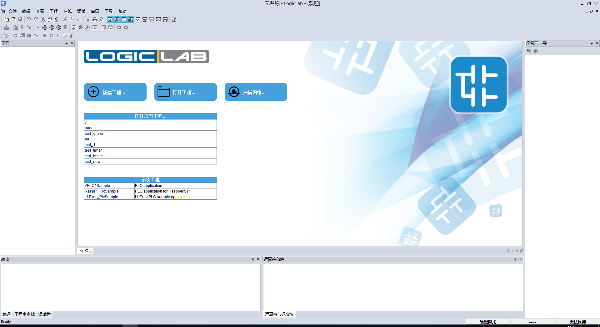
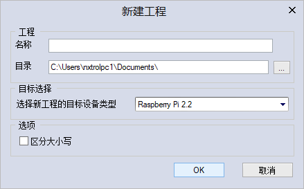
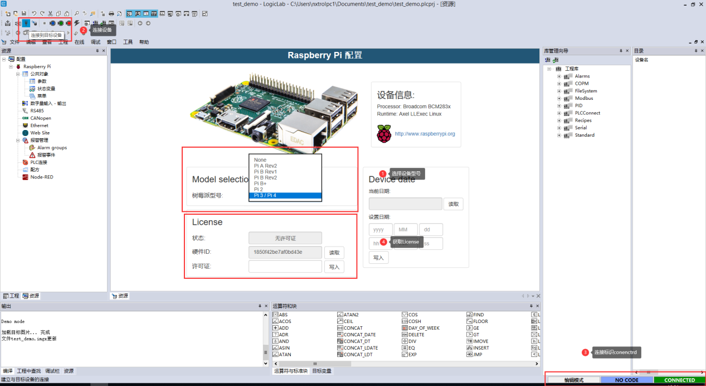
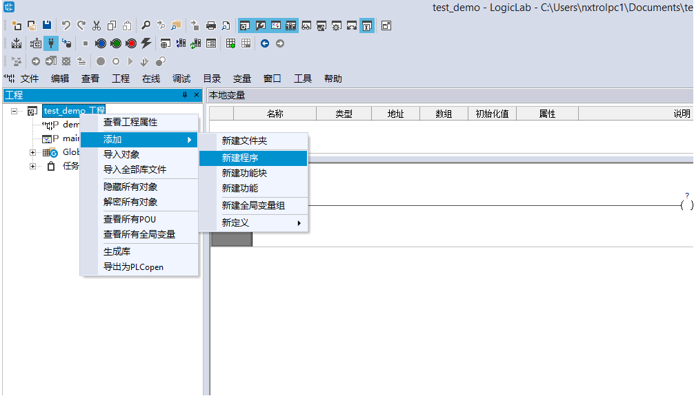
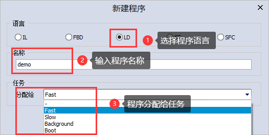
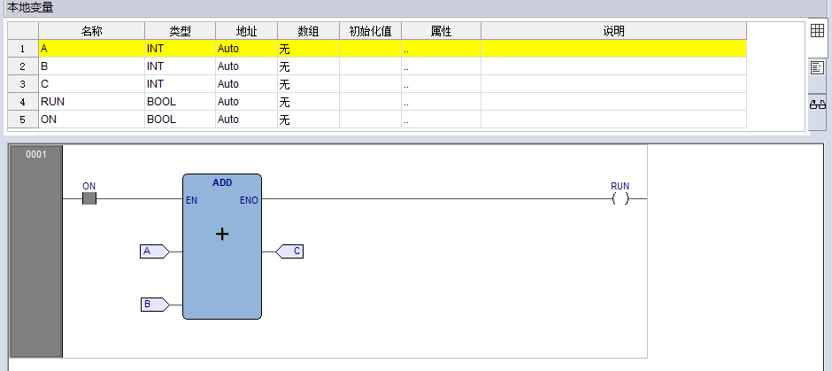
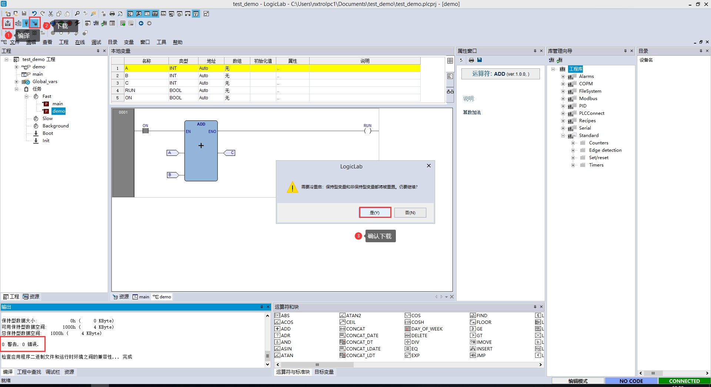
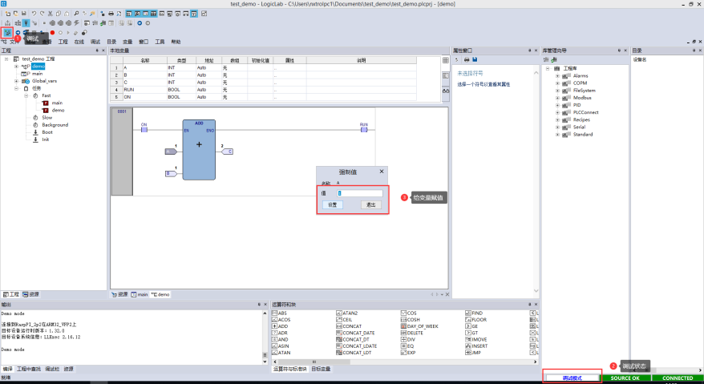

## 1.上手LogicLab

### 1.1. LogicLab编程工具如何下载？如何安装？

登录https://www.nxtrol.com/download.html 下载LogicLab Automation Suite最新版本,目前分为无INtime和有INtime版,根据需求选择下载。（实际LogicLab 安装文件会持续更新，发布版本可能会有不一样）：

下载完成后，开始安装，根据提示一步一步完成安装。
基于树莓派PLC目前支持的功能，在安装LogicLabAutomationSuite过程中无INtime和有INtime的组件如下：

### 1.2 Logiclab初体验
1.LogicLab起始界面如下图所示：

连接目标设备
 点击扫描网络，logiclab自动识别连接的目标设备。

 
新建工程，输入工程名称。

 点击工具栏连接目标设备，右下角显示CONNECTED表示已经连接。

2.添加PLC程序
 右击工程栏的工程名字，选择添加的程序语言。 输入程序的名称把程序分配给指定的任务（程序必须放在任务里才能运行）。

添加PLC指令，拖拽ADD运算块到梯形图中。 添加变量，选择变量类型。

 

3.设备上运行PLC程序
 编译 下载 PLC程序到设备上运行。

 

点击调试 进入调试

